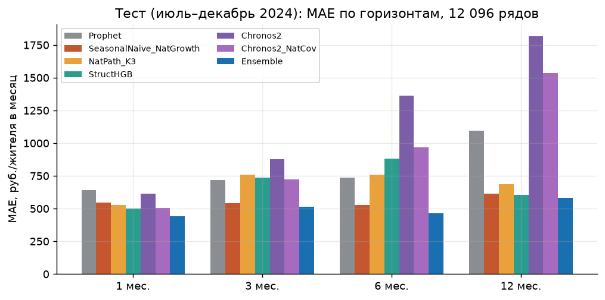
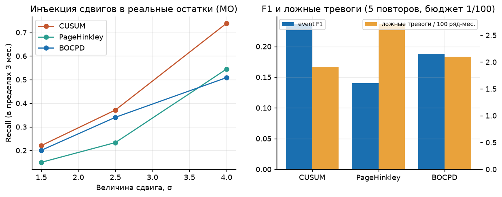
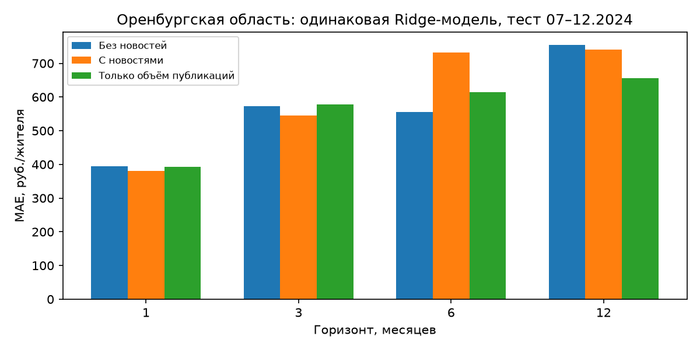

# Прогноз расходов муниципалитетов и ранние сигналы структурных сдвигов (СберИндекс)

Прогноз средних безналичных расходов жителя 2 016 муниципальных образований по 6 категориям на 1/3/6/12 месяцев, сравнение детекторов структурных сдвигов, фундаментальные модели, «новостные» признаки, недельный nowcast и заморозка прогноза на 2025 год. Основа — открытые данные конкурса СберИндекса (CC BY-SA 4.0). Код и результаты разделены со скачиваемыми данными; порядок воспроизведения описан ниже.

## Главный результат

Ретроспективный тест: цели июль–декабрь 2024, 12 096 рядов (2 016 МО × 6 категорий). Выбор моделей и весов записан до подсчёта метрик (`frozen_selection.json`), но на длинных горизонтах эти веса не были доступны на историческом origin. Prophet — база по умолчанию, настройки организатора неизвестны.

### Доработка от 07.10.2026

Все новые эксперименты выполнены после просмотра test; их результаты исследовательские. Исходный запуск и замороженные файлы сохранены.

- [Обновлённое исследование](docs/RESEARCH_AUDIT_RESULTS_RU.md): сильные базы, последовательные веса, отдельная калибровка, вклад HGB, категории и регионы.
- [Проверка критериев](docs/CRITERIA_AUDIT_RU.md): свидетельства и ограничения по каждому пункту; точные критерии и веса подтверждены пользователем 07.10.2026; оценка выполнения не является баллами жюри.
- [Интерактивные кейсы](presentation/research_demo.html): факт, прогноз до наблюдения, тревоги и сценарий регионального аналитика.
- Недельный prior по маркетплейсам, три официальных событийных кейса и ИПЦ для интерпретации. В исходной абляции использован реестр событий; позднее собран региональный корпус из 28 900 заголовков, проверенный отдельно.
- `make research-prophet research verify` — дополнительный анализ на одном потоке и с пониженным приоритетом. Требуются исходные прогнозы.

Ансамбль без HGB даёт среднюю MAE около 503 против 501 руб. у исходного. Последовательные веса дают 454/539/577/628 руб.; для h=12 нет истории калибровки, интервалы недоступны. Превосходство исходного ансамбля над сильной сезонной базой на h=3/12 по bootstrap месяцев не подтверждено.

| MAE, руб. на жителя в месяц | 1 мес. | 3 мес. | 6 мес. | 12 мес. |
|---|---:|---:|---:|---:|
| **Ансамбль (замороженный)** | **440** | **514** | **466** | **583** |
| Prophet (настройки по умолчанию) | 640 | 719 | 736 | 1 093 |
| Снижение MAE | −31% | −28% | −37% | −47% |

Для исходного ретроспективного ансамбля против Prophet 95% интервалы разности MAE (bootstrap по МО и по целевым месяцам) на всех горизонтах лежат ниже нуля. Это не устраняет ограничений доступности весов; против сильной сезонной базы выигрыш на h=3/12 не подтверждён. Откуда выигрыш: у МО всего 24 месяца, поэтому сезонность и рост берутся из национальных рядов с 2018 г. (абляция: −33% MAE только за счёт национального пути). Нелинейная модель по МО даёт мало. Полный разбор и все оговорки — в [отчёте](report/report.pdf) и [`docs/MUNICIPAL_RESULTS_RU.md`](docs/MUNICIPAL_RESULTS_RU.md).

**Что не получилось (и это записано в отчёте):**
- Фундаментальные модели (Chronos-Bolt, Chronos-2, Chronos-2 + национальная ковариата, TimesFM на подвыборке 200 МО) без дообучения уступают Prophet на h≥3; в ансамбле их вес 0.
- Раннее предупреждение сдвигов: навык не подтверждён (PR-AUC около доли событий, Brier не лучше константы). Детекторы реагируют на уже начавшийся сдвиг. Победитель CUSUM / Page–Hinkley / BOCPD зависит от способа разметки.
- «Новости» (решения ЦБ + реестр из 7 событий) не лучше плацебо. В исходной абляции использован реестр событий; позднее собран региональный корпус из 28 900 заголовков, проверенный отдельно.
- В категории «Маркетплейсы» ансамбль не лучше Prophet.

**Главное допущение.** Официальные правила и baseline организатора мне неизвестны. Использован «конкурсный» протокол из открытых работ участников: validation — цели янв.–июнь 2024, test — июль–декабрь 2024, минимальная история 6 месяцев. Его нужно сверить с правилами; Prophet здесь — «из коробки», без настроек организатора.

## Что обучено и какие метрики

Полный каталог (параметры, ревизии чекпойнтов, число подгонок, все метрики validation/test, детекторы, новости, национальный блок) — [`docs/MODELS_AND_METRICS_RU.md`](docs/MODELS_AND_METRICS_RU.md). Кратко, test (июль–декабрь 2024), MAE руб. на жителя:

| Модель | Что обучено | h=1 | h=3 | h=6 | h=12 | среднее |
|---|---|---:|---:|---:|---:|---:|
| **Ensemble** | LAD-веса на validation: Prophet + SeasonalNaive_NatGrowth + StructHGB | **440** | **514** | **466** | **583** | **501** |
| SeasonalNaive_NatGrowth | правило: прошлый год × национальный рост | 547 | 543 | 529 | 612 | 558 |
| NatPath_K3 | правило: локальный уровень × национальный путь | 526 | 758 | 757 | 687 | 682 |
| StructHGB | HistGradientBoosting по остатку (18 моделей на вариант веса) | 500 | 736 | 883 | 606 | 681 |
| Prophet | 229 824 подгонки, настройки по умолчанию | 640 | 719 | 736 | 1 093 | 797 |
| LocalOnlyHGB | абляция без национальных данных | 666 | 775 | 930 | 1 165 | 884 |
| Chronos-2 + национальная ковариата | zero-shot, 12 096 × 19 | 506 | 722 | 970 | 1 533 | 933 |
| Chronos-2 | zero-shot | 613 | 877 | 1 361 | 1 817 | 1 167 |
| Chronos-Bolt-small | zero-shot | 707 | 1 024 | 1 603 | 1 986 | 1 330 |
| TimesFM-2.5 | zero-shot, **только 200 МО** (сравнение на той же подвыборке: 549 / 786 / 1 245 / 1 630 против Prophet 622 / 695 / 709 / 1 078) | | | | | |



**Как читать сравнение:** меньше MAE — точнее прогноз. Среди моделей основной таблицы исходный ансамбль имеет наименьшую среднюю MAE, около 501 руб.; сильная сезонная база — 558 руб., Prophet — 797 руб. Основной вклад даёт перенос национальной динамики. Удаление HGB увеличивает среднюю MAE лишь до 503 руб. Более строгий вариант с последовательным подбором весов, PastOnlyBlend, даёт около 549 руб.; это отдельная исследовательская проверка доступности параметров во времени. Исходный ансамбль не является лучшим на каждом горизонте среди всех дополнительных вариантов; результаты не следует выдавать за независимый финальный тест.

Остальные метрики:
- **R² по изменению** (test, h=1/3/6/12): ансамбль 0.67 / 0.74 / 0.84 / 0.69, Prophet 0.13 / 0.42 / 0.53 / −0.44; интервалы 90% покрывают 0.89 / 0.87 / 0.94 / 0.94.
- **Детекторы** (инъекции, бюджет 1/100): F1 CUSUM 0.24, BOCPD 0.19, Page–Hinkley 0.14. Недельные реальные ряды (proxy-метки): Page–Hinkley 0.39, CUSUM 0.31, BOCPD 0.14.
- **Раннее предупреждение** (недельные ряды): PR-AUC 0.16 при доле событий 0.12 (k=4), 0.39 при 0.36 (k=13): навыка нет.
- **Исходная событийная абляция:** изменение MAE к базе на тесте −1.0 / −1.9 / −2.5 / −0.2% против плацебо от −2.6 до +1.2%. Результаты расширенного текстового корпуса приведены в разделе «Региональные новости» ниже.
- **Nowcast** (национальный уровень, млрд руб.): 62.0 по полному месяцу против 70.1 у h=1-ансамбля N01.
- **Национальный N01** (holdout, млрд руб.): ансамбль 74.66, CatBoost 78.91, SeasonalGrowth 86.99, SeasonalNaive 346.62.

### Сравнение детекторов



На синтетических инъекциях CUSUM имеет лучший F1: 0.24 против 0.19 у BOCPD и 0.14 у Page–Hinkley. Он выбран для основного муниципального опыта. На недельных финансовых proxy-метках лидирует Page–Hinkley (F1 0.39). Выбор зависит от данных и разметки: универсальный победитель и устойчивое предупреждение до начала сдвига не доказаны. [Обоснование выбора](docs/DETECTOR_CHOICE_RU.md).

## Соответствие ТЗ по пунктам

Критерии и веса предоставлены пользователем 07.10.2026 и сохранены в [конфигурации ТЗ](configs/contest_criteria.json). Вес — доля итоговой оценки, а не полученные баллы. Реализованный пункт не означает, что улучшение качества доказано; ограничения перечислены отдельно.

| Пункт ТЗ | Вес | Что сделано и где проверить | Статус и ограничения |
|---|---:|---|---|
| 1. Простое объяснение методологии | 10% | [Методология на одной странице](docs/METHODOLOGY_ONE_PAGE_RU.md), [отчёт](report/report.md), [презентация](presentation/slides.pdf) | Выполнено; допущения доступности данных указаны |
| 2. Сравнение прогнозов, выбор модели, горизонты 1/3/6/12 | 20% | Таблица и график выше; [результаты и последовательная проверка](docs/RESEARCH_AUDIT_RESULTS_RU.md) | Выполнено с ограничениями: настройки официального Prophet и протокол не подтверждены; исходные веса не всегда доступны на историческую дату прогноза |
| 3. Сравнение детекторов и выбор лучшего | 20% | CUSUM, Page–Hinkley, BOCPD; [выбор детектора](docs/DETECTOR_CHOICE_RU.md), [метрики недельного опыта](artifacts/weekly_shocks/detector_metrics_proxy_labels.csv) | Сравнение выполнено; CUSUM выбран условно для инъекционного опыта. Независимых подтверждённых меток реальных сдвигов нет |
| 4. Современные фундаментальные модели временных рядов | 15% | Chronos-Bolt, Chronos-2, Chronos-2 с национальной ковариатой, TimesFM; [модели и параметры](docs/MODELS_AND_METRICS_RU.md) | Выполнено в zero-shot режиме; TimesFM на 200 МО, историческая доступность чекпойнтов не подтверждена |
| 5. Новости и согласование со СберИндексом для прогноза и детекторов | 15% | 28 900 заголовков, сопоставление по географии и дате доступности; [согласование](docs/NEWS_ALIGNMENT_RU.md), [парные сравнения](docs/REGIONAL_NEWS_IMPACT_RU.md) | Интеграция выполнена в региональном пилоте; устойчивое улучшение не доказано, бинарный вход детекторов насыщается |
| 6. Обязательная MAE, опциональная R² | 10% | MAE на всех четырёх горизонтах; R² и дополнительные метрики в [каталоге результатов](docs/MODELS_AND_METRICS_RU.md) | Выполнено; официальный способ итогового агрегирования нужно сверить |
| 7. Интерпретация, ясность, воспроизводимость и обоснованность | 10% | [Отчёт](report/report.md), [интерактивные кейсы](presentation/research_demo.html), [снимок среды](requirements.lock.txt), [проверки](tracking/research_verification.json) | Текущая среда и сохранённые результаты проверены; полная установка с нуля, внешний релиз и независимая временная отметка не подтверждены |

Подробные свидетельства по каждому пункту — в [аудите критериев](docs/CRITERIA_AUDIT_RU.md). Отрицательные результаты новостей и foundation-моделей сохранены: критерии требуют интеграции и корректного сравнения, а не обязательного выигрыша каждого метода.

## Материалы

| Что | Где |
|---|---|
| Методологический отчёт (PDF / HTML / MD) | [`report/report.pdf`](report/report.pdf), [`report/report.html`](report/report.html), [`report/report.md`](report/report.md) |
| Презентация и лендинг | [`presentation/slides.pdf`](presentation/slides.pdf), [`presentation/index.html`](presentation/index.html) (самодостаточный) |
| Что обучено и все метрики | [`docs/MODELS_AND_METRICS_RU.md`](docs/MODELS_AND_METRICS_RU.md) |
| Результаты муниципального блока | [`docs/MUNICIPAL_RESULTS_RU.md`](docs/MUNICIPAL_RESULTS_RU.md), `artifacts/municipal_runs/<run>/` |
| Детекторы и раннее предупреждение | `artifacts/shocks/` (МО), `artifacts/weekly_shocks/` (недельные ряды) |
| Новости / события | [Источники данных](docs/DATA_SOURCES_RU.md), `artifacts/news_ablation/` |
| Недельный nowcast | `artifacts/nowcast/` |
| Замороженные прогнозы для будущей проверки | [`prospective/`](prospective/README.md): 2025 по МО, 09.2026 национальные |
| Журналы экспериментов и метрик | `tracking/*.csv` |
| Национальный эксперимент N01 | [`docs/NATIONAL_FORECAST_RESULTS_RU.md`](docs/NATIONAL_FORECAST_RESULTS_RU.md), ансамбль MAE 74.66 млрд руб. |
| Адаптивная ветка N02 (не улучшение, holdout не независим) | [`docs/ADAPTIVE_BRANCH_RU.md`](docs/ADAPTIVE_BRANCH_RU.md) |
| План моделирования | [`docs/MODELING_PLAN_RU.md`](docs/MODELING_PLAN_RU.md) |
| Аудит справочника МО и потребительских выгрузок | `notebooks/01…02`, `artifacts/eda/`, `artifacts/consumer_audit/` |

## Запуск

Все входные файлы уже собраны в `data/inputs/`. [Список имён и назначения](docs/INPUT_DATA_RU.md); машинный перечень — `configs/input_files.json`. На другом компьютере эту папку нужно скопировать отдельно: данные не входят в GitHub-репозиторий.

```bash
conda env create -f environment.yml && conda activate sber     # Python 3.12; проверено на версиях из requirements.lock.txt
python scripts/check_inputs.py --profile full                  # локальные данные, без скачивания
make test                                                      # юнит-тесты, включая проверки утечек
make foundation                                                # Prophet, Chronos, TimesFM: ~2 ч на 12 ядрах CPU (TimesFM — подвыборка)
make municipal shocks news nowcast check2025 report            # прогнозы, детекторы, абляция, nowcast, отчёт
```

Воспроизведение национального N01 в единой среде дало те же метрики (`tracking/reproduction_check_N01.csv`). Каждый запуск пишет свой каталог с `config.json`, SHA256 данных и `manifest.json`; предыдущие запуски не перезаписываются.

Полный снимок среды: `requirements.lock.txt`; `environment.yml` использует его. В установленной среде `sber` прошли 26 юнит-тестов, 137 проверок целостности и временных границ, 3 проверки логики демонстрации; конфликтов зависимостей нет. Chronos и TimesFM проверены на одном реальном ряду из локального кеша: получены прогнозы и квантили на 12 месяцев. Это проверка работоспособности текущей среды; полная установка с нуля не подтверждена. Лёгкие проверки: `make test verify`. `make report` включает дополнение, если оно уже построено.

Для проверки уже установленной среды без обучения и скачивания (Make необязателен):

```bash
conda activate sber
python -m pip check
python scripts/check_inputs.py --profile full
OMP_NUM_THREADS=1 OPENBLAS_NUM_THREADS=1 python -m pytest tests -q
python scripts/verify_research.py
node scripts/check_research_demo.js                            # Node.js; проверка логики, не рендеринга браузера
```

## Проверка вперёд (out-of-time)

- `prospective/forecast_2025_frozen.csv` — ретроспективный прогноз по МО на 2025 г., построенный в 2026 году по истории до декабря 2024, с эмпирическими интервалами и SHA256. Когда СберИндекс опубликует факты 2025 г. по МО: `python scripts/score_prospective.py`.
- `prospective/national_2026-09_frozen.csv` — национальные прогнозы и недельный nowcast на сентябрь 2026 (заморожены до выхода месячных данных): `python scripts/score_prospective_national.py`.
- Локальный коммит фиксирует версию, но независимую дату обеспечивает внешний релиз/публикация до выхода фактов. Внешняя публикация пока не выполнена; прошлую дату создания прогнозов подтвердить задним числом нельзя.

## Структура

```
src/            mun_data / mun_models / mun_eval / mun_ensemble / mun_shocks / mun_news — муниципальный блок;
                forecasting / adaptive / transitions / evaluation — национальный блок и детекторы
scripts/        run_municipal, run_shocks, run_weekly_shocks, run_news_ablation, nowcast_weekly, mun_prophet,
                mun_foundation, check_2025_vs_national, make_figures, build_report ...
configs/        municipal.json, shocks.json, national_forecast.json, adaptive_forecast.json ...
tests/          test_municipal.py (утечки, метрики, детекторы), test_forecasting.py
data/inputs/    все локальные входные данные, исключены из Git; список — docs/INPUT_DATA_RU.md
```

## Данные и лицензия

Муниципальные расходы, справочник и индекс доступности рынков — СберИндекс, CC BY-SA 4.0 («Потребительские безналичные расходы на уровне муниципальных образований по категориям трат. СберИндекс», данные скачаны 04.10.2026, [описание](https://sberindex.ru/ru/research/data-sense-opisanie-nabora-dannikh-khakatona-sberindeksa-po-munitsipalnim-dannim)). Справочник границ: [СберИндекс](https://sberindex.ru/ru/research/dataset-borders-and-changes-of-municipalities), метаданные — `data/inputs/municipal_metadata.pdf`. Все входные файлы находятся в `data/inputs/` и не отслеживаются Git. Ключевая ставка — [cbr.ru](https://www.cbr.ru/hd_base/KeyRate/).

Ограничения справочника (срезы на 1 января 2018–2024, центры по состоянию на 2018 г., нет координат городов федерального значения, Чечня) описаны в `configs/municipal_metadata.json` и `docs/MODELING_PLAN_RU.md`. Панель расходов покрывает 2 016 из 2 594 МО справочника (73 региона из 85).

## Региональные новости

Пилот по Оренбургской области за 2023–2024 расширен с 53 публикаций МЧС до **28 900 уникальных заголовков**: добавлен датированный архив «Оренбург Медиа», все страницы за 24 месяца получены. Парсер — requests + BeautifulSoup; браузер не требуется. Полнота всех новостей региона неизвестна. [Сбор, дополнительные признаки и повторный запуск](docs/REGIONAL_NEWS_COLLECTION_RU.md); конфигурация — `configs/news_archive.json`, лёгкая среда — `requirements-news.txt` (установка с нуля и обработка кеша проверены).

Добавлены экономические темы и направления цен/доходов/открытия бизнеса, месячные признаки по источникам и географии. Проверены семь вариантов прогнозов и три детектора: `make regional-news-archive regional-news-impact`. Парное сравнение одной Ridge-модели на тех же 234 рядах Оренбургской области, тест июль–декабрь 2024:

| MAE, руб./жителя | 1 мес. | 3 мес. | 6 мес. | 12 мес. |
|---|---:|---:|---:|---:|
| Без новостей | 394.6 | 573.5 | 555.1 | 755.4 |
| С новостями | 380.7 | 545.5 | 731.8 | 740.2 |
| Изменение MAE относительно варианта без новостей | −3.5% | −4.9% | +31.8% | −2.0% |
| Сохранённый основной ансамбль на тех же рядах | 367.3 | 425.9 | 424.7 | 511.8 |



**Что дали новости:** относительно контрольной Ridge ошибка немного снизилась на h=1/3/12, но выросла на h=6. Сохранённый основной ансамбль точнее новостного варианта на всех четырёх горизонтах; это ориентир, а не парная абляция Ridge. Улучшение от содержания новостей сверх контроля объёма публикаций поддерживается месячным bootstrap только на h=1. Тест уже просмотрен, регион один, целевых месяцев шесть — устойчивое улучшение по России не доказано.

**Для детекторов** бинарное правило «есть тематическая новость» насыщается и даёт те же тревоги, что контроль покрытия. Поэтому изменения относительно варианта без новостей нельзя считать доказанной пользой содержания сообщений. Чувствительность к разметке и все варианты — в [полном отчёте](docs/REGIONAL_NEWS_IMPACT_RU.md). Локальные данные и кеш находятся в `data/inputs/`, исключены из Git.

## Состав репозитория и готовность

В Git сохраняются код, конфигурации, тесты, документация, итоговые метрики, материалы защиты и замороженные прогнозы с SHA256. Скачиваемые входы, веса моделей, кеши и тяжёлые промежуточные файлы перечислены в [`.gitignore`](.gitignore). Некоторые ранее закоммиченные артефакты продолжают отслеживаться несмотря на новые правила исключения; проверка — `python scripts/repository_audit.py`.

[Источники и SHA256 входов](configs/data_provenance.json), [перечень входных файлов](docs/INPUT_DATA_RU.md), [аудит критериев и ограничений](docs/CRITERIA_AUDIT_RU.md). Точный официальный протокол и настройки baseline остаются неподтверждёнными; независимая следующая оценка требует новых, не использованных для подбора фактов.

Авторские реестры восстановить командой `python scripts/prepare_inputs.py --references`. Полные данные копируются отдельно или скачиваются у источников; новый экспорт может отличаться от исходного снимка.
