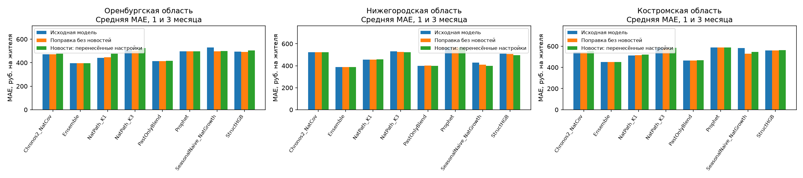
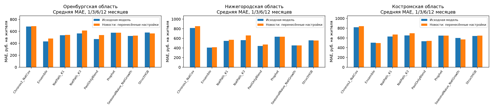

# Экономические новости, затухание и перенос между регионами

Запуск `decay_20261008T153750_772322Z`. Период источников 2023–2024; validation январь–июнь 2024 только Оренбург; test июль–декабрь 2024. Основные горизонты 1 и 3 месяца, 6 — дополнительный; h=12 остаётся без поправки из-за отсутствия прошлых примеров с уже известными фактическими расходами при валидации.

## Результат

На основных h=1/3 Ensemble остаётся исходным: на периоде подбора в Оренбургской области выбран shrink=0, и это решение перенесено на другие регионы. Преимущество над лучшим исходным Ensemble не получено. У SeasonalNaive_NatGrowth экономические признаки с выбранным затуханием снижают среднюю ошибку относительно исходной модели во всех оценённых регионах; финансовый контроль и вариант только с количеством новостей нужны для отделения вклада новостей.

SeasonalNaive_NatGrowth, средняя MAE по h=1/3:

| Область                |   Исходная модель |   Поправка без новостей |   Общее количество публикаций |   Выбранный вариант с новостями |   Изменение ошибки, % |
|:----------------------|-----------:|-----------------:|---------------:|----------------:|-------------:|
| Оренбургская область  |     528.38 |           497.44 |         494.29 |          500.06 |        -5.36 |
| Нижегородская область |     428.56 |           409.20 |         410.55 |          398.81 |        -6.94 |
| Костромская область   |     584.01 |           529.80 |         527.41 |          546.28 |        -6.46 |

Есть отдельные случаи уменьшения ошибки и относительно оригинала, и относительно сопоставимого контроля экономического объёма; в таблице показаны случаи с верхней границей bootstrap-интервала ниже нуля для сравнения с объёмом. Это исследовательские сигналы, а не подтверждение устойчивого эффекта: шесть месяцев, множественные сравнения; интервал сравнения с оригиналом может включать ноль.

| Модель              | Вариант       |   Горизонт, мес. | С чем сравниваем                  |   Разность ошибок, руб. |   Нижняя граница 95% интервала |   Верхняя граница 95% интервала |   Месяцев | Область                |
|:------------------------|:--------------|----:|:----------------------------|-----------------:|---------:|----------:|---------:|:----------------------|
| SeasonalNaive_NatGrowth | Выбранный вариант с новостями |   3 | Количество экономических новостей: вес вдвое меньше через 14 дней |           -3.572 |   -7.542 |    -0.146 |        6 | Нижегородская область |

## Протокол

Области выбраны до оценки: Оренбургская для подбора настроек, Нижегородская по запросу пользователя, Костромская по доступности датированного архива. Проверенный архив Тверской области оказался недоступен для выбранного способа сбора. Архивы НИА Нижний Новгород и Кострома.Today собраны полностью в рамках заданных запросов; это не все новости региона.

Qwen разметила по 50 публикаций каждого месяца: 30 из группы, заранее отобранной по ключевым словам, и 20 из остальных. Отбор не использует расходы или ошибки модели. Вес выборки учитывает долю взятых публикаций из каждой группы.

В экономический вариант попадают сообщения, которые LLM сочла экономически значимыми и которые содержат экономическую тему, явное направление цены/доходов/бизнеса или связь с категорией расходов. Отдельно проверяется добавление чрезвычайных событий. Если категория не указана, такие события применяются только к общему ряду расходов. Полный архив сохранён для сравнений с количеством публикаций.

Проверены новости за последние 1 или 3 месяца и варианты, где вес уменьшается вдвое через 14, 30 или 90 дней. Давность считается по точному времени публикации; будущие публикации исключены. Вариант с уменьшением веса использует всю доступную историю с января 2023. Код направления 0 означает явно указанное отсутствие изменения; 9 — сведений нет.

Здесь уменьшается вес числа публикаций, но доля негативных сообщений может сохраняться: единственная старая негативная новость остаётся «100% негативных». Поэтому этот способ не гарантирует уменьшения самой прогнозной поправки. Проверка, в которой уменьшается весь сигнал, описана в [следующем эксперименте](../../../docs/NEWS_MASS_RESULTS_RU.md).

Для восьми моделей настройки и способ расчёта признаков выбираются только на январе–июне 2024 Оренбургской области. Затем сохраняются параметры и их SHA256, и только после этого рассчитываются ошибки на июле–декабре. В двух других областях настройки не выбираются заново. Коэффициенты Ridge обучаются на местных прошлых ошибках, для которых факт уже известен. Таким образом переносится способ настройки, а коэффициенты рассчитываются в каждой области. Контрольные варианты сохраняют географию, отбор и давность, но используют только количество новостей.

Объяснения обозначений — в [словаре терминов](../../../docs/TERMS_RU.md).

Для Ensemble на h=1/3 Оренбургская validation выбрала shrink=0. Поэтому на этих горизонтах прогноз совпадает с исходным и в двух других областях по зафиксированному протоколу. Такое совпадение не доказывает бесполезность всех возможных региональных новостных моделей. На h=6 поправка ненулевая; результат показан отдельно, включая ухудшение на Оренбургском тесте. Поисковый архив НИА содержит и недатированные карточки людей: они учитываются в полноте загрузки выдачи, но исключаются из новостей, даты им не приписываются; число исключений сохранено в collection_nizhny.json.

## Оренбургская область

39 МО, 234 рядов; 1200 публикаций (1189 уникальных заголовков), экономический отбор оставил 383, с ЧС — 509.

Ensemble на основных h=1/3: 396.60 → 396.60 (+0.00%).

**Основные горизонты h=1/3**, средняя MAE, руб./жителя. Выбранный вариант с новостями выбирает окна или затухание только по Оренбургской валидации, Выбранный срок уменьшения влияния — лучший из 14/30/90 дней по той же валидации.

| Модель              |   Исходная модель |   Поправка без новостей |   Общее количество публикаций |   Все новости за 1 или 3 месяца |   Экономические новости за 1 или 3 месяца |   Экономические новости и чрезвычайные события |   Выбранный срок уменьшения влияния |   Выбранный вариант с новостями |   Изменение ошибки, % |
|:------------------------|-----------:|-----------------:|---------------:|--------------:|-------------------:|--------------------------:|-----------------:|----------------:|-------------:|
| Chronos2_NatCov         |     471.58 |           472.42 |         477.52 |        475.92 |             476.20 |                    475.15 |           475.82 |          475.82 |         0.90 |
| Ensemble                |     396.60 |           396.60 |         400.43 |        396.60 |             396.60 |                    396.60 |           396.60 |          396.60 |         0.00 |
| NatPath_K1              |     442.44 |           445.36 |         449.25 |        462.70 |             477.95 |                    458.77 |           457.23 |          477.82 |         7.99 |
| NatPath_K3              |     507.92 |           502.16 |         508.02 |        523.64 |             543.58 |                    529.44 |           523.72 |          523.72 |         3.11 |
| PastOnlyBlend           |     414.24 |           414.37 |         426.05 |        414.24 |             414.24 |                    436.32 |           415.51 |          415.51 |         0.31 |
| Prophet                 |     496.77 |           496.77 |         504.17 |        496.77 |             496.77 |                    496.77 |           496.77 |          496.77 |         0.00 |
| SeasonalNaive_NatGrowth |     528.38 |           497.44 |         494.29 |        523.17 |             523.83 |                    508.40 |           500.06 |          500.06 |        -5.36 |
| StructHGB               |     495.16 |           491.09 |         489.35 |        503.05 |             504.42 |                    500.88 |           501.25 |          505.19 |         2.03 |

Средняя MAE по всем h=1/3/6/12:

| Модель              |   Исходная модель |   Поправка без новостей |   Общее количество публикаций |   Все новости за 1 или 3 месяца |   Экономические новости за 1 или 3 месяца |   Экономические новости и чрезвычайные события |   Выбранный срок уменьшения влияния |   Выбранный вариант с новостями |   Изменение ошибки, % |
|:------------------------|-----------:|-----------------:|---------------:|--------------:|-------------------:|--------------------------:|-----------------:|----------------:|-------------:|
| Chronos2_NatCov         |     681.97 |           674.62 |         667.19 |        661.92 |             687.58 |                    677.08 |           709.09 |          687.39 |         0.80 |
| Ensemble                |     432.41 |           437.64 |         434.33 |        432.41 |             432.41 |                    432.41 |           479.66 |          479.66 |        10.93 |
| NatPath_K1              |     535.67 |           577.81 |         585.77 |        536.14 |             540.12 |                    535.28 |           589.48 |          540.05 |         0.82 |
| NatPath_K3              |     565.58 |           616.15 |         609.78 |        566.69 |             623.46 |                    575.52 |           657.52 |          613.53 |         8.48 |
| PastOnlyBlend           |     470.25 |           490.73 |         476.16 |        470.25 |             490.91 |                    481.30 |           536.49 |          536.49 |        14.08 |
| Prophet                 |     577.15 |           577.15 |         580.86 |        577.15 |             577.15 |                    577.15 |           577.15 |          577.15 |         0.00 |
| SeasonalNaive_NatGrowth |     522.17 |           524.11 |         512.24 |        539.14 |             519.90 |                    552.79 |           529.91 |          529.91 |         1.48 |
| StructHGB               |     580.38 |           578.34 |         577.47 |        584.33 |             565.42 |                    583.24 |           583.42 |          565.81 |        -2.51 |

По горизонтам:

| Модель              | Вариант          |      1 |      3 |      6 |      12 |
|:------------------------|:-----------------|-------:|-------:|-------:|--------:|
| Chronos2_NatCov         | Экономические новости за 1 или 3 месяца | 395.63 | 556.76 | 692.20 | 1105.73 |
| Chronos2_NatCov         | Исходная модель         | 395.63 | 547.52 | 678.99 | 1105.73 |
| Chronos2_NatCov         | Выбранный срок уменьшения влияния   | 395.63 | 556.01 | 778.97 | 1105.73 |
| Chronos2_NatCov         | Выбранный вариант с новостями    | 395.63 | 556.01 | 692.20 | 1105.73 |
| Ensemble                | Экономические новости за 1 или 3 месяца | 367.33 | 425.87 | 424.66 |  511.78 |
| Ensemble                | Исходная модель         | 367.33 | 425.87 | 424.66 |  511.78 |
| Ensemble                | Выбранный срок уменьшения влияния   | 367.33 | 425.87 | 613.67 |  511.78 |
| Ensemble                | Выбранный вариант с новостями    | 367.33 | 425.87 | 613.67 |  511.78 |
| NatPath_K1              | Экономические новости за 1 или 3 месяца | 325.01 | 630.90 | 681.17 |  523.38 |
| NatPath_K1              | Исходная модель         | 323.85 | 561.04 | 734.42 |  523.38 |
| NatPath_K1              | Выбранный срок уменьшения влияния   | 324.73 | 589.74 | 920.07 |  523.38 |
| NatPath_K1              | Выбранный вариант с новостями    | 324.73 | 630.90 | 681.17 |  523.38 |
| NatPath_K3              | Экономические новости за 1 или 3 месяца | 396.49 | 690.67 | 822.01 |  584.68 |
| NatPath_K3              | Исходная модель         | 396.49 | 619.36 | 661.80 |  584.68 |
| NatPath_K3              | Выбранный срок уменьшения влияния   | 402.43 | 645.01 | 997.96 |  584.68 |
| NatPath_K3              | Выбранный вариант с новостями    | 402.43 | 645.01 | 822.01 |  584.68 |
| PastOnlyBlend           | Экономические новости за 1 или 3 месяца | 375.87 | 452.60 | 592.65 |  542.49 |
| PastOnlyBlend           | Исходная модель         | 375.87 | 452.60 | 510.05 |  542.49 |
| PastOnlyBlend           | Выбранный срок уменьшения влияния   | 378.41 | 452.60 | 772.44 |  542.49 |
| PastOnlyBlend           | Выбранный вариант с новостями    | 378.41 | 452.60 | 772.44 |  542.49 |
| Prophet                 | Экономические новости за 1 или 3 месяца | 466.11 | 527.42 | 533.74 |  781.34 |
| Prophet                 | Исходная модель         | 466.11 | 527.42 | 533.74 |  781.34 |
| Prophet                 | Выбранный срок уменьшения влияния   | 466.11 | 527.42 | 533.74 |  781.34 |
| Prophet                 | Выбранный вариант с новостями    | 466.11 | 527.42 | 533.74 |  781.34 |
| SeasonalNaive_NatGrowth | Экономические новости за 1 или 3 месяца | 521.30 | 526.36 | 508.53 |  523.38 |
| SeasonalNaive_NatGrowth | Исходная модель         | 530.39 | 526.36 | 508.53 |  523.38 |
| SeasonalNaive_NatGrowth | Выбранный срок уменьшения влияния   | 483.55 | 516.57 | 596.16 |  523.38 |
| SeasonalNaive_NatGrowth | Выбранный вариант с новостями    | 483.55 | 516.57 | 596.16 |  523.38 |
| StructHGB               | Экономические новости за 1 или 3 месяца | 381.73 | 627.10 | 715.95 |  536.90 |
| StructHGB               | Исходная модель         | 381.73 | 608.59 | 794.30 |  536.90 |
| StructHGB               | Выбранный срок уменьшения влияния   | 383.28 | 619.22 | 794.30 |  536.90 |
| StructHGB               | Выбранный вариант с новостями    | 383.28 | 627.10 | 715.95 |  536.90 |

Контрольные сравнения выбранного варианта на основных h=1/3: разность MAE (отрицательная лучше), 95% bootstrap целевых месяцев.

| Модель              | Вариант       |   Горизонт, мес. | С чем сравниваем                  |   Разность ошибок, руб. |   Нижняя граница 95% интервала |   Верхняя граница 95% интервала |   Месяцев |
|:------------------------|:--------------|----:|:----------------------------|-----------------:|---------:|----------:|---------:|
| Ensemble                | Выбранный вариант с новостями |   1 | Исходная модель                    |             0.00 |     0.00 |      0.00 |        6 |
| Ensemble                | Выбранный вариант с новостями |   3 | Исходная модель                    |             0.00 |     0.00 |      0.00 |        6 |
| Ensemble                | Выбранный вариант с новостями |   1 | Поправка без новостей              |             0.00 |     0.00 |      0.00 |        6 |
| Ensemble                | Выбранный вариант с новостями |   1 | Общее количество публикаций                |             0.00 |     0.00 |      0.00 |        6 |
| Ensemble                | Выбранный вариант с новостями |   1 | Количество экономических новостей за 1 или 3 месяца   |             0.00 |     0.00 |      0.00 |        6 |
| Ensemble                | Выбранный вариант с новостями |   3 | Поправка без новостей              |             0.00 |     0.00 |      0.00 |        6 |
| Ensemble                | Выбранный вариант с новостями |   3 | Общее количество публикаций                |            -7.66 |   -17.93 |      1.30 |        6 |
| Ensemble                | Выбранный вариант с новостями |   3 | Количество экономических новостей за 1 или 3 месяца   |             0.00 |     0.00 |      0.00 |        6 |
| PastOnlyBlend           | Выбранный вариант с новостями |   1 | Исходная модель                    |             2.54 |    -2.72 |      8.03 |        6 |
| PastOnlyBlend           | Выбранный вариант с новостями |   3 | Исходная модель                    |             0.00 |     0.00 |      0.00 |        6 |
| PastOnlyBlend           | Выбранный вариант с новостями |   1 | Поправка без новостей              |             2.26 |     0.10 |      4.45 |        6 |
| PastOnlyBlend           | Выбранный вариант с новостями |   1 | Общее количество публикаций                |             2.54 |    -2.72 |      8.03 |        6 |
| PastOnlyBlend           | Выбранный вариант с новостями |   1 | Количество экономических новостей: вес вдвое меньше через 14 дней |            -0.02 |    -5.41 |      5.38 |        6 |
| PastOnlyBlend           | Выбранный вариант с новостями |   3 | Поправка без новостей              |             0.00 |     0.00 |      0.00 |        6 |
| PastOnlyBlend           | Выбранный вариант с новостями |   3 | Общее количество публикаций                |           -23.62 |   -36.36 |    -10.82 |        6 |
| PastOnlyBlend           | Выбранный вариант с новостями |   3 | Количество экономических новостей за 1 или 3 месяца   |           -25.07 |   -39.20 |     -9.22 |        6 |
| Prophet                 | Выбранный вариант с новостями |   1 | Исходная модель                    |             0.00 |     0.00 |      0.00 |        6 |
| Prophet                 | Выбранный вариант с новостями |   3 | Исходная модель                    |             0.00 |     0.00 |      0.00 |        6 |
| Prophet                 | Выбранный вариант с новостями |   1 | Поправка без новостей              |             0.00 |     0.00 |      0.00 |        6 |
| Prophet                 | Выбранный вариант с новостями |   1 | Общее количество публикаций                |             0.00 |     0.00 |      0.00 |        6 |
| Prophet                 | Выбранный вариант с новостями |   1 | Количество экономических новостей за 1 или 3 месяца   |             0.00 |     0.00 |      0.00 |        6 |
| Prophet                 | Выбранный вариант с новостями |   3 | Поправка без новостей              |             0.00 |     0.00 |      0.00 |        6 |
| Prophet                 | Выбранный вариант с новостями |   3 | Общее количество публикаций                |           -14.81 |   -23.99 |     -5.18 |        6 |
| Prophet                 | Выбранный вариант с новостями |   3 | Количество экономических новостей за 1 или 3 месяца   |             0.00 |     0.00 |      0.00 |        6 |
| SeasonalNaive_NatGrowth | Выбранный вариант с новостями |   1 | Исходная модель                    |           -46.84 |   -83.80 |    -18.05 |        6 |
| SeasonalNaive_NatGrowth | Выбранный вариант с новостями |   3 | Исходная модель                    |            -9.80 |   -45.17 |     15.11 |        6 |
| SeasonalNaive_NatGrowth | Выбранный вариант с новостями |   1 | Поправка без новостей              |             1.65 |    -6.51 |     10.92 |        6 |
| SeasonalNaive_NatGrowth | Выбранный вариант с новостями |   1 | Общее количество публикаций                |             7.05 |    -4.40 |     18.61 |        6 |
| SeasonalNaive_NatGrowth | Выбранный вариант с новостями |   1 | Количество экономических новостей: вес вдвое меньше через 14 дней |            -0.20 |    -8.74 |      7.90 |        6 |
| SeasonalNaive_NatGrowth | Выбранный вариант с новостями |   3 | Поправка без новостей              |             3.58 |    -5.69 |     10.95 |        6 |
| SeasonalNaive_NatGrowth | Выбранный вариант с новостями |   3 | Общее количество публикаций                |             4.49 |    -1.77 |     11.83 |        6 |
| SeasonalNaive_NatGrowth | Выбранный вариант с новостями |   3 | Количество экономических новостей: вес вдвое меньше через 14 дней |             0.19 |    -7.15 |      5.84 |        6 |
| NatPath_K3              | Выбранный вариант с новостями |   1 | Исходная модель                    |             5.94 |    -4.45 |     19.63 |        6 |
| NatPath_K3              | Выбранный вариант с новостями |   3 | Исходная модель                    |            25.65 |    -8.87 |     78.58 |        6 |
| NatPath_K3              | Выбранный вариант с новостями |   1 | Поправка без новостей              |             5.54 |    -0.93 |     13.00 |        6 |
| NatPath_K3              | Выбранный вариант с новостями |   1 | Общее количество публикаций                |             1.75 |    -7.55 |     11.11 |        6 |
| NatPath_K3              | Выбранный вариант с новостями |   1 | Количество экономических новостей: вес вдвое меньше через 14 дней |             4.46 |     0.85 |     10.20 |        6 |
| NatPath_K3              | Выбранный вариант с новостями |   3 | Поправка без новостей              |            37.58 |     2.15 |     75.39 |        6 |
| NatPath_K3              | Выбранный вариант с новостями |   3 | Общее количество публикаций                |            29.65 |    -4.69 |     82.54 |        6 |
| NatPath_K3              | Выбранный вариант с новостями |   3 | Количество экономических новостей: вес вдвое меньше через 90 дней |            34.19 |     5.29 |     80.24 |        6 |
| NatPath_K1              | Выбранный вариант с новостями |   1 | Исходная модель                    |             0.88 |    -5.64 |      8.33 |        6 |
| NatPath_K1              | Выбранный вариант с новостями |   3 | Исходная модель                    |            69.86 |    37.66 |     99.09 |        6 |
| NatPath_K1              | Выбранный вариант с новостями |   1 | Поправка без новостей              |             1.72 |    -0.84 |      4.99 |        6 |
| NatPath_K1              | Выбранный вариант с новостями |   1 | Общее количество публикаций                |            -1.57 |    -7.11 |      4.95 |        6 |
| NatPath_K1              | Выбранный вариант с новостями |   1 | Количество экономических новостей: вес вдвое меньше через 14 дней |             1.46 |    -0.49 |      4.59 |        6 |
| NatPath_K1              | Выбранный вариант с новостями |   3 | Поправка без новостей              |            63.20 |    38.75 |     90.39 |        6 |
| NatPath_K1              | Выбранный вариант с новостями |   3 | Общее количество публикаций                |            58.70 |    31.13 |     87.11 |        6 |
| NatPath_K1              | Выбранный вариант с новостями |   3 | Количество экономических новостей за 1 или 3 месяца   |            63.71 |    35.02 |     91.81 |        6 |
| StructHGB               | Выбранный вариант с новостями |   1 | Исходная модель                    |             1.55 |    -3.39 |      7.15 |        6 |
| StructHGB               | Выбранный вариант с новостями |   3 | Исходная модель                    |            18.52 |    -4.62 |     42.57 |        6 |
| StructHGB               | Выбранный вариант с новостями |   1 | Поправка без новостей              |             1.55 |    -3.39 |      7.15 |        6 |
| StructHGB               | Выбранный вариант с новостями |   1 | Общее количество публикаций                |             1.89 |    -2.63 |      6.93 |        6 |
| StructHGB               | Выбранный вариант с новостями |   1 | Количество экономических новостей: вес вдвое меньше через 14 дней |             1.55 |    -3.39 |      7.15 |        6 |
| StructHGB               | Выбранный вариант с новостями |   3 | Поправка без новостей              |            26.65 |     6.00 |     50.62 |        6 |
| StructHGB               | Выбранный вариант с новостями |   3 | Общее количество публикаций                |            29.80 |     2.21 |     63.74 |        6 |
| StructHGB               | Выбранный вариант с новостями |   3 | Количество экономических новостей за 1 или 3 месяца   |            23.40 |     1.24 |     51.66 |        6 |
| Chronos2_NatCov         | Выбранный вариант с новостями |   1 | Исходная модель                    |             0.00 |     0.00 |      0.00 |        6 |
| Chronos2_NatCov         | Выбранный вариант с новостями |   3 | Исходная модель                    |             8.49 |   -10.82 |     27.88 |        6 |
| Chronos2_NatCov         | Выбранный вариант с новостями |   1 | Поправка без новостей              |             0.00 |     0.00 |      0.00 |        6 |
| Chronos2_NatCov         | Выбранный вариант с новостями |   1 | Общее количество публикаций                |             0.00 |     0.00 |      0.00 |        6 |
| Chronos2_NatCov         | Выбранный вариант с новостями |   1 | Количество экономических новостей за 1 или 3 месяца   |             0.00 |     0.00 |      0.00 |        6 |
| Chronos2_NatCov         | Выбранный вариант с новостями |   3 | Поправка без новостей              |             6.80 |    -6.41 |     18.83 |        6 |
| Chronos2_NatCov         | Выбранный вариант с новостями |   3 | Общее количество публикаций                |            -3.39 |   -17.18 |      5.57 |        6 |
| Chronos2_NatCov         | Выбранный вариант с новостями |   3 | Количество экономических новостей: вес вдвое меньше через 14 дней |             3.31 |    -8.03 |     13.57 |        6 |

## Нижегородская область

50 МО, 300 рядов; 1200 публикаций (1198 уникальных заголовков), экономический отбор оставил 601, с ЧС — 638.

Ensemble на основных h=1/3: 387.71 → 387.71 (+0.00%).

**Основные горизонты h=1/3**, средняя MAE, руб./жителя. Выбранный вариант с новостями выбирает окна или затухание только по Оренбургской валидации, Выбранный срок уменьшения влияния — лучший из 14/30/90 дней по той же валидации.

| Модель              |   Исходная модель |   Поправка без новостей |   Общее количество публикаций |   Все новости за 1 или 3 месяца |   Экономические новости за 1 или 3 месяца |   Экономические новости и чрезвычайные события |   Выбранный срок уменьшения влияния |   Выбранный вариант с новостями |   Изменение ошибки, % |
|:------------------------|-----------:|-----------------:|---------------:|--------------:|-------------------:|--------------------------:|-----------------:|----------------:|-------------:|
| Chronos2_NatCov         |     522.24 |           524.14 |         524.01 |        529.49 |             529.96 |                    534.91 |           523.75 |          523.75 |         0.29 |
| Ensemble                |     387.71 |           387.71 |         389.31 |        387.71 |             387.71 |                    387.71 |           387.71 |          387.71 |         0.00 |
| NatPath_K1              |     455.26 |           456.71 |         458.97 |        449.88 |             456.13 |                    453.51 |           461.52 |          457.66 |         0.53 |
| NatPath_K3              |     529.75 |           526.05 |         528.78 |        508.39 |             505.42 |                    503.77 |           523.61 |          523.61 |        -1.16 |
| PastOnlyBlend           |     399.81 |           400.65 |         412.28 |        399.81 |             399.81 |                    396.80 |           399.15 |          399.15 |        -0.17 |
| Prophet                 |     564.83 |           564.83 |         567.24 |        564.83 |             564.83 |                    564.83 |           564.83 |          564.83 |         0.00 |
| SeasonalNaive_NatGrowth |     428.56 |           409.20 |         410.55 |        423.11 |             422.23 |                    397.41 |           398.81 |          398.81 |        -6.94 |
| StructHGB               |     510.73 |           506.55 |         503.07 |        496.34 |             498.04 |                    494.47 |           501.10 |          497.00 |        -2.69 |

Средняя MAE по всем h=1/3/6/12:

| Модель              |   Исходная модель |   Поправка без новостей |   Общее количество публикаций |   Все новости за 1 или 3 месяца |   Экономические новости за 1 или 3 месяца |   Экономические новости и чрезвычайные события |   Выбранный срок уменьшения влияния |   Выбранный вариант с новостями |   Изменение ошибки, % |
|:------------------------|-----------:|-----------------:|---------------:|--------------:|-------------------:|--------------------------:|-----------------:|----------------:|-------------:|
| Chronos2_NatCov         |     813.94 |           807.12 |         834.21 |        821.80 |             857.17 |                    810.84 |           834.26 |          854.06 |         4.93 |
| Ensemble                |     407.33 |           415.52 |         408.13 |        407.33 |             407.33 |                    407.33 |           416.58 |          416.58 |         2.27 |
| NatPath_K1              |     546.89 |           578.35 |         612.63 |        536.13 |             568.55 |                    541.21 |           559.06 |          569.32 |         4.10 |
| NatPath_K3              |     562.55 |           644.64 |         638.96 |        556.74 |             653.07 |                    554.35 |           626.17 |          662.16 |        17.71 |
| PastOnlyBlend           |     442.68 |           471.95 |         448.91 |        442.68 |             483.41 |                    441.17 |           472.25 |          472.25 |         6.68 |
| Prophet                 |     633.70 |           633.70 |         634.91 |        633.70 |             633.70 |                    633.70 |           633.70 |          633.70 |         0.00 |
| SeasonalNaive_NatGrowth |     451.98 |           467.69 |         460.08 |        468.04 |             448.81 |                    461.83 |           451.34 |          451.34 |        -0.14 |
| StructHGB               |     559.56 |           557.47 |         555.73 |        552.36 |             555.74 |                    551.43 |           554.74 |          555.23 |        -0.77 |

По горизонтам:

| Модель              | Вариант          |      1 |      3 |       6 |      12 |
|:------------------------|:-----------------|-------:|-------:|--------:|--------:|
| Chronos2_NatCov         | Экономические новости за 1 или 3 месяца | 429.21 | 630.71 |  996.71 | 1372.05 |
| Chronos2_NatCov         | Исходная модель         | 429.21 | 615.26 |  839.24 | 1372.05 |
| Chronos2_NatCov         | Выбранный срок уменьшения влияния   | 429.21 | 618.29 |  917.48 | 1372.05 |
| Chronos2_NatCov         | Выбранный вариант с новостями    | 429.21 | 618.29 |  996.71 | 1372.05 |
| Ensemble                | Экономические новости за 1 или 3 месяца | 360.11 | 415.31 |  372.47 |  481.43 |
| Ensemble                | Исходная модель         | 360.11 | 415.31 |  372.47 |  481.43 |
| Ensemble                | Выбранный срок уменьшения влияния   | 360.11 | 415.31 |  409.49 |  481.43 |
| Ensemble                | Выбранный вариант с новостями    | 360.11 | 415.31 |  409.49 |  481.43 |
| NatPath_K1              | Экономические новости за 1 или 3 месяца | 315.61 | 596.64 |  819.20 |  542.75 |
| NatPath_K1              | Исходная модель         | 317.35 | 593.16 |  734.28 |  542.75 |
| NatPath_K1              | Выбранный срок уменьшения влияния   | 318.69 | 604.35 |  770.47 |  542.75 |
| NatPath_K1              | Выбранный вариант с новостями    | 318.69 | 596.64 |  819.20 |  542.75 |
| NatPath_K3              | Экономические новости за 1 или 3 месяца | 439.34 | 571.49 | 1003.82 |  597.62 |
| NatPath_K3              | Исходная модель         | 439.34 | 620.16 |  593.09 |  597.62 |
| NatPath_K3              | Выбранный срок уменьшения влияния   | 436.62 | 610.60 |  859.86 |  597.62 |
| NatPath_K3              | Выбранный вариант с новостями    | 436.62 | 610.60 | 1003.82 |  597.62 |
| PastOnlyBlend           | Экономические новости за 1 или 3 месяца | 375.45 | 424.18 |  621.04 |  512.97 |
| PastOnlyBlend           | Исходная модель         | 375.45 | 424.18 |  458.11 |  512.97 |
| PastOnlyBlend           | Выбранный срок уменьшения влияния   | 374.12 | 424.18 |  577.72 |  512.97 |
| PastOnlyBlend           | Выбранный вариант с новостями    | 374.12 | 424.18 |  577.72 |  512.97 |
| Prophet                 | Экономические новости за 1 или 3 месяца | 533.21 | 596.45 |  602.64 |  802.50 |
| Prophet                 | Исходная модель         | 533.21 | 596.45 |  602.64 |  802.50 |
| Prophet                 | Выбранный срок уменьшения влияния   | 533.21 | 596.45 |  602.64 |  802.50 |
| Prophet                 | Выбранный вариант с новостями    | 533.21 | 596.45 |  602.64 |  802.50 |
| SeasonalNaive_NatGrowth | Экономические новости за 1 или 3 месяца | 421.99 | 422.46 |  408.03 |  542.75 |
| SeasonalNaive_NatGrowth | Исходная модель         | 434.66 | 422.46 |  408.03 |  542.75 |
| SeasonalNaive_NatGrowth | Выбранный срок уменьшения влияния   | 394.88 | 402.74 |  464.97 |  542.75 |
| SeasonalNaive_NatGrowth | Выбранный вариант с новостями    | 394.88 | 402.74 |  464.97 |  542.75 |
| StructHGB               | Экономические новости за 1 или 3 месяца | 415.90 | 580.17 |  724.69 |  502.22 |
| StructHGB               | Исходная модель         | 415.90 | 605.57 |  714.54 |  502.22 |
| StructHGB               | Выбранный срок уменьшения влияния   | 413.84 | 588.35 |  714.54 |  502.22 |
| StructHGB               | Выбранный вариант с новостями    | 413.84 | 580.17 |  724.69 |  502.22 |

Контрольные сравнения выбранного варианта на основных h=1/3: разность MAE (отрицательная лучше), 95% bootstrap целевых месяцев.

| Модель              | Вариант       |   Горизонт, мес. | С чем сравниваем                  |   Разность ошибок, руб. |   Нижняя граница 95% интервала |   Верхняя граница 95% интервала |   Месяцев |
|:------------------------|:--------------|----:|:----------------------------|-----------------:|---------:|----------:|---------:|
| Ensemble                | Выбранный вариант с новостями |   1 | Исходная модель                    |             0.00 |     0.00 |      0.00 |        6 |
| Ensemble                | Выбранный вариант с новостями |   3 | Исходная модель                    |             0.00 |     0.00 |      0.00 |        6 |
| Ensemble                | Выбранный вариант с новостями |   1 | Поправка без новостей              |             0.00 |     0.00 |      0.00 |        6 |
| Ensemble                | Выбранный вариант с новостями |   1 | Общее количество публикаций                |             0.00 |     0.00 |      0.00 |        6 |
| Ensemble                | Выбранный вариант с новостями |   1 | Количество экономических новостей за 1 или 3 месяца   |             0.00 |     0.00 |      0.00 |        6 |
| Ensemble                | Выбранный вариант с новостями |   3 | Поправка без новостей              |             0.00 |     0.00 |      0.00 |        6 |
| Ensemble                | Выбранный вариант с новостями |   3 | Общее количество публикаций                |            -3.20 |   -14.76 |      7.64 |        6 |
| Ensemble                | Выбранный вариант с новостями |   3 | Количество экономических новостей за 1 или 3 месяца   |             0.00 |     0.00 |      0.00 |        6 |
| PastOnlyBlend           | Выбранный вариант с новостями |   1 | Исходная модель                    |            -1.33 |    -6.32 |      6.09 |        6 |
| PastOnlyBlend           | Выбранный вариант с новостями |   3 | Исходная модель                    |             0.00 |     0.00 |      0.00 |        6 |
| PastOnlyBlend           | Выбранный вариант с новостями |   1 | Поправка без новостей              |            -3.01 |    -8.11 |      3.20 |        6 |
| PastOnlyBlend           | Выбранный вариант с новостями |   1 | Общее количество публикаций                |            -1.33 |    -6.32 |      6.09 |        6 |
| PastOnlyBlend           | Выбранный вариант с новостями |   1 | Количество экономических новостей: вес вдвое меньше через 14 дней |            -0.33 |    -8.22 |      7.19 |        6 |
| PastOnlyBlend           | Выбранный вариант с новостями |   3 | Поправка без новостей              |             0.00 |     0.00 |      0.00 |        6 |
| PastOnlyBlend           | Выбранный вариант с новостями |   3 | Общее количество публикаций                |           -24.94 |   -35.76 |    -14.88 |        6 |
| PastOnlyBlend           | Выбранный вариант с новостями |   3 | Количество экономических новостей за 1 или 3 месяца   |           -24.67 |   -35.27 |    -11.30 |        6 |
| Prophet                 | Выбранный вариант с новостями |   1 | Исходная модель                    |             0.00 |     0.00 |      0.00 |        6 |
| Prophet                 | Выбранный вариант с новостями |   3 | Исходная модель                    |             0.00 |     0.00 |      0.00 |        6 |
| Prophet                 | Выбранный вариант с новостями |   1 | Поправка без новостей              |             0.00 |     0.00 |      0.00 |        6 |
| Prophet                 | Выбранный вариант с новостями |   1 | Общее количество публикаций                |             0.00 |     0.00 |      0.00 |        6 |
| Prophet                 | Выбранный вариант с новостями |   1 | Количество экономических новостей за 1 или 3 месяца   |             0.00 |     0.00 |      0.00 |        6 |
| Prophet                 | Выбранный вариант с новостями |   3 | Поправка без новостей              |             0.00 |     0.00 |      0.00 |        6 |
| Prophet                 | Выбранный вариант с новостями |   3 | Общее количество публикаций                |            -4.83 |   -13.40 |      2.94 |        6 |
| Prophet                 | Выбранный вариант с новостями |   3 | Количество экономических новостей за 1 или 3 месяца   |             0.00 |     0.00 |      0.00 |        6 |
| SeasonalNaive_NatGrowth | Выбранный вариант с новостями |   1 | Исходная модель                    |           -39.78 |   -48.77 |    -31.11 |        6 |
| SeasonalNaive_NatGrowth | Выбранный вариант с новостями |   3 | Исходная модель                    |           -19.72 |   -43.29 |      4.85 |        6 |
| SeasonalNaive_NatGrowth | Выбранный вариант с новостями |   1 | Поправка без новостей              |           -11.77 |   -27.20 |      4.26 |        6 |
| SeasonalNaive_NatGrowth | Выбранный вариант с новостями |   1 | Общее количество публикаций                |           -13.93 |   -30.18 |      3.05 |        6 |
| SeasonalNaive_NatGrowth | Выбранный вариант с новостями |   1 | Количество экономических новостей: вес вдвое меньше через 14 дней |            -0.09 |   -14.23 |     13.55 |        6 |
| SeasonalNaive_NatGrowth | Выбранный вариант с новостями |   3 | Поправка без новостей              |            -9.00 |   -13.49 |     -5.14 |        6 |
| SeasonalNaive_NatGrowth | Выбранный вариант с новостями |   3 | Общее количество публикаций                |            -9.54 |   -15.06 |     -4.58 |        6 |
| SeasonalNaive_NatGrowth | Выбранный вариант с новостями |   3 | Количество экономических новостей: вес вдвое меньше через 14 дней |            -3.57 |    -7.54 |     -0.15 |        6 |
| NatPath_K3              | Выбранный вариант с новостями |   1 | Исходная модель                    |            -2.73 |   -27.75 |     18.50 |        6 |
| NatPath_K3              | Выбранный вариант с новостями |   3 | Исходная модель                    |            -9.56 |   -31.47 |     12.20 |        6 |
| NatPath_K3              | Выбранный вариант с новостями |   1 | Поправка без новостей              |            -5.61 |   -26.31 |     10.16 |        6 |
| NatPath_K3              | Выбранный вариант с новостями |   1 | Общее количество публикаций                |            -5.78 |   -27.32 |      9.16 |        6 |
| NatPath_K3              | Выбранный вариант с новостями |   1 | Количество экономических новостей: вес вдвое меньше через 14 дней |             0.12 |   -23.35 |     18.88 |        6 |
| NatPath_K3              | Выбранный вариант с новостями |   3 | Поправка без новостей              |             0.72 |   -35.08 |     29.09 |        6 |
| NatPath_K3              | Выбранный вариант с новостями |   3 | Общее количество публикаций                |            -4.58 |   -14.70 |      4.20 |        6 |
| NatPath_K3              | Выбранный вариант с новостями |   3 | Количество экономических новостей: вес вдвое меньше через 90 дней |            -0.81 |   -21.32 |     15.53 |        6 |
| NatPath_K1              | Выбранный вариант с новостями |   1 | Исходная модель                    |             1.33 |    -4.91 |      6.17 |        6 |
| NatPath_K1              | Выбранный вариант с новостями |   3 | Исходная модель                    |             3.48 |   -68.73 |     69.12 |        6 |
| NatPath_K1              | Выбранный вариант с новостями |   1 | Поправка без новостей              |            -0.33 |    -5.29 |      3.42 |        6 |
| NatPath_K1              | Выбранный вариант с новостями |   1 | Общее количество публикаций                |            -4.89 |   -12.13 |      2.35 |        6 |
| NatPath_K1              | Выбранный вариант с новостями |   1 | Количество экономических новостей: вес вдвое меньше через 14 дней |             0.88 |    -4.43 |      5.48 |        6 |
| NatPath_K1              | Выбранный вариант с новостями |   3 | Поправка без новостей              |             2.23 |   -53.16 |     51.24 |        6 |
| NatPath_K1              | Выбранный вариант с новостями |   3 | Общее количество публикаций                |             2.29 |   -57.36 |     52.87 |        6 |
| NatPath_K1              | Выбранный вариант с новостями |   3 | Количество экономических новостей за 1 или 3 месяца   |            -9.80 |   -72.40 |     40.31 |        6 |
| StructHGB               | Выбранный вариант с новостями |   1 | Исходная модель                    |            -2.06 |   -11.47 |      5.29 |        6 |
| StructHGB               | Выбранный вариант с новостями |   3 | Исходная модель                    |           -25.40 |   -53.28 |     -1.30 |        6 |
| StructHGB               | Выбранный вариант с новостями |   1 | Поправка без новостей              |            -2.06 |   -11.47 |      5.29 |        6 |
| StructHGB               | Выбранный вариант с новостями |   1 | Общее количество публикаций                |            -0.39 |    -7.64 |      4.30 |        6 |
| StructHGB               | Выбранный вариант с новостями |   1 | Количество экономических новостей: вес вдвое меньше через 14 дней |            -2.06 |   -11.47 |      5.29 |        6 |
| StructHGB               | Выбранный вариант с новостями |   3 | Поправка без новостей              |           -17.03 |   -43.85 |      4.63 |        6 |
| StructHGB               | Выбранный вариант с новостями |   3 | Общее количество публикаций                |           -11.74 |   -43.25 |     17.36 |        6 |
| StructHGB               | Выбранный вариант с новостями |   3 | Количество экономических новостей за 1 или 3 месяца   |           -24.73 |   -59.28 |      0.23 |        6 |
| Chronos2_NatCov         | Выбранный вариант с новостями |   1 | Исходная модель                    |             0.00 |     0.00 |      0.00 |        6 |
| Chronos2_NatCov         | Выбранный вариант с новостями |   3 | Исходная модель                    |             3.03 |    -9.66 |     13.45 |        6 |
| Chronos2_NatCov         | Выбранный вариант с новостями |   1 | Поправка без новостей              |             0.00 |     0.00 |      0.00 |        6 |
| Chronos2_NatCov         | Выбранный вариант с новостями |   1 | Общее количество публикаций                |             0.00 |     0.00 |      0.00 |        6 |
| Chronos2_NatCov         | Выбранный вариант с новостями |   1 | Количество экономических новостей за 1 или 3 месяца   |             0.00 |     0.00 |      0.00 |        6 |
| Chronos2_NatCov         | Выбранный вариант с новостями |   3 | Поправка без новостей              |            -0.78 |   -15.82 |      9.60 |        6 |
| Chronos2_NatCov         | Выбранный вариант с новостями |   3 | Общее количество публикаций                |            -0.52 |   -18.43 |     11.47 |        6 |
| Chronos2_NatCov         | Выбранный вариант с новостями |   3 | Количество экономических новостей: вес вдвое меньше через 14 дней |            -0.83 |   -10.38 |      7.73 |        6 |

## Костромская область

28 МО, 168 рядов; 1200 публикаций (1187 уникальных заголовков), экономический отбор оставил 436, с ЧС — 543.

Ensemble на основных h=1/3: 451.81 → 451.81 (+0.00%).

**Основные горизонты h=1/3**, средняя MAE, руб./жителя. Выбранный вариант с новостями выбирает окна или затухание только по Оренбургской валидации, Выбранный срок уменьшения влияния — лучший из 14/30/90 дней по той же валидации.

| Модель              |   Исходная модель |   Поправка без новостей |   Общее количество публикаций |   Все новости за 1 или 3 месяца |   Экономические новости за 1 или 3 месяца |   Экономические новости и чрезвычайные события |   Выбранный срок уменьшения влияния |   Выбранный вариант с новостями |   Изменение ошибки, % |
|:------------------------|-----------:|-----------------:|---------------:|--------------:|-------------------:|--------------------------:|-----------------:|----------------:|-------------:|
| Chronos2_NatCov         |     546.01 |           544.65 |         546.70 |        544.84 |             546.46 |                    544.88 |           554.37 |          554.37 |         1.53 |
| Ensemble                |     451.81 |           451.81 |         448.97 |        451.81 |             451.81 |                    451.81 |           451.81 |          451.81 |         0.00 |
| NatPath_K1              |     513.30 |           515.36 |         522.03 |        516.09 |             521.75 |                    529.55 |           521.73 |          520.74 |         1.45 |
| NatPath_K3              |     584.29 |           576.12 |         581.66 |        576.58 |             584.72 |                    568.18 |           586.59 |          586.59 |         0.39 |
| PastOnlyBlend           |     466.07 |           465.04 |         475.58 |        466.07 |             466.07 |                    475.08 |           466.92 |          466.92 |         0.18 |
| Prophet                 |     586.89 |           586.89 |         590.61 |        586.89 |             586.89 |                    586.89 |           586.89 |          586.89 |         0.00 |
| SeasonalNaive_NatGrowth |     584.01 |           529.80 |         527.41 |        580.39 |             581.39 |                    559.35 |           546.28 |          546.28 |        -6.46 |
| StructHGB               |     561.22 |           559.99 |         561.62 |        558.28 |             559.13 |                    548.65 |           566.29 |          562.13 |         0.16 |

Средняя MAE по всем h=1/3/6/12:

| Модель              |   Исходная модель |   Поправка без новостей |   Общее количество публикаций |   Все новости за 1 или 3 месяца |   Экономические новости за 1 или 3 месяца |   Экономические новости и чрезвычайные события |   Выбранный срок уменьшения влияния |   Выбранный вариант с новостями |   Изменение ошибки, % |
|:------------------------|-----------:|-----------------:|---------------:|--------------:|-------------------:|--------------------------:|-----------------:|----------------:|-------------:|
| Chronos2_NatCov         |     819.63 |           803.67 |         820.51 |        804.32 |             837.47 |                    817.40 |           851.10 |          841.43 |         2.66 |
| Ensemble                |     500.05 |           497.07 |         498.64 |        500.05 |             500.05 |                    500.05 |           495.93 |          495.93 |        -0.82 |
| NatPath_K1              |     629.56 |           646.18 |         672.12 |        641.67 |             669.92 |                    623.72 |           660.97 |          669.42 |         6.33 |
| NatPath_K3              |     648.85 |           686.33 |         742.95 |        668.21 |             693.72 |                    634.30 |           690.39 |          694.65 |         7.06 |
| PastOnlyBlend           |     532.25 |           547.61 |         537.00 |        532.25 |             541.70 |                    536.75 |           540.70 |          540.70 |         1.59 |
| Prophet                 |     645.14 |           645.14 |         647.00 |        645.14 |             645.14 |                    645.14 |           645.14 |          645.14 |         0.00 |
| SeasonalNaive_NatGrowth |     599.31 |           578.10 |         557.84 |        583.51 |             598.00 |                    572.87 |           569.26 |          569.26 |        -5.01 |
| StructHGB               |     639.69 |           639.08 |         639.89 |        638.22 |             645.86 |                    633.40 |           642.23 |          647.36 |         1.20 |

По горизонтам:

| Модель              | Вариант          |      1 |      3 |      6 |      12 |
|:------------------------|:-----------------|-------:|-------:|-------:|--------:|
| Chronos2_NatCov         | Экономические новости за 1 или 3 месяца | 460.97 | 631.95 | 891.02 | 1365.96 |
| Chronos2_NatCov         | Исходная модель         | 460.97 | 631.05 | 820.53 | 1365.96 |
| Chronos2_NatCov         | Выбранный срок уменьшения влияния   | 460.97 | 647.76 | 929.72 | 1365.96 |
| Chronos2_NatCov         | Выбранный вариант с новостями    | 460.97 | 647.76 | 891.02 | 1365.96 |
| Ensemble                | Экономические новости за 1 или 3 месяца | 417.06 | 486.55 | 501.16 |  595.45 |
| Ensemble                | Исходная модель         | 417.06 | 486.55 | 501.16 |  595.45 |
| Ensemble                | Выбранный срок уменьшения влияния   | 417.06 | 486.55 | 484.66 |  595.45 |
| Ensemble                | Выбранный вариант с новостями    | 417.06 | 486.55 | 484.66 |  595.45 |
| NatPath_K1              | Экономические новости за 1 или 3 месяца | 376.99 | 666.51 | 978.48 |  657.71 |
| NatPath_K1              | Исходная модель         | 368.85 | 657.74 | 833.95 |  657.71 |
| NatPath_K1              | Выбранный срок уменьшения влияния   | 374.97 | 668.48 | 942.70 |  657.71 |
| NatPath_K1              | Выбранный вариант с новостями    | 374.97 | 666.51 | 978.48 |  657.71 |
| NatPath_K3              | Экономические новости за 1 или 3 месяца | 473.14 | 696.31 | 897.51 |  707.91 |
| NatPath_K3              | Исходная модель         | 473.14 | 695.44 | 718.92 |  707.91 |
| NatPath_K3              | Выбранный срок уменьшения влияния   | 489.23 | 683.94 | 880.48 |  707.91 |
| NatPath_K3              | Выбранный вариант с новостями    | 489.23 | 683.94 | 897.51 |  707.91 |
| PastOnlyBlend           | Экономические новости за 1 или 3 месяца | 433.07 | 499.07 | 614.14 |  620.52 |
| PastOnlyBlend           | Исходная модель         | 433.07 | 499.07 | 576.32 |  620.52 |
| PastOnlyBlend           | Выбранный срок уменьшения влияния   | 434.76 | 499.07 | 608.45 |  620.52 |
| PastOnlyBlend           | Выбранный вариант с новостями    | 434.76 | 499.07 | 608.45 |  620.52 |
| Prophet                 | Экономические новости за 1 или 3 месяца | 555.12 | 618.66 | 608.33 |  798.46 |
| Prophet                 | Исходная модель         | 555.12 | 618.66 | 608.33 |  798.46 |
| Prophet                 | Выбранный срок уменьшения влияния   | 555.12 | 618.66 | 608.33 |  798.46 |
| Prophet                 | Выбранный вариант с новостями    | 555.12 | 618.66 | 608.33 |  798.46 |
| SeasonalNaive_NatGrowth | Экономические новости за 1 или 3 месяца | 583.92 | 578.86 | 571.51 |  657.71 |
| SeasonalNaive_NatGrowth | Исходная модель         | 589.16 | 578.86 | 571.51 |  657.71 |
| SeasonalNaive_NatGrowth | Выбранный срок уменьшения влияния   | 550.43 | 542.13 | 526.77 |  657.71 |
| SeasonalNaive_NatGrowth | Выбранный вариант с новостями    | 550.43 | 542.13 | 526.77 |  657.71 |
| StructHGB               | Экономические новости за 1 или 3 месяца | 453.23 | 665.02 | 823.24 |  641.94 |
| StructHGB               | Исходная модель         | 453.23 | 669.20 | 794.38 |  641.94 |
| StructHGB               | Выбранный срок уменьшения влияния   | 459.23 | 673.36 | 794.38 |  641.94 |
| StructHGB               | Выбранный вариант с новостями    | 459.23 | 665.02 | 823.24 |  641.94 |

Контрольные сравнения выбранного варианта на основных h=1/3: разность MAE (отрицательная лучше), 95% bootstrap целевых месяцев.

| Модель              | Вариант       |   Горизонт, мес. | С чем сравниваем                  |   Разность ошибок, руб. |   Нижняя граница 95% интервала |   Верхняя граница 95% интервала |   Месяцев |
|:------------------------|:--------------|----:|:----------------------------|-----------------:|---------:|----------:|---------:|
| Ensemble                | Выбранный вариант с новостями |   1 | Исходная модель                    |             0.00 |     0.00 |      0.00 |        6 |
| Ensemble                | Выбранный вариант с новостями |   3 | Исходная модель                    |             0.00 |     0.00 |      0.00 |        6 |
| Ensemble                | Выбранный вариант с новостями |   1 | Поправка без новостей              |             0.00 |     0.00 |      0.00 |        6 |
| Ensemble                | Выбранный вариант с новостями |   1 | Общее количество публикаций                |             0.00 |     0.00 |      0.00 |        6 |
| Ensemble                | Выбранный вариант с новостями |   1 | Количество экономических новостей за 1 или 3 месяца   |             0.00 |     0.00 |      0.00 |        6 |
| Ensemble                | Выбранный вариант с новостями |   3 | Поправка без новостей              |             0.00 |     0.00 |      0.00 |        6 |
| Ensemble                | Выбранный вариант с новостями |   3 | Общее количество публикаций                |             5.67 |    -7.53 |     22.47 |        6 |
| Ensemble                | Выбранный вариант с новостями |   3 | Количество экономических новостей за 1 или 3 месяца   |             0.00 |     0.00 |      0.00 |        6 |
| PastOnlyBlend           | Выбранный вариант с новостями |   1 | Исходная модель                    |             1.69 |   -10.01 |     14.27 |        6 |
| PastOnlyBlend           | Выбранный вариант с новостями |   3 | Исходная модель                    |             0.00 |     0.00 |      0.00 |        6 |
| PastOnlyBlend           | Выбранный вариант с новостями |   1 | Поправка без новостей              |             3.75 |    -4.76 |     13.86 |        6 |
| PastOnlyBlend           | Выбранный вариант с новостями |   1 | Общее количество публикаций                |             1.69 |   -10.01 |     14.27 |        6 |
| PastOnlyBlend           | Выбранный вариант с новостями |   1 | Количество экономических новостей: вес вдвое меньше через 14 дней |             5.19 |    -3.39 |     14.62 |        6 |
| PastOnlyBlend           | Выбранный вариант с новостями |   3 | Поправка без новостей              |             0.00 |     0.00 |      0.00 |        6 |
| PastOnlyBlend           | Выбранный вариант с новостями |   3 | Общее количество публикаций                |           -19.02 |   -28.28 |    -10.41 |        6 |
| PastOnlyBlend           | Выбранный вариант с новостями |   3 | Количество экономических новостей за 1 или 3 месяца   |            -8.68 |   -18.43 |      1.23 |        6 |
| Prophet                 | Выбранный вариант с новостями |   1 | Исходная модель                    |             0.00 |     0.00 |      0.00 |        6 |
| Prophet                 | Выбранный вариант с новостями |   3 | Исходная модель                    |             0.00 |     0.00 |      0.00 |        6 |
| Prophet                 | Выбранный вариант с новостями |   1 | Поправка без новостей              |             0.00 |     0.00 |      0.00 |        6 |
| Prophet                 | Выбранный вариант с новостями |   1 | Общее количество публикаций                |             0.00 |     0.00 |      0.00 |        6 |
| Prophet                 | Выбранный вариант с новостями |   1 | Количество экономических новостей за 1 или 3 месяца   |             0.00 |     0.00 |      0.00 |        6 |
| Prophet                 | Выбранный вариант с новостями |   3 | Поправка без новостей              |             0.00 |     0.00 |      0.00 |        6 |
| Prophet                 | Выбранный вариант с новостями |   3 | Общее количество публикаций                |            -7.44 |   -29.58 |     21.83 |        6 |
| Prophet                 | Выбранный вариант с новостями |   3 | Количество экономических новостей за 1 или 3 месяца   |             0.00 |     0.00 |      0.00 |        6 |
| SeasonalNaive_NatGrowth | Выбранный вариант с новостями |   1 | Исходная модель                    |           -38.73 |   -94.37 |     42.73 |        6 |
| SeasonalNaive_NatGrowth | Выбранный вариант с новостями |   3 | Исходная модель                    |           -36.74 |   -56.51 |    -14.50 |        6 |
| SeasonalNaive_NatGrowth | Выбранный вариант с новостями |   1 | Поправка без новостей              |            30.42 |    -8.81 |     95.47 |        6 |
| SeasonalNaive_NatGrowth | Выбранный вариант с новостями |   1 | Общее количество публикаций                |            33.03 |    -6.16 |     99.81 |        6 |
| SeasonalNaive_NatGrowth | Выбранный вариант с новостями |   1 | Количество экономических новостей: вес вдвое меньше через 14 дней |            28.24 |    -7.63 |     89.19 |        6 |
| SeasonalNaive_NatGrowth | Выбранный вариант с новостями |   3 | Поправка без новостей              |             2.53 |   -10.91 |     22.50 |        6 |
| SeasonalNaive_NatGrowth | Выбранный вариант с новостями |   3 | Общее количество публикаций                |             4.70 |    -7.43 |     23.34 |        6 |
| SeasonalNaive_NatGrowth | Выбранный вариант с новостями |   3 | Количество экономических новостей: вес вдвое меньше через 14 дней |             5.56 |    -5.73 |     23.34 |        6 |
| NatPath_K3              | Выбранный вариант с новостями |   1 | Исходная модель                    |            16.09 |   -15.73 |     59.18 |        6 |
| NatPath_K3              | Выбранный вариант с новостями |   3 | Исходная модель                    |           -11.49 |   -24.41 |      3.91 |        6 |
| NatPath_K3              | Выбранный вариант с новостями |   1 | Поправка без новостей              |            14.90 |   -12.50 |     56.62 |        6 |
| NatPath_K3              | Выбранный вариант с новостями |   1 | Общее количество публикаций                |            13.25 |   -13.13 |     56.72 |        6 |
| NatPath_K3              | Выбранный вариант с новостями |   1 | Количество экономических новостей: вес вдвое меньше через 14 дней |            15.96 |   -13.31 |     58.60 |        6 |
| NatPath_K3              | Выбранный вариант с новостями |   3 | Поправка без новостей              |             6.04 |   -26.95 |     36.06 |        6 |
| NatPath_K3              | Выбранный вариант с новостями |   3 | Общее количество публикаций                |            -3.40 |   -12.57 |      4.98 |        6 |
| NatPath_K3              | Выбранный вариант с новостями |   3 | Количество экономических новостей: вес вдвое меньше через 90 дней |            -3.55 |   -13.14 |      4.32 |        6 |
| NatPath_K1              | Выбранный вариант с новостями |   1 | Исходная модель                    |             6.12 |    -4.34 |     21.48 |        6 |
| NatPath_K1              | Выбранный вариант с новостями |   3 | Исходная модель                    |             8.77 |   -36.07 |     46.44 |        6 |
| NatPath_K1              | Выбранный вариант с новостями |   1 | Поправка без новостей              |             4.75 |    -5.22 |     20.53 |        6 |
| NatPath_K1              | Выбранный вариант с новостями |   1 | Общее количество публикаций                |            -1.94 |   -18.19 |     19.06 |        6 |
| NatPath_K1              | Выбранный вариант с новостями |   1 | Количество экономических новостей: вес вдвое меньше через 14 дней |             5.92 |    -4.76 |     22.94 |        6 |
| NatPath_K1              | Выбранный вариант с новостями |   3 | Поправка без новостей              |             6.02 |   -26.83 |     42.61 |        6 |
| NatPath_K1              | Выбранный вариант с новостями |   3 | Общее количество публикаций                |            -0.64 |   -34.18 |     33.10 |        6 |
| NatPath_K1              | Выбранный вариант с новостями |   3 | Количество экономических новостей за 1 или 3 месяца   |             5.58 |   -39.62 |     52.96 |        6 |
| StructHGB               | Выбранный вариант с новостями |   1 | Исходная модель                    |             6.00 |    -7.80 |     24.25 |        6 |
| StructHGB               | Выбранный вариант с новостями |   3 | Исходная модель                    |            -4.18 |   -29.12 |     19.96 |        6 |
| StructHGB               | Выбранный вариант с новостями |   1 | Поправка без новостей              |             6.00 |    -7.80 |     24.25 |        6 |
| StructHGB               | Выбранный вариант с новостями |   1 | Общее количество публикаций                |             5.88 |    -5.87 |     25.49 |        6 |
| StructHGB               | Выбранный вариант с новостями |   1 | Количество экономических новостей: вес вдвое меньше через 14 дней |             6.00 |    -7.80 |     24.25 |        6 |
| StructHGB               | Выбранный вариант с новостями |   3 | Поправка без новостей              |            -1.73 |   -19.03 |     20.48 |        6 |
| StructHGB               | Выбранный вариант с новостями |   3 | Общее количество публикаций                |            -4.86 |   -20.83 |     16.49 |        6 |
| StructHGB               | Выбранный вариант с новостями |   3 | Количество экономических новостей за 1 или 3 месяца   |            -0.87 |   -26.42 |     27.87 |        6 |
| Chronos2_NatCov         | Выбранный вариант с новостями |   1 | Исходная модель                    |             0.00 |     0.00 |      0.00 |        6 |
| Chronos2_NatCov         | Выбранный вариант с новостями |   3 | Исходная модель                    |            16.72 |    -1.81 |     43.08 |        6 |
| Chronos2_NatCov         | Выбранный вариант с новостями |   1 | Поправка без новостей              |             0.00 |     0.00 |      0.00 |        6 |
| Chronos2_NatCov         | Выбранный вариант с новостями |   1 | Общее количество публикаций                |             0.00 |     0.00 |      0.00 |        6 |
| Chronos2_NatCov         | Выбранный вариант с новостями |   1 | Количество экономических новостей за 1 или 3 месяца   |             0.00 |     0.00 |      0.00 |        6 |
| Chronos2_NatCov         | Выбранный вариант с новостями |   3 | Поправка без новостей              |            19.43 |    -0.47 |     45.89 |        6 |
| Chronos2_NatCov         | Выбранный вариант с новостями |   3 | Общее количество публикаций                |            15.32 |   -27.54 |     50.02 |        6 |
| Chronos2_NatCov         | Выбранный вариант с новостями |   3 | Количество экономических новостей: вес вдвое меньше через 14 дней |            19.31 |    -3.38 |     47.46 |        6 |

## Ограничения

Все сравнения исследовательские: Оренбургский тест ранее просмотрен; исходные прогнозы всех регионов получены в прежнем общем эксперименте, исходный Ensemble наследует ретроспективные ограничения весов. Проверка новых новостных признаков на другом регионе не является полностью независимым будущим тестом. Всего 24 месяца и шесть тестовых месяцев; bootstrap не устраняет временную зависимость и множественные сравнения. Современная LLM может знать последующие события; разметка по заголовкам не прошла независимую ручную оценку. Историческая доступность предполагается по публикации, сбор и разметка выполнены в 2026. Вес по времени — гипотеза; условный географический отбор теряет новости без явного топонима.

## Воспроизведение

В активированном окружении sber: `python scripts/collect_transfer_news.py` и `python scripts/collect_news_archive.py --config configs/news_archive_kostroma.json`; затем `python scripts/annotate_llm_news.py --config configs/llm_news_nizhny.json` и аналогично configs/llm_news_kostroma.json. `python scripts/evaluate_news_decay.py` создаёт Оренбургский запуск и фиксирует выбор. Затем `python scripts/evaluate_news_decay.py --run artifacts/news_decay_runs/decay_20261008T153750_772322Z --regions nizhny kostroma` переносит настройки. Если Make установлен, сбор и разметку объединяют цели `news-transfer-collect` и `news-transfer-annotate`. В текущей среде Make отсутствует, эксперимент выполнен командами Python. Входы, ответы, кеш и подробные прогнозы игнорируются Git; итоговые метрики, график и зафиксированные параметры сохраняются. Исходные прогнозы не изменяются.
