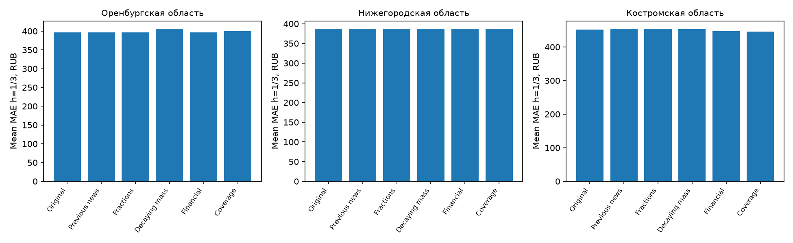

# Затухание самого новостного сигнала

Средняя MAE лучшего исходного Ensemble на h=1/3 не улучшилась ни в одной области. Основная модель по этому исследовательскому запуску автоматически не заменяется.

| base_model   |   financial_only |   matched_coverage |   original |   selected_fractions |   selected_mass |   previous_news |   change_pct | region                |
|:-------------|-----------------:|-------------------:|-----------:|---------------------:|----------------:|----------------:|-------------:|:----------------------|
| Ensemble     |           396.60 |             399.75 |     396.60 |               396.60 |          406.80 |          396.60 |         2.57 | Оренбургская область  |
| Ensemble     |           387.71 |             387.71 |     387.71 |               387.71 |          387.71 |          387.71 |         0.00 | Нижегородская область |
| Ensemble     |           447.01 |             445.82 |     451.81 |               454.93 |          453.05 |          454.93 |         0.27 | Костромская область   |

## Протокол

Экономические публикации и прежние правила географии/категорий. Вес события = sampling_weight × 2^(-age_days / half_life). Периоды полураспада 14/30/90 дней. Каждый положительный/негативный/смешанный/неизвестный сигнал и направление — абсолютная взвешенная масса с log1p; знаковая сумма тональности — sign(sum) × log1p(abs(sum)). При отсутствии новых событий весь сигнал стремится к нулю. Нейтральные/неизвестные направления не становятся ростом или падением. Объём всего корпуса, географический экономический объём и объём совпавшей категории — отдельные признаки.

selected_mass и selected_fractions отдельно выбирают период, alpha=100/1000 и shrink=0/.1/.25/.5 только на validation январь–июнь 2024 в каждой области. Все 24 набора для восьми моделей и трёх регионов сохранены до первого текущего test scoring. Обучение использует только созревшие прошлые ошибки; нулевая поправка допустима. h=12 без созревшего обучения на validation сохраняет базу.

selected_fractions — контроль прежней нормировки, локально выбирающий только три затухающих представления. previous_news — сохранённый прежний экономический подбор (окна или доли с затуханием; перенос для Оренбургской, местный подбор для двух других областей). financial_only исключает новости. matched_coverage сохраняет все три объёмных признака с тем же выбранным полураспадом, без содержания; его alpha/shrink выбраны отдельно на validation.

## Оренбургская область

| base_model              |   financial_only |   matched_coverage |   original |   selected_fractions |   selected_mass |   previous_news |   change_pct |
|:------------------------|-----------------:|-------------------:|-----------:|---------------------:|----------------:|----------------:|-------------:|
| Chronos2_NatCov         |           472.42 |             474.07 |     471.58 |               475.82 |          480.86 |          475.82 |         1.97 |
| Ensemble                |           396.60 |             399.75 |     396.60 |               396.60 |          406.80 |          396.60 |         2.57 |
| NatPath_K1              |           445.36 |             443.58 |     442.44 |               457.23 |          452.90 |          477.82 |         2.36 |
| NatPath_K3              |           502.16 |             509.62 |     507.92 |               523.72 |          524.10 |          523.72 |         3.18 |
| PastOnlyBlend           |           414.37 |             426.15 |     414.24 |               415.51 |          433.31 |          415.51 |         4.60 |
| Prophet                 |           496.77 |             496.77 |     496.77 |               496.77 |          496.77 |          496.77 |         0.00 |
| SeasonalNaive_NatGrowth |           497.44 |             502.84 |     528.38 |               500.06 |          505.71 |          500.06 |        -4.29 |
| StructHGB               |           491.09 |             489.11 |     495.16 |               501.25 |          502.06 |          505.19 |         1.39 |

Ensemble по горизонтам:

| variant            |      1 |      3 |      6 |     12 |
|:-------------------|-------:|-------:|-------:|-------:|
| financial_only     | 367.33 | 425.87 | 445.57 | 511.78 |
| matched_coverage   | 367.33 | 432.17 | 493.33 | 511.78 |
| original           | 367.33 | 425.87 | 424.66 | 511.78 |
| selected_fractions | 367.33 | 425.87 | 613.67 | 511.78 |
| selected_mass      | 367.33 | 446.27 | 424.66 | 511.78 |

Выбор Ensemble:

| variant       |   alpha |   shrink |   h |   validation_mae | family             | base_model   |
|:--------------|--------:|---------:|----:|-----------------:|:-------------------|:-------------|
| mass_14d      |     100 |    0.000 |   1 |          268.870 | selected_mass      | Ensemble     |
| mass_14d      |    1000 |    0.100 |   3 |          289.677 | selected_mass      | Ensemble     |
| mass_14d      |     100 |    0.000 |   6 |          454.974 | selected_mass      | Ensemble     |
| mass_14d      |     100 |    0.000 |  12 |          675.277 | selected_mass      | Ensemble     |
| fractions_14d |     100 |    0.000 |   1 |          268.870 | selected_fractions | Ensemble     |
| fractions_14d |     100 |    0.000 |   3 |          291.179 | selected_fractions | Ensemble     |
| fractions_14d |     100 |    0.100 |   6 |          451.205 | selected_fractions | Ensemble     |
| fractions_14d |     100 |    0.000 |  12 |          675.277 | selected_fractions | Ensemble     |

Bootstrap Ensemble (отрицательная разность MAE лучше):

| base_model   |   h | comparator         |   mae_difference |   ci_low |   ci_high |   target_months |
|:-------------|----:|:-------------------|-----------------:|---------:|----------:|----------------:|
| Ensemble     |   1 | original           |            0.000 |    0.000 |     0.000 |               6 |
| Ensemble     |   1 | financial_only     |            0.000 |    0.000 |     0.000 |               6 |
| Ensemble     |   1 | matched_coverage   |            0.000 |    0.000 |     0.000 |               6 |
| Ensemble     |   1 | selected_fractions |            0.000 |    0.000 |     0.000 |               6 |
| Ensemble     |   3 | original           |           20.400 |   14.502 |    25.403 |               6 |
| Ensemble     |   3 | financial_only     |           20.400 |   14.502 |    25.403 |               6 |
| Ensemble     |   3 | matched_coverage   |           14.106 |    8.762 |    19.981 |               6 |
| Ensemble     |   3 | selected_fractions |           20.400 |   14.502 |    25.403 |               6 |
| Ensemble     |   6 | original           |            0.000 |    0.000 |     0.000 |               6 |
| Ensemble     |   6 | financial_only     |          -20.907 |  -93.638 |    27.103 |               6 |
| Ensemble     |   6 | matched_coverage   |          -68.666 | -158.847 |    -4.509 |               6 |
| Ensemble     |   6 | selected_fractions |         -189.006 | -344.655 |   -66.255 |               6 |
| Ensemble     |  12 | original           |            0.000 |    0.000 |     0.000 |               6 |
| Ensemble     |  12 | financial_only     |            0.000 |    0.000 |     0.000 |               6 |
| Ensemble     |  12 | matched_coverage   |            0.000 |    0.000 |     0.000 |               6 |
| Ensemble     |  12 | selected_fractions |            0.000 |    0.000 |     0.000 |               6 |

## Нижегородская область

| base_model              |   financial_only |   matched_coverage |   original |   selected_fractions |   selected_mass |   previous_news |   change_pct |
|:------------------------|-----------------:|-------------------:|-----------:|---------------------:|----------------:|----------------:|-------------:|
| Chronos2_NatCov         |           524.14 |             521.93 |     522.24 |               523.14 |          522.58 |          523.14 |         0.07 |
| Ensemble                |           387.71 |             387.71 |     387.71 |               387.71 |          387.71 |          387.71 |         0.00 |
| NatPath_K1              |           456.71 |             466.54 |     455.26 |               467.04 |          466.29 |          467.04 |         2.42 |
| NatPath_K3              |           531.43 |             523.35 |     529.75 |               518.78 |          520.20 |          518.78 |        -1.80 |
| PastOnlyBlend           |           413.72 |             406.93 |     399.81 |               403.07 |          400.39 |          403.07 |         0.14 |
| Prophet                 |           564.83 |             564.83 |     564.83 |               564.83 |          564.83 |          564.83 |         0.00 |
| SeasonalNaive_NatGrowth |           409.20 |             399.51 |     428.56 |               398.81 |          394.91 |          398.81 |        -7.85 |
| StructHGB               |           506.55 |             504.51 |     510.73 |               501.15 |          502.30 |          501.15 |        -1.65 |

Ensemble по горизонтам:

| variant            |      1 |      3 |      6 |     12 |
|:-------------------|-------:|-------:|-------:|-------:|
| financial_only     | 360.11 | 415.31 | 405.25 | 481.43 |
| matched_coverage   | 360.11 | 415.31 | 414.05 | 481.43 |
| original           | 360.11 | 415.31 | 372.47 | 481.43 |
| selected_fractions | 360.11 | 415.31 | 409.49 | 481.43 |
| selected_mass      | 360.11 | 415.31 | 416.78 | 481.43 |

Выбор Ensemble:

| variant       |   alpha |   shrink |   h |   validation_mae | family             | base_model   |
|:--------------|--------:|---------:|----:|-----------------:|:-------------------|:-------------|
| mass_14d      |     100 |    0.000 |   1 |          312.072 | selected_mass      | Ensemble     |
| mass_14d      |     100 |    0.000 |   3 |          341.230 | selected_mass      | Ensemble     |
| mass_14d      |     100 |    0.100 |   6 |          424.293 | selected_mass      | Ensemble     |
| mass_14d      |     100 |    0.000 |  12 |          635.527 | selected_mass      | Ensemble     |
| fractions_14d |     100 |    0.000 |   1 |          312.072 | selected_fractions | Ensemble     |
| fractions_14d |     100 |    0.000 |   3 |          341.230 | selected_fractions | Ensemble     |
| fractions_14d |     100 |    0.100 |   6 |          431.162 | selected_fractions | Ensemble     |
| fractions_14d |     100 |    0.000 |  12 |          635.527 | selected_fractions | Ensemble     |

Bootstrap Ensemble (отрицательная разность MAE лучше):

| base_model   |   h | comparator         |   mae_difference |   ci_low |   ci_high |   target_months |
|:-------------|----:|:-------------------|-----------------:|---------:|----------:|----------------:|
| Ensemble     |   1 | original           |            0.000 |    0.000 |     0.000 |               6 |
| Ensemble     |   1 | financial_only     |            0.000 |    0.000 |     0.000 |               6 |
| Ensemble     |   1 | matched_coverage   |            0.000 |    0.000 |     0.000 |               6 |
| Ensemble     |   1 | selected_fractions |            0.000 |    0.000 |     0.000 |               6 |
| Ensemble     |   3 | original           |            0.000 |    0.000 |     0.000 |               6 |
| Ensemble     |   3 | financial_only     |            0.000 |    0.000 |     0.000 |               6 |
| Ensemble     |   3 | matched_coverage   |            0.000 |    0.000 |     0.000 |               6 |
| Ensemble     |   3 | selected_fractions |            0.000 |    0.000 |     0.000 |               6 |
| Ensemble     |   6 | original           |           44.310 |  -23.836 |   147.858 |               6 |
| Ensemble     |   6 | financial_only     |           11.535 |   -0.177 |    26.499 |               6 |
| Ensemble     |   6 | matched_coverage   |            2.730 |  -13.746 |    22.672 |               6 |
| Ensemble     |   6 | selected_fractions |            7.296 |   -4.583 |    19.090 |               6 |
| Ensemble     |  12 | original           |            0.000 |    0.000 |     0.000 |               6 |
| Ensemble     |  12 | financial_only     |            0.000 |    0.000 |     0.000 |               6 |
| Ensemble     |  12 | matched_coverage   |            0.000 |    0.000 |     0.000 |               6 |
| Ensemble     |  12 | selected_fractions |            0.000 |    0.000 |     0.000 |               6 |

## Костромская область

| base_model              |   financial_only |   matched_coverage |   original |   selected_fractions |   selected_mass |   previous_news |   change_pct |
|:------------------------|-----------------:|-------------------:|-----------:|---------------------:|----------------:|----------------:|-------------:|
| Chronos2_NatCov         |           543.83 |             543.93 |     546.01 |               546.61 |          550.21 |          546.16 |         0.77 |
| Ensemble                |           447.01 |             445.82 |     451.81 |               454.93 |          453.05 |          454.93 |         0.27 |
| NatPath_K1              |           528.30 |             511.85 |     513.30 |               559.21 |          536.82 |          559.21 |         4.58 |
| NatPath_K3              |           577.97 |             560.56 |     584.29 |               612.71 |          601.08 |          625.59 |         2.87 |
| PastOnlyBlend           |           468.95 |             466.29 |     466.07 |               486.29 |          479.22 |          477.44 |         2.82 |
| Prophet                 |           586.89 |             586.89 |     586.89 |               586.89 |          586.89 |          599.59 |         0.00 |
| SeasonalNaive_NatGrowth |           529.80 |             527.52 |     584.01 |               546.28 |          530.55 |          546.28 |        -9.15 |
| StructHGB               |           555.48 |             545.51 |     561.22 |               570.21 |          567.07 |          564.17 |         1.04 |

Ensemble по горизонтам:

| variant            |      1 |      3 |      6 |     12 |
|:-------------------|-------:|-------:|-------:|-------:|
| financial_only     | 417.06 | 476.95 | 489.22 | 595.45 |
| matched_coverage   | 417.06 | 474.57 | 471.15 | 595.45 |
| original           | 417.06 | 486.55 | 501.16 | 595.45 |
| selected_fractions | 417.06 | 492.79 | 501.16 | 595.45 |
| selected_mass      | 417.06 | 489.03 | 501.16 | 595.45 |

Выбор Ensemble:

| variant       |   alpha |   shrink |   h |   validation_mae | family             | base_model   |
|:--------------|--------:|---------:|----:|-----------------:|:-------------------|:-------------|
| mass_14d      |     100 |    0.000 |   1 |          360.482 | selected_mass      | Ensemble     |
| mass_14d      |    1000 |    0.100 |   3 |          396.445 | selected_mass      | Ensemble     |
| mass_14d      |     100 |    0.000 |   6 |          542.791 | selected_mass      | Ensemble     |
| mass_14d      |     100 |    0.000 |  12 |          702.676 | selected_mass      | Ensemble     |
| fractions_14d |     100 |    0.000 |   1 |          360.482 | selected_fractions | Ensemble     |
| fractions_14d |    1000 |    0.100 |   3 |          384.156 | selected_fractions | Ensemble     |
| fractions_14d |     100 |    0.000 |   6 |          542.791 | selected_fractions | Ensemble     |
| fractions_14d |     100 |    0.000 |  12 |          702.676 | selected_fractions | Ensemble     |

Bootstrap Ensemble (отрицательная разность MAE лучше):

| base_model   |   h | comparator         |   mae_difference |   ci_low |   ci_high |   target_months |
|:-------------|----:|:-------------------|-----------------:|---------:|----------:|----------------:|
| Ensemble     |   1 | original           |            0.000 |    0.000 |     0.000 |               6 |
| Ensemble     |   1 | financial_only     |            0.000 |    0.000 |     0.000 |               6 |
| Ensemble     |   1 | matched_coverage   |            0.000 |    0.000 |     0.000 |               6 |
| Ensemble     |   1 | selected_fractions |            0.000 |    0.000 |     0.000 |               6 |
| Ensemble     |   3 | original           |            2.482 |  -14.766 |    27.169 |               6 |
| Ensemble     |   3 | financial_only     |           12.082 |   -4.245 |    37.137 |               6 |
| Ensemble     |   3 | matched_coverage   |           14.459 |    1.554 |    36.148 |               6 |
| Ensemble     |   3 | selected_fractions |           -3.761 |  -12.506 |     1.787 |               6 |
| Ensemble     |   6 | original           |            0.000 |    0.000 |     0.000 |               6 |
| Ensemble     |   6 | financial_only     |           11.934 |  -56.684 |    55.084 |               6 |
| Ensemble     |   6 | matched_coverage   |           30.007 |  -24.646 |    71.076 |               6 |
| Ensemble     |   6 | selected_fractions |            0.000 |    0.000 |     0.000 |               6 |
| Ensemble     |  12 | original           |            0.000 |    0.000 |     0.000 |               6 |
| Ensemble     |  12 | financial_only     |            0.000 |    0.000 |     0.000 |               6 |
| Ensemble     |  12 | matched_coverage   |            0.000 |    0.000 |     0.000 |               6 |
| Ensemble     |  12 | selected_fractions |            0.000 |    0.000 |     0.000 |               6 |

## Ограничения и воспроизведение

Повторная исследовательская оценка на уже просмотренном test июль–декабрь 2024, шесть целевых месяцев и много сравнений. Bootstrap по целевым месяцам не исправляет множественность сравнений и не доказывает причинность. Современная LLM, заголовки, пилотные 1200 публикаций на регион и ретроспективные ограничения исходной модели остаются. Независимой ручной точности разметки пока нет; см. [аудит разметки](../../../docs/NEWS_LABEL_AUDIT_RU.md). Новый период данных здесь не добавлялся.

Запуск в существующей среде: `python scripts/evaluate_news_mass.py`. Конфигурация configs/news_mass.json; результаты `artifacts/news_mass_runs/mass_20261009T155140_551755Z`. Сырые разметки и бинарные прогнозы не включаются в Git.
