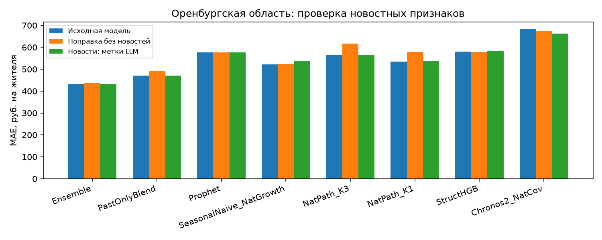

# LLM-разметка новостей и прогнозы

Запуск `llm_20261008T151443_476526Z`. Qwen через локальный llama.cpp; разметка только заголовков. Обработано **1200 публикаций**, 1189 уникальных заголовков, за 24 месяцев. Регион: Оренбургская область, 39 МО × 6 категорий = 234 ряда. Все сравнения исследовательские: тест уже просмотрен, современная LLM может знать последующие события.

## Сравнение с исходными моделями

Лучшая исходная модель — **Ensemble**: средняя MAE 432.41 → 432.41 руб./жителя (+0.00%). Валидация выбрала shrink=0 на всех горизонтах: LLM-поправка не применяется. Максимальное среднее улучшение — Chronos2_NatCov: 681.97 → 661.92 (-2.94%). Это не улучшение лучшего ансамбля. SeasonalNaive_NatGrowth, h=1: bootstrap поддерживает снижение относительно исходной модели. Chronos2_NatCov, h=6: bootstrap поддерживает снижение относительно исходной модели. Но интервалы сравнения с поправкой без новостей и вариантом, учитывающим только количество новостей включают ноль; добавочная польза содержания не доказана.

Средняя MAE по h=1/3/6/12; отрицательное изменение — улучшение.

| Модель                   |   Исходная MAE, руб. |   MAE без новостей, руб. |   MAE с новостями, руб. |   Изменение ошибки, % |   Разность с поправкой без новостей, руб. |
|:------------------------|--------------------:|-----------------------------:|---------------:|-------------:|-----------------------------:|
| Ensemble                |              432.41 |                       437.64 |         432.41 |         0.00 |                        -5.23 |
| PastOnlyBlend           |              470.25 |                       490.73 |         470.25 |         0.00 |                       -20.48 |
| Prophet                 |              577.15 |                       577.15 |         577.15 |         0.00 |                         0.00 |
| SeasonalNaive_NatGrowth |              522.17 |                       524.11 |         539.14 |         3.25 |                        15.04 |
| NatPath_K3              |              565.58 |                       616.15 |         566.69 |         0.20 |                       -49.46 |
| NatPath_K1              |              535.67 |                       577.81 |         536.14 |         0.09 |                       -41.67 |
| StructHGB               |              580.38 |                       578.34 |         584.33 |         0.68 |                         5.98 |
| Chronos2_NatCov         |              681.97 |                       674.62 |         661.92 |        -2.94 |                       -12.70 |

Полная таблица по горизонтам:

| Модель                                     |      1 |      3 |      6 |      12 |
|:------------------------------------------|-------:|-------:|-------:|--------:|
| Chronos2_NatCov                           | 395.63 | 547.52 | 678.99 | 1105.73 |
| Chronos2_NatCov+Количество новостей             | 395.63 | 559.40 | 607.99 | 1105.73 |
| Chronos2_NatCov+Поправка без новостей            | 395.63 | 549.21 | 647.91 | 1105.73 |
| Chronos2_NatCov+Новости: метки LLM                       | 395.63 | 556.20 | 590.12 | 1105.73 |
| Chronos2_NatCov+Новости с задержкой 3 месяца            | 395.63 | 559.26 | 862.59 | 1105.73 |
| Chronos2_NatCov+Новости: отбор по ключевым словам         | 417.64 | 579.86 | 809.37 | 1105.73 |
| Ensemble                                  | 367.33 | 425.87 | 424.66 |  511.78 |
| Ensemble+Количество новостей                    | 367.33 | 433.53 | 424.66 |  511.78 |
| Ensemble+Поправка без новостей                   | 367.33 | 425.87 | 445.57 |  511.78 |
| Ensemble+Новости: метки LLM                              | 367.33 | 425.87 | 424.66 |  511.78 |
| Ensemble+Новости с задержкой 3 месяца                   | 367.33 | 425.87 | 434.41 |  511.78 |
| Ensemble+Новости: отбор по ключевым словам                | 367.33 | 436.29 | 424.66 |  511.78 |
| NatPath_K1                                | 323.85 | 561.04 | 734.42 |  523.38 |
| NatPath_K1+Количество новостей                  | 326.30 | 572.20 | 921.19 |  523.38 |
| NatPath_K1+Поправка без новостей                 | 323.01 | 567.71 | 897.14 |  523.38 |
| NatPath_K1+Новости: метки LLM                            | 332.04 | 593.36 | 695.76 |  523.38 |
| NatPath_K1+Новости с задержкой 3 месяца                 | 325.37 | 558.52 | 703.52 |  523.38 |
| NatPath_K1+Новости: отбор по ключевым словам              | 327.42 | 585.37 | 761.54 |  523.38 |
| NatPath_K3                                | 396.49 | 619.36 | 661.80 |  584.68 |
| NatPath_K3+Количество новостей                  | 400.68 | 615.36 | 838.40 |  584.68 |
| NatPath_K3+Поправка без новостей                 | 396.89 | 607.42 | 875.59 |  584.68 |
| NatPath_K3+Новости: метки LLM                            | 401.68 | 645.61 | 634.79 |  584.68 |
| NatPath_K3+Новости с задержкой 3 месяца                 | 393.09 | 584.59 | 924.55 |  584.68 |
| NatPath_K3+Новости: отбор по ключевым словам              | 391.58 | 642.95 | 658.13 |  584.68 |
| PastOnlyBlend                             | 375.87 | 452.60 | 510.05 |  542.49 |
| PastOnlyBlend+Количество новостей               | 375.87 | 476.23 | 510.05 |  542.49 |
| PastOnlyBlend+Поправка без новостей              | 376.14 | 452.60 | 591.69 |  542.49 |
| PastOnlyBlend+Новости: метки LLM                         | 375.87 | 452.60 | 510.05 |  542.49 |
| PastOnlyBlend+Новости с задержкой 3 месяца              | 370.75 | 454.75 | 563.86 |  542.49 |
| PastOnlyBlend+Новости: отбор по ключевым словам           | 375.10 | 481.12 | 510.05 |  542.49 |
| Prophet                                   | 466.11 | 527.42 | 533.74 |  781.34 |
| Prophet+Количество новостей                     | 466.11 | 542.23 | 533.74 |  781.34 |
| Prophet+Поправка без новостей                    | 466.11 | 527.42 | 533.74 |  781.34 |
| Prophet+Новости: метки LLM                               | 466.11 | 527.42 | 533.74 |  781.34 |
| Prophet+Новости с задержкой 3 месяца                    | 466.11 | 527.42 | 533.74 |  781.34 |
| Prophet+Новости: отбор по ключевым словам                 | 466.11 | 567.49 | 533.74 |  781.34 |
| SeasonalNaive_NatGrowth                   | 530.39 | 526.36 | 508.53 |  523.38 |
| SeasonalNaive_NatGrowth+Количество новостей     | 476.50 | 512.08 | 537.01 |  523.38 |
| SeasonalNaive_NatGrowth+Поправка без новостей    | 481.90 | 512.98 | 578.16 |  523.38 |
| SeasonalNaive_NatGrowth+Новости: метки LLM               | 519.98 | 526.36 | 586.86 |  523.38 |
| SeasonalNaive_NatGrowth+Новости с задержкой 3 месяца    | 478.77 | 498.70 | 523.74 |  523.38 |
| SeasonalNaive_NatGrowth+Новости: отбор по ключевым словам | 468.18 | 500.24 | 539.64 |  523.38 |
| StructHGB                                 | 381.73 | 608.59 | 794.30 |  536.90 |
| StructHGB+Количество новостей                   | 381.39 | 597.30 | 794.30 |  536.90 |
| StructHGB+Поправка без новостей                  | 381.73 | 600.45 | 794.30 |  536.90 |
| StructHGB+Новости: метки LLM                             | 381.73 | 624.38 | 794.30 |  536.90 |
| StructHGB+Новости с задержкой 3 месяца                  | 379.40 | 579.56 | 794.30 |  536.90 |
| StructHGB+Новости: отбор по ключевым словам               | 378.31 | 610.01 | 794.30 |  536.90 |

## Региональные категории и муниципалитеты

Все числа относятся только к Оренбургской области. Разрез основной модели по категориям, MAE:

| Категория             | Модель                   |      1 |       3 |       6 |      12 |
|:---------------------|:------------------------|-------:|--------:|--------:|--------:|
| Все категории        | Ensemble                | 889.94 | 1048.23 | 1017.36 | 1098.03 |
| Все категории        | Ensemble+Количество новостей  | 889.94 | 1102.84 | 1017.36 | 1098.03 |
| Все категории        | Ensemble+Поправка без новостей | 889.94 | 1048.23 | 1186.42 | 1098.03 |
| Все категории        | Ensemble+Новости: метки LLM            | 889.94 | 1048.23 | 1017.36 | 1098.03 |
| Здоровье             | Ensemble                |  92.60 |   98.80 |  129.14 |  162.60 |
| Здоровье             | Ensemble+Количество новостей  |  92.60 |  101.41 |  129.14 |  162.60 |
| Здоровье             | Ensemble+Поправка без новостей |  92.60 |   98.80 |  148.56 |  162.60 |
| Здоровье             | Ensemble+Новости: метки LLM            |  92.60 |   98.80 |  129.14 |  162.60 |
| Маркетплейсы         | Ensemble                | 471.09 |  506.74 |  571.54 |  951.77 |
| Маркетплейсы         | Ensemble+Количество новостей  | 471.09 |  472.34 |  571.54 |  951.77 |
| Маркетплейсы         | Ensemble+Поправка без новостей | 471.09 |  506.74 |  420.88 |  951.77 |
| Маркетплейсы         | Ensemble+Новости: метки LLM            | 471.09 |  506.74 |  571.54 |  951.77 |
| Общественное питание | Ensemble                |  81.92 |   93.26 |   76.04 |  120.04 |
| Общественное питание | Ensemble+Количество новостей  |  81.92 |   93.47 |   76.04 |  120.04 |
| Общественное питание | Ensemble+Поправка без новостей |  81.92 |   93.26 |   76.50 |  120.04 |
| Общественное питание | Ensemble+Новости: метки LLM            |  81.92 |   93.26 |   76.04 |  120.04 |
| Продовольствие       | Ensemble                | 591.06 |  725.07 |  664.84 |  580.12 |
| Продовольствие       | Ensemble+Количество новостей  | 591.06 |  749.16 |  664.84 |  580.12 |
| Продовольствие       | Ensemble+Поправка без новостей | 591.06 |  725.07 |  760.11 |  580.12 |
| Продовольствие       | Ensemble+Новости: метки LLM            | 591.06 |  725.07 |  664.84 |  580.12 |
| Транспорт            | Ensemble                |  77.39 |   83.12 |   89.06 |  158.11 |
| Транспорт            | Ensemble+Количество новостей  |  77.39 |   81.95 |   89.06 |  158.11 |
| Транспорт            | Ensemble+Поправка без новостей |  77.39 |   83.12 |   80.95 |  158.11 |
| Транспорт            | Ensemble+Новости: метки LLM            |  77.39 |   83.12 |   89.06 |  158.11 |

Доля муниципалитетов с уменьшением MAE, усреднённой по шести категориям и целевым месяцам:

| Модель              |   Горизонт, мес. |   Муниципалитетов |   Доля улучшенных муниципалитетов |   Доля без изменения |
|:------------------------|----:|-----------------:|-----------------:|------------------:|
| Ensemble                |   1 |               39 |            0.000 |             1.000 |
| Ensemble                |   3 |               39 |            0.000 |             1.000 |
| Ensemble                |   6 |               39 |            0.000 |             1.000 |
| Ensemble                |  12 |               39 |            0.000 |             1.000 |
| PastOnlyBlend           |   1 |               39 |            0.000 |             1.000 |
| PastOnlyBlend           |   3 |               39 |            0.000 |             1.000 |
| PastOnlyBlend           |   6 |               39 |            0.000 |             1.000 |
| PastOnlyBlend           |  12 |               39 |            0.000 |             1.000 |
| Prophet                 |   1 |               39 |            0.000 |             1.000 |
| Prophet                 |   3 |               39 |            0.000 |             1.000 |
| Prophet                 |   6 |               39 |            0.000 |             1.000 |
| Prophet                 |  12 |               39 |            0.000 |             1.000 |
| SeasonalNaive_NatGrowth |   1 |               39 |            1.000 |             0.000 |
| SeasonalNaive_NatGrowth |   3 |               39 |            0.000 |             1.000 |
| SeasonalNaive_NatGrowth |   6 |               39 |            0.128 |             0.000 |
| SeasonalNaive_NatGrowth |  12 |               39 |            0.000 |             1.000 |
| NatPath_K3              |   1 |               39 |            0.179 |             0.000 |
| NatPath_K3              |   3 |               39 |            0.000 |             0.000 |
| NatPath_K3              |   6 |               39 |            0.846 |             0.000 |
| NatPath_K3              |  12 |               39 |            0.000 |             1.000 |
| NatPath_K1              |   1 |               39 |            0.385 |             0.000 |
| NatPath_K1              |   3 |               39 |            0.000 |             0.000 |
| NatPath_K1              |   6 |               39 |            0.872 |             0.000 |
| NatPath_K1              |  12 |               39 |            0.000 |             1.000 |
| StructHGB               |   1 |               39 |            0.000 |             1.000 |
| StructHGB               |   3 |               39 |            0.051 |             0.000 |
| StructHGB               |   6 |               39 |            0.000 |             1.000 |
| StructHGB               |  12 |               39 |            0.000 |             1.000 |
| Chronos2_NatCov         |   1 |               39 |            0.000 |             1.000 |
| Chronos2_NatCov         |   3 |               39 |            0.308 |             0.000 |
| Chronos2_NatCov         |   6 |               39 |            0.974 |             0.000 |
| Chronos2_NatCov         |  12 |               39 |            0.000 |             1.000 |

## Что именно проверено

Для каждой исходной модели проверена одинаковая Ridge-поправка по созревшим ошибкам: только финансовые признаки, вариант только с количеством новостей выборки, существующие правила на полном корпусе, LLM-признаки, LLM с задержкой 3 месяца. Alpha и shrink выбираются отдельно по модели/горизонту на периоде подбора параметров; shrink=0 разрешает оставить исходный прогноз. Поэтому улучшение против оригинала само по себе не доказывает вклад содержания: важны сравнения с Поправка без новостей и Количество новостей. Нулевая выбранная поправка означает, что validation отвергла применение LLM на этом горизонте.

На h=12 в validation только один целевой месяц с origin=5: в этот момент нет ошибок, для которых уже известны фактические расходы для обучения поправки. Все кандидаты совпадают с исходной моделью, при равенстве выбирается shrink=0. Поэтому h=12 остаётся без поправки; это отсутствие данных для выбора, а не доказательство бесполезности LLM на годовом горизонте.

Нулевые/неположительные исходные прогнозы исключаются только из обучения логарифмической поправки; число исключений записано в training_audit.csv. В оценке остаются все ряды и исходные нулевые прогнозы: мультипликативная поправка не заменяет их искусственным положительным значением.

Исходный Ensemble наследует ретроспективные ограничения весов. PastOnlyBlend показан отдельно; поздний подбор гиперпараметров по результатам периода подбора параметров также не превращает опыт в строгий исторический онлайн-тест. Для такого теста понадобится новый период или последовательный подбор.

Выбранные параметры LLM-поправки:

| Вариант   |   Регуляризация Ridge (alpha) |   Доля применяемой поправки |   Горизонт, мес. |   MAE на периоде подбора, руб. | Модель              |
|:----------|--------:|---------:|----:|-----------------:|:------------------------|
| Новости: метки LLM       |     100 |    0.000 |   1 |          268.870 | Ensemble                |
| Новости: метки LLM       |     100 |    0.000 |   3 |          291.179 | Ensemble                |
| Новости: метки LLM       |     100 |    0.000 |   6 |          454.974 | Ensemble                |
| Новости: метки LLM       |     100 |    0.000 |  12 |          675.277 | Ensemble                |
| Новости: метки LLM       |     100 |    0.000 |   1 |          329.889 | PastOnlyBlend           |
| Новости: метки LLM       |     100 |    0.000 |   3 |          399.567 | PastOnlyBlend           |
| Новости: метки LLM       |     100 |    0.000 |   6 |          526.274 | PastOnlyBlend           |
| Новости: метки LLM       |     100 |    0.000 |  12 |          656.207 | PastOnlyBlend           |
| Новости: метки LLM       |     100 |    0.000 |   3 |          401.174 | Prophet                 |
| Новости: метки LLM       |     100 |    0.000 |   1 |          403.534 | Prophet                 |
| Новости: метки LLM       |     100 |    0.000 |   6 |          687.570 | Prophet                 |
| Новости: метки LLM       |     100 |    0.000 |  12 |          995.652 | Prophet                 |
| Новости: метки LLM       |    1000 |    0.100 |   1 |          484.400 | SeasonalNaive_NatGrowth |
| Новости: метки LLM       |     100 |    0.000 |   3 |          495.410 | SeasonalNaive_NatGrowth |
| Новости: метки LLM       |    1000 |    0.100 |   6 |          519.310 | SeasonalNaive_NatGrowth |
| Новости: метки LLM       |     100 |    0.000 |  12 |          741.308 | SeasonalNaive_NatGrowth |
| Новости: метки LLM       |     100 |    0.100 |   1 |          356.974 | NatPath_K3              |
| Новости: метки LLM       |     100 |    0.100 |   3 |          377.723 | NatPath_K3              |
| Новости: метки LLM       |     100 |    0.000 |  12 |          677.480 | NatPath_K3              |
| Новости: метки LLM       |    1000 |    0.100 |   6 |          711.809 | NatPath_K3              |
| Новости: метки LLM       |     100 |    0.250 |   1 |          342.885 | NatPath_K1              |
| Новости: метки LLM       |     100 |    0.100 |   3 |          349.422 | NatPath_K1              |
| Новости: метки LLM       |     100 |    0.000 |  12 |          741.308 | NatPath_K1              |
| Новости: метки LLM       |    1000 |    0.100 |   6 |          745.564 | NatPath_K1              |
| Новости: метки LLM       |     100 |    0.100 |   3 |          334.255 | StructHGB               |
| Новости: метки LLM       |     100 |    0.000 |   1 |          349.088 | StructHGB               |
| Новости: метки LLM       |     100 |    0.000 |   6 |          612.747 | StructHGB               |
| Новости: метки LLM       |     100 |    0.000 |  12 |          677.480 | StructHGB               |
| Новости: метки LLM       |     100 |    0.100 |   3 |          434.007 | Chronos2_NatCov         |
| Новости: метки LLM       |     100 |    0.000 |   1 |          466.407 | Chronos2_NatCov         |
| Новости: метки LLM       |    1000 |    0.100 |   6 |          691.605 | Chronos2_NatCov         |
| Новости: метки LLM       |     100 |    0.000 |  12 |         1174.009 | Chronos2_NatCov         |

## Добавочная польза содержания

Разность MAE LLM минус контроль, 95% bootstrap шести целевых месяцев. Временная зависимость, малое число месяцев и множественные сравнения ограничивают интерпретацию.

| Модель              | Вариант   |   Горизонт, мес. | С чем сравниваем     |   Разность ошибок, руб. |   month_ci_low |   month_ci_high |   Месяцев проверки |
|:------------------------|:----------|----:|:---------------|-----------------:|---------------:|----------------:|----------------:|
| Ensemble                | Новости: метки LLM       |   1 | Поправка без новостей |            0.000 |          0.000 |           0.000 |               6 |
| Ensemble                | Новости: метки LLM       |   3 | Поправка без новостей |            0.000 |          0.000 |           0.000 |               6 |
| Ensemble                | Новости: метки LLM       |   6 | Поправка без новостей |          -20.907 |        -93.638 |          27.103 |               6 |
| Ensemble                | Новости: метки LLM       |  12 | Поправка без новостей |            0.000 |          0.000 |           0.000 |               6 |
| Ensemble                | Новости: метки LLM       |   1 | Количество новостей  |            0.000 |          0.000 |           0.000 |               6 |
| Ensemble                | Новости: метки LLM       |   3 | Количество новостей  |           -7.658 |        -17.928 |           1.299 |               6 |
| Ensemble                | Новости: метки LLM       |   6 | Количество новостей  |            0.000 |          0.000 |           0.000 |               6 |
| Ensemble                | Новости: метки LLM       |  12 | Количество новостей  |            0.000 |          0.000 |           0.000 |               6 |
| PastOnlyBlend           | Новости: метки LLM       |   1 | Поправка без новостей |           -0.275 |         -3.779 |           2.866 |               6 |
| PastOnlyBlend           | Новости: метки LLM       |   3 | Поправка без новостей |            0.000 |          0.000 |           0.000 |               6 |
| PastOnlyBlend           | Новости: метки LLM       |   6 | Поправка без новостей |          -81.635 |       -191.280 |           0.197 |               6 |
| PastOnlyBlend           | Новости: метки LLM       |  12 | Поправка без новостей |            0.000 |          0.000 |           0.000 |               6 |
| PastOnlyBlend           | Новости: метки LLM       |   1 | Количество новостей  |            0.000 |          0.000 |           0.000 |               6 |
| PastOnlyBlend           | Новости: метки LLM       |   3 | Количество новостей  |          -23.621 |        -36.361 |         -10.816 |               6 |
| PastOnlyBlend           | Новости: метки LLM       |   6 | Количество новостей  |            0.000 |          0.000 |           0.000 |               6 |
| PastOnlyBlend           | Новости: метки LLM       |  12 | Количество новостей  |            0.000 |          0.000 |           0.000 |               6 |
| Prophet                 | Новости: метки LLM       |   1 | Поправка без новостей |            0.000 |          0.000 |           0.000 |               6 |
| Prophet                 | Новости: метки LLM       |   3 | Поправка без новостей |            0.000 |          0.000 |           0.000 |               6 |
| Prophet                 | Новости: метки LLM       |   6 | Поправка без новостей |            0.000 |          0.000 |           0.000 |               6 |
| Prophet                 | Новости: метки LLM       |  12 | Поправка без новостей |            0.000 |          0.000 |           0.000 |               6 |
| Prophet                 | Новости: метки LLM       |   1 | Количество новостей  |            0.000 |          0.000 |           0.000 |               6 |
| Prophet                 | Новости: метки LLM       |   3 | Количество новостей  |          -14.811 |        -23.993 |          -5.177 |               6 |
| Prophet                 | Новости: метки LLM       |   6 | Количество новостей  |            0.000 |          0.000 |           0.000 |               6 |
| Prophet                 | Новости: метки LLM       |  12 | Количество новостей  |            0.000 |          0.000 |           0.000 |               6 |
| SeasonalNaive_NatGrowth | Новости: метки LLM       |   1 | Поправка без новостей |           38.072 |         19.658 |          64.807 |               6 |
| SeasonalNaive_NatGrowth | Новости: метки LLM       |   3 | Поправка без новостей |           13.381 |         -5.885 |          39.376 |               6 |
| SeasonalNaive_NatGrowth | Новости: метки LLM       |   6 | Поправка без новостей |            8.693 |        -68.026 |          69.344 |               6 |
| SeasonalNaive_NatGrowth | Новости: метки LLM       |  12 | Поправка без новостей |            0.000 |          0.000 |           0.000 |               6 |
| SeasonalNaive_NatGrowth | Новости: метки LLM       |   1 | Количество новостей  |           43.481 |         23.025 |          74.039 |               6 |
| SeasonalNaive_NatGrowth | Новости: метки LLM       |   3 | Количество новостей  |           14.284 |         -9.115 |          44.175 |               6 |
| SeasonalNaive_NatGrowth | Новости: метки LLM       |   6 | Количество новостей  |           49.851 |          2.367 |          91.886 |               6 |
| SeasonalNaive_NatGrowth | Новости: метки LLM       |  12 | Количество новостей  |            0.000 |          0.000 |           0.000 |               6 |
| NatPath_K3              | Новости: метки LLM       |   1 | Поправка без новостей |            4.786 |         -2.004 |          11.472 |               6 |
| NatPath_K3              | Новости: метки LLM       |   3 | Поправка без новостей |           38.183 |          5.248 |          67.130 |               6 |
| NatPath_K3              | Новости: метки LLM       |   6 | Поправка без новостей |         -240.805 |       -708.211 |         162.432 |               6 |
| NatPath_K3              | Новости: метки LLM       |  12 | Поправка без новостей |            0.000 |          0.000 |           0.000 |               6 |
| NatPath_K3              | Новости: метки LLM       |   1 | Количество новостей  |            0.998 |         -6.511 |           9.451 |               6 |
| NatPath_K3              | Новости: метки LLM       |   3 | Количество новостей  |           30.250 |          3.156 |          62.513 |               6 |
| NatPath_K3              | Новости: метки LLM       |   6 | Количество новостей  |         -203.606 |       -639.385 |         183.237 |               6 |
| NatPath_K3              | Новости: метки LLM       |  12 | Количество новостей  |            0.000 |          0.000 |           0.000 |               6 |
| NatPath_K1              | Новости: метки LLM       |   1 | Поправка без новостей |            9.032 |         -7.637 |          26.118 |               6 |
| NatPath_K1              | Новости: метки LLM       |   3 | Поправка без новостей |           25.648 |          2.999 |          44.853 |               6 |
| NatPath_K1              | Новости: метки LLM       |   6 | Поправка без новостей |         -201.377 |       -513.632 |         106.062 |               6 |
| NatPath_K1              | Новости: метки LLM       |  12 | Поправка без новостей |            0.000 |          0.000 |           0.000 |               6 |
| NatPath_K1              | Новости: метки LLM       |   1 | Количество новостей  |            5.735 |         -7.359 |          18.788 |               6 |
| NatPath_K1              | Новости: метки LLM       |   3 | Количество новостей  |           21.155 |         -0.307 |          42.265 |               6 |
| NatPath_K1              | Новости: метки LLM       |   6 | Количество новостей  |         -225.427 |       -587.013 |         115.596 |               6 |
| NatPath_K1              | Новости: метки LLM       |  12 | Количество новостей  |            0.000 |          0.000 |           0.000 |               6 |
| StructHGB               | Новости: метки LLM       |   1 | Поправка без новостей |            0.000 |          0.000 |           0.000 |               6 |
| StructHGB               | Новости: метки LLM       |   3 | Поправка без новостей |           23.923 |          1.032 |          44.962 |               6 |
| StructHGB               | Новости: метки LLM       |   6 | Поправка без новостей |            0.000 |          0.000 |           0.000 |               6 |
| StructHGB               | Новости: метки LLM       |  12 | Поправка без новостей |            0.000 |          0.000 |           0.000 |               6 |
| StructHGB               | Новости: метки LLM       |   1 | Количество новостей  |            0.342 |         -2.535 |           2.853 |               6 |
| StructHGB               | Новости: метки LLM       |   3 | Количество новостей  |           27.070 |         -1.022 |          54.100 |               6 |
| StructHGB               | Новости: метки LLM       |   6 | Количество новостей  |            0.000 |          0.000 |           0.000 |               6 |
| StructHGB               | Новости: метки LLM       |  12 | Количество новостей  |            0.000 |          0.000 |           0.000 |               6 |
| Chronos2_NatCov         | Новости: метки LLM       |   1 | Поправка без новостей |            0.000 |          0.000 |           0.000 |               6 |
| Chronos2_NatCov         | Новости: метки LLM       |   3 | Поправка без новостей |            6.988 |        -23.516 |          35.060 |               6 |
| Chronos2_NatCov         | Новости: метки LLM       |   6 | Поправка без новостей |          -57.790 |       -146.951 |          38.241 |               6 |
| Chronos2_NatCov         | Новости: метки LLM       |  12 | Поправка без новостей |            0.000 |          0.000 |           0.000 |               6 |
| Chronos2_NatCov         | Новости: метки LLM       |   1 | Количество новостей  |            0.000 |          0.000 |           0.000 |               6 |
| Chronos2_NatCov         | Новости: метки LLM       |   3 | Количество новостей  |           -3.201 |        -27.192 |          20.790 |               6 |
| Chronos2_NatCov         | Новости: метки LLM       |   6 | Количество новостей  |          -17.874 |       -124.082 |          69.064 |               6 |
| Chronos2_NatCov         | Новости: метки LLM       |  12 | Количество новостей  |            0.000 |          0.000 |           0.000 |               6 |

## Признаки и ограничения

36 признаков за 1 и 3 месяца: объём известной выборки, экономическая доля, число сообщений с совпадающей географией/категорией, доли негативной/позитивной/смешанной/неизвестной тональности, средняя тональность, направления цен/доходов/бизнеса с долями известности, доля чрезвычайных событий. Объяснения LLM не подаются в модель. География берётся из существующего сопоставления; неразрешённые топонимы не распространяются на область. Housing без категории не становится расходами на продовольствие/транспорт.

Выборка пилота стратифицирована по месяцу и прежнему признаку relevant, без финансовых значений. Обратные вероятности компенсируют разные доли отбора, но не устраняют шум и не гарантируют полного охвата новостей. Для полного корпуса используется вес 1. Разметка не прошла независимую ручную оценку; correctness JSON не означает correctness смысла. Историческая доступность принимается по публикации, фактический сбор и LLM-разметка выполнены в 2026 году.

## Воспроизведение

`python scripts/annotate_llm_news.py` — разметка с кешем и возобновлением; `--full` для всего корпуса, `--base-url` для другого адреса сервера. Затем `python scripts/evaluate_llm_news.py` (тот же `--full` при полном корпусе). Настройки: `configs/llm_news.json`. Сырые ответы и разметка: `data/inputs/llm_news/`, исключены из Git. Итоговые метрики, выбор и манифест: `artifacts/llm_news_runs/llm_20261008T151443_476526Z`. Исходные прогнозы и frozen-файлы не менялись.
