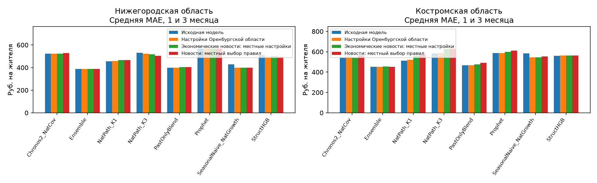

# Местный подбор новостных признаков: Нижегородская и Костромская области

Запуск `local_20261009T124348_521680Z`. Восемь моделей, те же 1 200 размеченных публикаций на область и те же исходные прогнозы, что в [эксперименте переноса](NEWS_DECAY_TRANSFER_RU.md). Новая разметка и скачивание не выполнялись.

## Выводы

**Местный подбор не улучшил среднюю MAE сильнейшего исходного Ensemble на h=1/3 ни в одной из двух областей.** Расширение выбора фильтра также не даёт среднего улучшения на этих горизонтах в данном запуске. Основную модель менять по этому эксперименту оснований нет.

Средняя MAE Ensemble по h=1/3, руб./жителя:

| Область                |   Исходная модель |   Новости: настройки Оренбургской области |   Поправка без новостей |   Количество новостей: настройки своей области |   Новости: настройки своей области |   Новости: выбор правил отбора |   Изменение с местными настройками, % |   Изменение с выбором правил, % |
|:----------------------|-----------:|-------------------:|-----------------:|----------------------:|-------------:|---------------:|------------------------:|--------------------------:|
| Нижегородская область |     387.71 |             387.71 |           387.71 |                387.71 |       387.71 |         387.71 |                    0.00 |                      0.00 |
| Костромская область   |     451.81 |             451.81 |           447.01 |                446.40 |       454.93 |         452.07 |                    0.69 |                      0.06 |

Отдельное улучшение на одном горизонте не означает улучшения модели в целом. Ненулевые поправки, принятые validation, местами ухудшают второе полугодие — в особенности на h=6. Местный подбор требует проверки на новом периоде; он не гарантирует преимущества перед перенесёнными настройками. Для слабых исходных моделей есть отдельные выигрыши (полные таблицы ниже), но исходный Ensemble остаётся точнее новостных версий остальных моделей на основных горизонтах этого теста.

## Протокол

В каждой области настройки выбираются отдельно для каждой модели и горизонта на январе–июне 2024. Проверяются коэффициенты регуляризации Ridge 100 и 1000 и доли применяемой поправки 0, 0,1, 0,25 и 0,5. После выбора в обеих областях сохраняются таблицы параметров и их контрольные суммы SHA256; только затем рассчитываются ошибки на июле–декабре. На каждой дате прогноза обучение использует только публикации и фактические расходы, уже доступные к этой дате.

**Новости: настройки своей области** — выбирается период 1/3 месяца или уменьшение веса старых новостей вдвое за 14/30/90 дней. Это тот же набор способов расчёта признаков, что при переносе Оренбургских настроек. **Новости: выбор правил отбора** — дополнительно разрешает все новости и экономические новости с чрезвычайными событиями. Выбор сделан на периоде подбора, а не на проверочном периоде.

**Поправка без новостей** использует прошлые расходы и ошибки модели. Для сравнения с содержанием есть варианты, учитывающие только количество новостей с той же географией, категорией и давностью. Их параметры Ridge подбираются отдельно на январе–июне. Нулевая доля поправки сохраняет исходный прогноз. Для горизонта 12 месяцев на периоде подбора ещё нет нужных прошлых примеров, поэтому поправка не применяется.

Объяснения обозначений и расчётов — в [словаре терминов](TERMS_RU.md).

## Нижегородская область

50 МО, 300 рядов, 1200 размеченных публикаций.

Ensemble, средняя MAE по h=1/3: 387.71 → 387.71 (+0.00%) при том же наборе экономических наборов признаков, что в переносе; с выбором фильтра — 387.71 (+0.00%). Теперь нулевая поправка выбрана собственной региональной validation: сохранение прогноза уже не следствие только Оренбургских настроек.

Основные горизонты h=1/3, средняя MAE:

| Модель              |   Исходная модель |   Новости: настройки Оренбургской области |   Поправка без новостей |   Количество новостей: настройки своей области |   Новости: настройки своей области |   Новости: выбор правил отбора |   Изменение с местными настройками, % |   Изменение с выбором правил, % |
|:------------------------|-----------:|-------------------:|-----------------:|----------------------:|-------------:|---------------:|------------------------:|--------------------------:|
| Chronos2_NatCov         |     522.24 |             523.75 |           524.14 |                524.17 |       523.14 |         529.50 |                    0.17 |                      1.39 |
| Ensemble                |     387.71 |             387.71 |           387.71 |                387.71 |       387.71 |         387.71 |                    0.00 |                      0.00 |
| NatPath_K1              |     455.26 |             457.66 |           456.71 |                467.03 |       467.04 |         467.04 |                    2.59 |                      2.59 |
| NatPath_K3              |     529.75 |             523.61 |           531.43 |                525.95 |       518.78 |         505.19 |                   -2.07 |                     -4.64 |
| PastOnlyBlend           |     399.81 |             399.15 |           413.72 |                409.07 |       403.07 |         403.07 |                    0.82 |                      0.82 |
| Prophet                 |     564.83 |             564.83 |           564.83 |                564.83 |       564.83 |         564.83 |                    0.00 |                      0.00 |
| SeasonalNaive_NatGrowth |     428.56 |             398.81 |           409.20 |                401.06 |       398.81 |         398.81 |                   -6.94 |                     -6.94 |
| StructHGB               |     510.73 |             497.00 |           506.55 |                505.42 |       501.15 |         494.98 |                   -1.88 |                     -3.08 |

Ensemble по всем горизонтам:

| Вариант             |      1 |      3 |      6 |     12 |
|:--------------------|-------:|-------:|-------:|-------:|
| Поправка без новостей      | 360.11 | 415.31 | 405.25 | 481.43 |
| Новости: настройки своей области          | 360.11 | 415.31 | 409.49 | 481.43 |
| Количество новостей: настройки своей области | 360.11 | 415.31 | 413.04 | 481.43 |
| Новости: выбор правил отбора        | 360.11 | 415.31 | 409.49 | 481.43 |
| Исходная модель            | 360.11 | 415.31 | 372.47 | 481.43 |
| Новости: настройки Оренбургской области    | 360.11 | 415.31 | 409.49 | 481.43 |

Выбранные параметры Ensemble:

| Вариант            |   Регуляризация Ridge (alpha) |   Доля применяемой поправки |   Горизонт, мес. |   MAE на периоде подбора, руб. | Группа вариантов       | Модель   |
|:-------------------|--------:|---------:|----:|-----------------:|:-------------|:-------------|
| Экономические новости за 1 или 3 месяца   |     100 |    0.000 |   1 |          312.072 | Новости: настройки своей области   | Ensemble     |
| Экономические новости за 1 или 3 месяца   |     100 |    0.000 |   3 |          341.230 | Новости: настройки своей области   | Ensemble     |
| Экономические новости: вес вдвое меньше через 14 дней |     100 |    0.100 |   6 |          431.162 | Новости: настройки своей области   | Ensemble     |
| Экономические новости за 1 или 3 месяца   |     100 |    0.000 |  12 |          635.527 | Новости: настройки своей области   | Ensemble     |
| Все новости за 1 или 3 месяца        |     100 |    0.000 |   1 |          312.072 | Новости: выбор правил отбора | Ensemble     |
| Все новости за 1 или 3 месяца        |     100 |    0.000 |   3 |          341.230 | Новости: выбор правил отбора | Ensemble     |
| Экономические новости: вес вдвое меньше через 14 дней |     100 |    0.100 |   6 |          431.162 | Новости: выбор правил отбора | Ensemble     |
| Все новости за 1 или 3 месяца        |     100 |    0.000 |  12 |          635.527 | Новости: выбор правил отбора | Ensemble     |

Bootstrap Ensemble, разность MAE относительно контроля (отрицательная лучше), 95% интервал шести целевых месяцев:

| Модель   | Вариант      |   Горизонт, мес. | С чем сравниваем            |   Разность ошибок, руб. |   Нижняя граница 95% интервала |   Верхняя граница 95% интервала |   Месяцев проверки |
|:-------------|:-------------|----:|:----------------------|-----------------:|---------:|----------:|----------------:|
| Ensemble     | Новости: настройки своей области   |   1 | Исходная модель              |            0.000 |    0.000 |     0.000 |               6 |
| Ensemble     | Новости: настройки своей области   |   1 | Новости: настройки Оренбургской области      |            0.000 |    0.000 |     0.000 |               6 |
| Ensemble     | Новости: настройки своей области   |   1 | Поправка без новостей        |            0.000 |    0.000 |     0.000 |               6 |
| Ensemble     | Новости: настройки своей области   |   1 | Количество новостей: настройки своей области   |            0.000 |    0.000 |     0.000 |               6 |
| Ensemble     | Новости: настройки своей области   |   1 | Общее количество публикаций          |            0.000 |    0.000 |     0.000 |               6 |
| Ensemble     | Новости: настройки своей области   |   3 | Исходная модель              |            0.000 |    0.000 |     0.000 |               6 |
| Ensemble     | Новости: настройки своей области   |   3 | Новости: настройки Оренбургской области      |            0.000 |    0.000 |     0.000 |               6 |
| Ensemble     | Новости: настройки своей области   |   3 | Поправка без новостей        |            0.000 |    0.000 |     0.000 |               6 |
| Ensemble     | Новости: настройки своей области   |   3 | Количество новостей: настройки своей области   |            0.000 |    0.000 |     0.000 |               6 |
| Ensemble     | Новости: настройки своей области   |   3 | Общее количество публикаций          |            0.000 |    0.000 |     0.000 |               6 |
| Ensemble     | Новости: настройки своей области   |   6 | Исходная модель              |           37.014 |  -25.006 |   133.455 |               6 |
| Ensemble     | Новости: настройки своей области   |   6 | Новости: настройки Оренбургской области      |            0.000 |    0.000 |     0.000 |               6 |
| Ensemble     | Новости: настройки своей области   |   6 | Поправка без новостей        |            4.239 |   -3.667 |    13.322 |               6 |
| Ensemble     | Новости: настройки своей области   |   6 | Количество новостей: настройки своей области   |           -3.555 |   -7.609 |     0.448 |               6 |
| Ensemble     | Новости: настройки своей области   |   6 | Общее количество публикаций          |           37.014 |  -25.006 |   133.455 |               6 |
| Ensemble     | Новости: настройки своей области   |  12 | Исходная модель              |            0.000 |    0.000 |     0.000 |               6 |
| Ensemble     | Новости: настройки своей области   |  12 | Новости: настройки Оренбургской области      |            0.000 |    0.000 |     0.000 |               6 |
| Ensemble     | Новости: настройки своей области   |  12 | Поправка без новостей        |            0.000 |    0.000 |     0.000 |               6 |
| Ensemble     | Новости: настройки своей области   |  12 | Количество новостей: настройки своей области   |            0.000 |    0.000 |     0.000 |               6 |
| Ensemble     | Новости: настройки своей области   |  12 | Общее количество публикаций          |            0.000 |    0.000 |     0.000 |               6 |
| Ensemble     | Новости: выбор правил отбора |   1 | Исходная модель              |            0.000 |    0.000 |     0.000 |               6 |
| Ensemble     | Новости: выбор правил отбора |   1 | Новости: настройки Оренбургской области      |            0.000 |    0.000 |     0.000 |               6 |
| Ensemble     | Новости: выбор правил отбора |   1 | Поправка без новостей        |            0.000 |    0.000 |     0.000 |               6 |
| Ensemble     | Новости: выбор правил отбора |   1 | Количество новостей: выбранные правила |            0.000 |    0.000 |     0.000 |               6 |
| Ensemble     | Новости: выбор правил отбора |   1 | Общее количество публикаций          |            0.000 |    0.000 |     0.000 |               6 |
| Ensemble     | Новости: выбор правил отбора |   3 | Исходная модель              |            0.000 |    0.000 |     0.000 |               6 |
| Ensemble     | Новости: выбор правил отбора |   3 | Новости: настройки Оренбургской области      |            0.000 |    0.000 |     0.000 |               6 |
| Ensemble     | Новости: выбор правил отбора |   3 | Поправка без новостей        |            0.000 |    0.000 |     0.000 |               6 |
| Ensemble     | Новости: выбор правил отбора |   3 | Количество новостей: выбранные правила |            0.000 |    0.000 |     0.000 |               6 |
| Ensemble     | Новости: выбор правил отбора |   3 | Общее количество публикаций          |            0.000 |    0.000 |     0.000 |               6 |
| Ensemble     | Новости: выбор правил отбора |   6 | Исходная модель              |           37.014 |  -25.006 |   133.455 |               6 |
| Ensemble     | Новости: выбор правил отбора |   6 | Новости: настройки Оренбургской области      |            0.000 |    0.000 |     0.000 |               6 |
| Ensemble     | Новости: выбор правил отбора |   6 | Поправка без новостей        |            4.239 |   -3.667 |    13.322 |               6 |
| Ensemble     | Новости: выбор правил отбора |   6 | Количество новостей: выбранные правила |           -3.555 |   -7.609 |     0.448 |               6 |
| Ensemble     | Новости: выбор правил отбора |   6 | Общее количество публикаций          |           37.014 |  -25.006 |   133.455 |               6 |
| Ensemble     | Новости: выбор правил отбора |  12 | Исходная модель              |            0.000 |    0.000 |     0.000 |               6 |
| Ensemble     | Новости: выбор правил отбора |  12 | Новости: настройки Оренбургской области      |            0.000 |    0.000 |     0.000 |               6 |
| Ensemble     | Новости: выбор правил отбора |  12 | Поправка без новостей        |            0.000 |    0.000 |     0.000 |               6 |
| Ensemble     | Новости: выбор правил отбора |  12 | Количество новостей: выбранные правила |            0.000 |    0.000 |     0.000 |               6 |
| Ensemble     | Новости: выбор правил отбора |  12 | Общее количество публикаций          |            0.000 |    0.000 |     0.000 |               6 |

Контрольные сравнения остальных моделей, основной экономический вариант h=1/3:

| Модель              | Вариант    |   Горизонт, мес. | С чем сравниваем          |   Разность ошибок, руб. |   Нижняя граница 95% интервала |   Верхняя граница 95% интервала |   Месяцев проверки |
|:------------------------|:-----------|----:|:--------------------|-----------------:|---------:|----------:|----------------:|
| PastOnlyBlend           | Новости: настройки своей области |   1 | Исходная модель            |           -2.169 |  -14.638 |    16.318 |               6 |
| PastOnlyBlend           | Новости: настройки своей области |   1 | Новости: настройки Оренбургской области    |           -0.840 |   -8.335 |    10.212 |               6 |
| PastOnlyBlend           | Новости: настройки своей области |   1 | Поправка без новостей      |           -7.143 |  -19.856 |     8.677 |               6 |
| PastOnlyBlend           | Новости: настройки своей области |   1 | Количество новостей: настройки своей области |           -1.173 |  -12.316 |    13.085 |               6 |
| PastOnlyBlend           | Новости: настройки своей области |   1 | Общее количество публикаций        |           -8.021 |  -22.775 |     7.990 |               6 |
| PastOnlyBlend           | Новости: настройки своей области |   3 | Исходная модель            |            8.687 |  -14.290 |    26.608 |               6 |
| PastOnlyBlend           | Новости: настройки своей области |   3 | Новости: настройки Оренбургской области    |            8.687 |  -14.290 |    26.608 |               6 |
| PastOnlyBlend           | Новости: настройки своей области |   3 | Поправка без новостей      |          -14.161 |  -29.098 |    -1.590 |               6 |
| PastOnlyBlend           | Новости: настройки своей области |   3 | Количество новостей: настройки своей области |          -10.825 |  -26.048 |     0.201 |               6 |
| PastOnlyBlend           | Новости: настройки своей области |   3 | Общее количество публикаций        |          -16.248 |  -31.992 |    -2.957 |               6 |
| Prophet                 | Новости: настройки своей области |   1 | Исходная модель            |            0.000 |    0.000 |     0.000 |               6 |
| Prophet                 | Новости: настройки своей области |   1 | Новости: настройки Оренбургской области    |            0.000 |    0.000 |     0.000 |               6 |
| Prophet                 | Новости: настройки своей области |   1 | Поправка без новостей      |            0.000 |    0.000 |     0.000 |               6 |
| Prophet                 | Новости: настройки своей области |   1 | Количество новостей: настройки своей области |            0.000 |    0.000 |     0.000 |               6 |
| Prophet                 | Новости: настройки своей области |   1 | Общее количество публикаций        |            0.000 |    0.000 |     0.000 |               6 |
| Prophet                 | Новости: настройки своей области |   3 | Исходная модель            |            0.000 |    0.000 |     0.000 |               6 |
| Prophet                 | Новости: настройки своей области |   3 | Новости: настройки Оренбургской области    |            0.000 |    0.000 |     0.000 |               6 |
| Prophet                 | Новости: настройки своей области |   3 | Поправка без новостей      |            0.000 |    0.000 |     0.000 |               6 |
| Prophet                 | Новости: настройки своей области |   3 | Количество новостей: настройки своей области |            0.000 |    0.000 |     0.000 |               6 |
| Prophet                 | Новости: настройки своей области |   3 | Общее количество публикаций        |            0.000 |    0.000 |     0.000 |               6 |
| SeasonalNaive_NatGrowth | Новости: настройки своей области |   1 | Исходная модель            |          -39.780 |  -48.772 |   -31.107 |               6 |
| SeasonalNaive_NatGrowth | Новости: настройки своей области |   1 | Новости: настройки Оренбургской области    |            0.000 |    0.000 |     0.000 |               6 |
| SeasonalNaive_NatGrowth | Новости: настройки своей области |   1 | Поправка без новостей      |          -11.772 |  -27.204 |     4.263 |               6 |
| SeasonalNaive_NatGrowth | Новости: настройки своей области |   1 | Количество новостей: настройки своей области |           -0.924 |  -13.873 |    12.299 |               6 |
| SeasonalNaive_NatGrowth | Новости: настройки своей области |   1 | Общее количество публикаций        |          -13.932 |  -30.175 |     3.045 |               6 |
| SeasonalNaive_NatGrowth | Новости: настройки своей области |   3 | Исходная модель            |          -19.719 |  -43.290 |     4.849 |               6 |
| SeasonalNaive_NatGrowth | Новости: настройки своей области |   3 | Новости: настройки Оренбургской области    |            0.000 |    0.000 |     0.000 |               6 |
| SeasonalNaive_NatGrowth | Новости: настройки своей области |   3 | Поправка без новостей      |           -8.995 |  -13.485 |    -5.138 |               6 |
| SeasonalNaive_NatGrowth | Новости: настройки своей области |   3 | Количество новостей: настройки своей области |           -3.572 |   -7.542 |    -0.146 |               6 |
| SeasonalNaive_NatGrowth | Новости: настройки своей области |   3 | Общее количество публикаций        |          -19.719 |  -43.290 |     4.849 |               6 |
| NatPath_K3              | Новости: настройки своей области |   1 | Исходная модель            |           -2.725 |  -27.754 |    18.501 |               6 |
| NatPath_K3              | Новости: настройки своей области |   1 | Новости: настройки Оренбургской области    |            0.000 |    0.000 |     0.000 |               6 |
| NatPath_K3              | Новости: настройки своей области |   1 | Поправка без новостей      |           -5.612 |  -26.308 |    10.160 |               6 |
| NatPath_K3              | Новости: настройки своей области |   1 | Количество новостей: настройки своей области |            0.122 |  -23.346 |    18.883 |               6 |
| NatPath_K3              | Новости: настройки своей области |   1 | Общее количество публикаций        |           -5.776 |  -27.319 |     9.160 |               6 |
| NatPath_K3              | Новости: настройки своей области |   3 | Исходная модель            |          -19.227 |  -78.652 |    30.045 |               6 |
| NatPath_K3              | Новости: настройки своей области |   3 | Новости: настройки Оренбургской области    |           -9.662 |  -55.761 |    26.539 |               6 |
| NatPath_K3              | Новости: настройки своей области |   3 | Поправка без новостей      |          -19.696 |  -63.079 |    11.332 |               6 |
| NatPath_K3              | Новости: настройки своей области |   3 | Количество новостей: настройки своей области |          -14.465 |  -64.584 |    18.051 |               6 |
| NatPath_K3              | Новости: настройки своей области |   3 | Общее количество публикаций        |          -26.433 |  -67.694 |     3.729 |               6 |
| NatPath_K1              | Новости: настройки своей области |   1 | Исходная модель            |            5.642 |  -10.467 |    18.898 |               6 |
| NatPath_K1              | Новости: настройки своей области |   1 | Новости: настройки Оренбургской области    |            4.309 |   -5.796 |    12.759 |               6 |
| NatPath_K1              | Новости: настройки своей области |   1 | Поправка без новостей      |            3.977 |  -11.378 |    15.206 |               6 |
| NatPath_K1              | Новости: настройки своей области |   1 | Количество новостей: настройки своей области |            4.804 |  -10.918 |    16.746 |               6 |
| NatPath_K1              | Новости: настройки своей области |   1 | Общее количество публикаций        |            4.028 |  -11.041 |    15.781 |               6 |
| NatPath_K1              | Новости: настройки своей области |   3 | Исходная модель            |           17.923 |  -37.935 |    85.471 |               6 |
| NatPath_K1              | Новости: настройки своей области |   3 | Новости: настройки Оренбургской области    |           14.442 |   -6.691 |    37.104 |               6 |
| NatPath_K1              | Новости: настройки своей области |   3 | Поправка без новостей      |           16.675 |  -22.928 |    56.095 |               6 |
| NatPath_K1              | Новости: настройки своей области |   3 | Количество новостей: настройки своей области |           -4.774 |  -35.274 |    16.320 |               6 |
| NatPath_K1              | Новости: настройки своей области |   3 | Общее количество публикаций        |           13.649 |  -27.952 |    54.178 |               6 |
| StructHGB               | Новости: настройки своей области |   1 | Исходная модель            |           -1.954 |  -11.016 |     5.054 |               6 |
| StructHGB               | Новости: настройки своей области |   1 | Новости: настройки Оренбургской области    |            0.108 |   -0.239 |     0.501 |               6 |
| StructHGB               | Новости: настройки своей области |   1 | Поправка без новостей      |           -1.954 |  -11.016 |     5.054 |               6 |
| StructHGB               | Новости: настройки своей области |   1 | Количество новостей: настройки своей области |           -1.954 |  -11.016 |     5.054 |               6 |
| StructHGB               | Новости: настройки своей области |   1 | Общее количество публикаций        |           -0.287 |   -7.115 |     4.156 |               6 |
| StructHGB               | Новости: настройки своей области |   3 | Исходная модель            |          -17.212 |  -39.042 |     8.454 |               6 |
| StructHGB               | Новости: настройки своей области |   3 | Новости: настройки Оренбургской области    |            8.187 |   -4.565 |    21.090 |               6 |
| StructHGB               | Новости: настройки своей области |   3 | Поправка без новостей      |           -8.844 |  -24.000 |     1.025 |               6 |
| StructHGB               | Новости: настройки своей области |   3 | Количество новостей: настройки своей области |           -6.576 |  -23.996 |     5.100 |               6 |
| StructHGB               | Новости: настройки своей области |   3 | Общее количество публикаций        |           -9.537 |  -24.570 |     2.697 |               6 |
| Chronos2_NatCov         | Новости: настройки своей области |   1 | Исходная модель            |            0.000 |    0.000 |     0.000 |               6 |
| Chronos2_NatCov         | Новости: настройки своей области |   1 | Новости: настройки Оренбургской области    |            0.000 |    0.000 |     0.000 |               6 |
| Chronos2_NatCov         | Новости: настройки своей области |   1 | Поправка без новостей      |            0.000 |    0.000 |     0.000 |               6 |
| Chronos2_NatCov         | Новости: настройки своей области |   1 | Количество новостей: настройки своей области |            0.000 |    0.000 |     0.000 |               6 |
| Chronos2_NatCov         | Новости: настройки своей области |   1 | Общее количество публикаций        |            0.000 |    0.000 |     0.000 |               6 |
| Chronos2_NatCov         | Новости: настройки своей области |   3 | Исходная модель            |            1.811 |   -9.282 |    11.064 |               6 |
| Chronos2_NatCov         | Новости: настройки своей области |   3 | Новости: настройки Оренбургской области    |           -1.217 |   -4.026 |     1.544 |               6 |
| Chronos2_NatCov         | Новости: настройки своей области |   3 | Поправка без новостей      |           -1.995 |  -14.724 |     7.023 |               6 |
| Chronos2_NatCov         | Новости: настройки своей области |   3 | Количество новостей: настройки своей области |           -2.045 |   -9.452 |     5.043 |               6 |
| Chronos2_NatCov         | Новости: настройки своей области |   3 | Общее количество публикаций        |           -1.313 |  -17.744 |    10.387 |               6 |

Все модели по горизонтам:

| Модель              | Вариант             |      1 |      3 |       6 |      12 |
|:------------------------|:--------------------|-------:|-------:|--------:|--------:|
| Chronos2_NatCov         | Поправка без новостей      | 429.21 | 619.07 |  828.50 | 1372.05 |
| Chronos2_NatCov         | Новости: настройки своей области          | 429.21 | 617.07 |  996.71 | 1372.05 |
| Chronos2_NatCov         | Количество новостей: настройки своей области | 429.21 | 619.12 |  852.27 | 1372.05 |
| Chronos2_NatCov         | Новости: выбор правил отбора        | 429.21 | 629.79 |  977.99 | 1372.05 |
| Chronos2_NatCov         | Исходная модель            | 429.21 | 615.26 |  839.24 | 1372.05 |
| Chronos2_NatCov         | Новости: настройки Оренбургской области    | 429.21 | 618.29 |  996.71 | 1372.05 |
| Ensemble                | Поправка без новостей      | 360.11 | 415.31 |  405.25 |  481.43 |
| Ensemble                | Новости: настройки своей области          | 360.11 | 415.31 |  409.49 |  481.43 |
| Ensemble                | Количество новостей: настройки своей области | 360.11 | 415.31 |  413.04 |  481.43 |
| Ensemble                | Новости: выбор правил отбора        | 360.11 | 415.31 |  409.49 |  481.43 |
| Ensemble                | Исходная модель            | 360.11 | 415.31 |  372.47 |  481.43 |
| Ensemble                | Новости: настройки Оренбургской области    | 360.11 | 415.31 |  409.49 |  481.43 |
| NatPath_K1              | Поправка без новостей      | 319.02 | 594.41 |  857.20 |  542.75 |
| NatPath_K1              | Новости: настройки своей области          | 323.00 | 611.08 | 1070.38 |  542.75 |
| NatPath_K1              | Количество новостей: настройки своей области | 318.19 | 615.86 | 1010.73 |  542.75 |
| NatPath_K1              | Новости: выбор правил отбора        | 323.00 | 611.08 |  905.36 |  542.75 |
| NatPath_K1              | Исходная модель            | 317.35 | 593.16 |  734.28 |  542.75 |
| NatPath_K1              | Новости: настройки Оренбургской области    | 318.69 | 596.64 |  819.20 |  542.75 |
| NatPath_K3              | Поправка без новостей      | 442.23 | 620.63 |  581.65 |  597.62 |
| NatPath_K3              | Новости: настройки своей области          | 436.62 | 600.93 |  576.22 |  597.62 |
| NatPath_K3              | Количество новостей: настройки своей области | 436.50 | 615.40 |  585.12 |  597.62 |
| NatPath_K3              | Новости: выбор правил отбора        | 409.44 | 600.93 |  929.66 |  597.62 |
| NatPath_K3              | Исходная модель            | 439.34 | 620.16 |  593.09 |  597.62 |
| NatPath_K3              | Новости: настройки Оренбургской области    | 436.62 | 610.60 | 1003.82 |  597.62 |
| PastOnlyBlend           | Поправка без новостей      | 380.42 | 447.02 |  573.54 |  512.97 |
| PastOnlyBlend           | Новости: настройки своей области          | 373.28 | 432.86 |  577.72 |  512.97 |
| PastOnlyBlend           | Количество новостей: настройки своей области | 374.45 | 443.69 |  589.66 |  512.97 |
| PastOnlyBlend           | Новости: выбор правил отбора        | 373.28 | 432.86 |  577.72 |  512.97 |
| PastOnlyBlend           | Исходная модель            | 375.45 | 424.18 |  458.11 |  512.97 |
| PastOnlyBlend           | Новости: настройки Оренбургской области    | 374.12 | 424.18 |  577.72 |  512.97 |
| Prophet                 | Поправка без новостей      | 533.21 | 596.45 |  602.64 |  802.50 |
| Prophet                 | Новости: настройки своей области          | 533.21 | 596.45 |  602.64 |  802.50 |
| Prophet                 | Количество новостей: настройки своей области | 533.21 | 596.45 |  602.64 |  802.50 |
| Prophet                 | Новости: выбор правил отбора        | 533.21 | 596.45 |  602.64 |  802.50 |
| Prophet                 | Исходная модель            | 533.21 | 596.45 |  602.64 |  802.50 |
| Prophet                 | Новости: настройки Оренбургской области    | 533.21 | 596.45 |  602.64 |  802.50 |
| SeasonalNaive_NatGrowth | Поправка без новостей      | 406.66 | 411.74 |  725.72 |  542.75 |
| SeasonalNaive_NatGrowth | Новости: настройки своей области          | 394.88 | 402.74 |  702.18 |  542.75 |
| SeasonalNaive_NatGrowth | Количество новостей: настройки своей области | 395.81 | 406.31 |  741.92 |  542.75 |
| SeasonalNaive_NatGrowth | Новости: выбор правил отбора        | 394.88 | 402.74 |  702.18 |  542.75 |
| SeasonalNaive_NatGrowth | Исходная модель            | 434.66 | 422.46 |  408.03 |  542.75 |
| SeasonalNaive_NatGrowth | Новости: настройки Оренбургской области    | 394.88 | 402.74 |  464.97 |  542.75 |
| StructHGB               | Поправка без новостей      | 415.90 | 597.20 |  714.54 |  502.22 |
| StructHGB               | Новости: настройки своей области          | 413.95 | 588.35 |  714.54 |  502.22 |
| StructHGB               | Количество новостей: настройки своей области | 415.90 | 594.93 |  714.54 |  502.22 |
| StructHGB               | Новости: выбор правил отбора        | 401.61 | 588.35 |  714.54 |  502.22 |
| StructHGB               | Исходная модель            | 415.90 | 605.57 |  714.54 |  502.22 |
| StructHGB               | Новости: настройки Оренбургской области    | 413.84 | 580.17 |  724.69 |  502.22 |

## Костромская область

28 МО, 168 рядов, 1200 размеченных публикаций.

Ensemble, средняя MAE по h=1/3: 451.81 → 454.93 (+0.69%) при том же наборе экономических наборов признаков, что в переносе; с выбором фильтра — 452.07 (+0.06%). Финансовая поправка без новостей точнее экономического новостного варианта: 447.01 против 454.93. При широком выборе фильтра на h=3 MAE снизилась 486.55 → 473.41 (-2.70%). Интервал сравнения с сопоставимым вариантом, учитывающим только количество новостей включает ноль; самостоятельный вклад тональности и направлений не доказан.

Основные горизонты h=1/3, средняя MAE:

| Модель              |   Исходная модель |   Новости: настройки Оренбургской области |   Поправка без новостей |   Количество новостей: настройки своей области |   Новости: настройки своей области |   Новости: выбор правил отбора |   Изменение с местными настройками, % |   Изменение с выбором правил, % |
|:------------------------|-----------:|-------------------:|-----------------:|----------------------:|-------------:|---------------:|------------------------:|--------------------------:|
| Chronos2_NatCov         |     546.01 |             554.37 |           543.83 |                543.50 |       546.16 |         562.83 |                    0.03 |                      3.08 |
| Ensemble                |     451.81 |             451.81 |           447.01 |                446.40 |       454.93 |         452.07 |                    0.69 |                      0.06 |
| NatPath_K1              |     513.30 |             520.74 |           528.30 |                515.68 |       559.21 |         573.08 |                    8.94 |                     11.65 |
| NatPath_K3              |     584.29 |             586.59 |           577.97 |                571.61 |       625.59 |         627.40 |                    7.07 |                      7.38 |
| PastOnlyBlend           |     466.07 |             466.92 |           468.95 |                464.57 |       477.44 |         489.68 |                    2.44 |                      5.06 |
| Prophet                 |     586.89 |             586.89 |           586.89 |                586.89 |       599.59 |         611.04 |                    2.16 |                      4.11 |
| SeasonalNaive_NatGrowth |     584.01 |             546.28 |           529.80 |                529.19 |       546.28 |         553.34 |                   -6.46 |                     -5.25 |
| StructHGB               |     561.22 |             562.13 |           555.48 |                559.17 |       564.17 |         564.17 |                    0.53 |                      0.53 |

Ensemble по всем горизонтам:

| Вариант             |      1 |      3 |      6 |     12 |
|:--------------------|-------:|-------:|-------:|-------:|
| Поправка без новостей      | 417.06 | 476.95 | 489.22 | 595.45 |
| Новости: настройки своей области          | 417.06 | 492.79 | 517.33 | 595.45 |
| Количество новостей: настройки своей области | 417.06 | 475.74 | 485.30 | 595.45 |
| Новости: выбор правил отбора        | 430.73 | 473.41 | 599.46 | 595.45 |
| Исходная модель            | 417.06 | 486.55 | 501.16 | 595.45 |
| Новости: настройки Оренбургской области    | 417.06 | 486.55 | 484.66 | 595.45 |

Выбранные параметры Ensemble:

| Вариант            |   Регуляризация Ridge (alpha) |   Доля применяемой поправки |   Горизонт, мес. |   MAE на периоде подбора, руб. | Группа вариантов       | Модель   |
|:-------------------|--------:|---------:|----:|-----------------:|:-------------|:-------------|
| Экономические новости за 1 или 3 месяца   |     100 |    0.000 |   1 |          360.482 | Новости: настройки своей области   | Ensemble     |
| Экономические новости: вес вдвое меньше через 14 дней |    1000 |    0.100 |   3 |          384.156 | Новости: настройки своей области   | Ensemble     |
| Экономические новости за 1 или 3 месяца   |     100 |    0.100 |   6 |          539.815 | Новости: настройки своей области   | Ensemble     |
| Экономические новости за 1 или 3 месяца   |     100 |    0.000 |  12 |          702.676 | Новости: настройки своей области   | Ensemble     |
| Все новости за 1 или 3 месяца        |     100 |    0.250 |   1 |          353.499 | Новости: выбор правил отбора | Ensemble     |
| Все новости за 1 или 3 месяца        |    1000 |    0.100 |   3 |          374.288 | Новости: выбор правил отбора | Ensemble     |
| Все новости за 1 или 3 месяца        |     100 |    0.100 |   6 |          525.796 | Новости: выбор правил отбора | Ensemble     |
| Все новости за 1 или 3 месяца        |     100 |    0.000 |  12 |          702.676 | Новости: выбор правил отбора | Ensemble     |

Bootstrap Ensemble, разность MAE относительно контроля (отрицательная лучше), 95% интервал шести целевых месяцев:

| Модель   | Вариант      |   Горизонт, мес. | С чем сравниваем            |   Разность ошибок, руб. |   Нижняя граница 95% интервала |   Верхняя граница 95% интервала |   Месяцев проверки |
|:-------------|:-------------|----:|:----------------------|-----------------:|---------:|----------:|----------------:|
| Ensemble     | Новости: настройки своей области   |   1 | Исходная модель              |            0.000 |    0.000 |     0.000 |               6 |
| Ensemble     | Новости: настройки своей области   |   1 | Новости: настройки Оренбургской области      |            0.000 |    0.000 |     0.000 |               6 |
| Ensemble     | Новости: настройки своей области   |   1 | Поправка без новостей        |            0.000 |    0.000 |     0.000 |               6 |
| Ensemble     | Новости: настройки своей области   |   1 | Количество новостей: настройки своей области   |            0.000 |    0.000 |     0.000 |               6 |
| Ensemble     | Новости: настройки своей области   |   1 | Общее количество публикаций          |            4.962 |    0.016 |     9.857 |               6 |
| Ensemble     | Новости: настройки своей области   |   3 | Исходная модель              |            6.243 |  -15.328 |    40.151 |               6 |
| Ensemble     | Новости: настройки своей области   |   3 | Новости: настройки Оренбургской области      |            6.243 |  -15.328 |    40.151 |               6 |
| Ensemble     | Новости: настройки своей области   |   3 | Поправка без новостей        |           15.843 |   -5.679 |    49.615 |               6 |
| Ensemble     | Новости: настройки своей области   |   3 | Количество новостей: настройки своей области   |           17.053 |   -2.488 |    49.398 |               6 |
| Ensemble     | Новости: настройки своей области   |   3 | Общее количество публикаций          |           14.690 |   -8.207 |    48.871 |               6 |
| Ensemble     | Новости: настройки своей области   |   6 | Исходная модель              |           16.172 |  -42.276 |    75.539 |               6 |
| Ensemble     | Новости: настройки своей области   |   6 | Новости: настройки Оренбургской области      |           32.666 |    1.368 |    67.514 |               6 |
| Ensemble     | Новости: настройки своей области   |   6 | Поправка без новостей        |           28.105 |  -14.886 |    80.417 |               6 |
| Ensemble     | Новости: настройки своей области   |   6 | Количество новостей: настройки своей области   |           32.032 |  -23.586 |    94.723 |               6 |
| Ensemble     | Новости: настройки своей области   |   6 | Общее количество публикаций          |          -70.351 | -131.914 |     4.528 |               6 |
| Ensemble     | Новости: настройки своей области   |  12 | Исходная модель              |            0.000 |    0.000 |     0.000 |               6 |
| Ensemble     | Новости: настройки своей области   |  12 | Новости: настройки Оренбургской области      |            0.000 |    0.000 |     0.000 |               6 |
| Ensemble     | Новости: настройки своей области   |  12 | Поправка без новостей        |            0.000 |    0.000 |     0.000 |               6 |
| Ensemble     | Новости: настройки своей области   |  12 | Количество новостей: настройки своей области   |            0.000 |    0.000 |     0.000 |               6 |
| Ensemble     | Новости: настройки своей области   |  12 | Общее количество публикаций          |            0.000 |    0.000 |     0.000 |               6 |
| Ensemble     | Новости: выбор правил отбора |   1 | Исходная модель              |           13.668 |   -1.740 |    38.701 |               6 |
| Ensemble     | Новости: выбор правил отбора |   1 | Новости: настройки Оренбургской области      |           13.668 |   -1.740 |    38.701 |               6 |
| Ensemble     | Новости: выбор правил отбора |   1 | Поправка без новостей        |           13.668 |   -1.740 |    38.701 |               6 |
| Ensemble     | Новости: выбор правил отбора |   1 | Количество новостей: выбранные правила |           17.478 |    1.574 |    44.161 |               6 |
| Ensemble     | Новости: выбор правил отбора |   1 | Общее количество публикаций          |           18.630 |    3.135 |    44.921 |               6 |
| Ensemble     | Новости: выбор правил отбора |   3 | Исходная модель              |          -13.140 |  -26.604 |    -0.872 |               6 |
| Ensemble     | Новости: выбор правил отбора |   3 | Новости: настройки Оренбургской области      |          -13.140 |  -26.604 |    -0.872 |               6 |
| Ensemble     | Новости: выбор правил отбора |   3 | Поправка без новостей        |           -3.540 |  -17.621 |    11.431 |               6 |
| Ensemble     | Новости: выбор правил отбора |   3 | Количество новостей: выбранные правила |           -7.983 |  -21.060 |     4.387 |               6 |
| Ensemble     | Новости: выбор правил отбора |   3 | Общее количество публикаций          |           -4.693 |  -18.069 |     9.564 |               6 |
| Ensemble     | Новости: выбор правил отбора |   6 | Исходная модель              |           98.301 |   20.406 |   177.273 |               6 |
| Ensemble     | Новости: выбор правил отбора |   6 | Новости: настройки Оренбургской области      |          114.795 |   63.224 |   173.579 |               6 |
| Ensemble     | Новости: выбор правил отбора |   6 | Поправка без новостей        |          110.235 |   59.733 |   174.270 |               6 |
| Ensemble     | Новости: выбор правил отбора |   6 | Количество новостей: выбранные правила |            4.155 |  -42.663 |    59.153 |               6 |
| Ensemble     | Новости: выбор правил отбора |   6 | Общее количество публикаций          |           11.778 |  -28.174 |    57.969 |               6 |
| Ensemble     | Новости: выбор правил отбора |  12 | Исходная модель              |            0.000 |    0.000 |     0.000 |               6 |
| Ensemble     | Новости: выбор правил отбора |  12 | Новости: настройки Оренбургской области      |            0.000 |    0.000 |     0.000 |               6 |
| Ensemble     | Новости: выбор правил отбора |  12 | Поправка без новостей        |            0.000 |    0.000 |     0.000 |               6 |
| Ensemble     | Новости: выбор правил отбора |  12 | Количество новостей: выбранные правила |            0.000 |    0.000 |     0.000 |               6 |
| Ensemble     | Новости: выбор правил отбора |  12 | Общее количество публикаций          |            0.000 |    0.000 |     0.000 |               6 |

Контрольные сравнения остальных моделей, основной экономический вариант h=1/3:

| Модель              | Вариант    |   Горизонт, мес. | С чем сравниваем          |   Разность ошибок, руб. |   Нижняя граница 95% интервала |   Верхняя граница 95% интервала |   Месяцев проверки |
|:------------------------|:-----------|----:|:--------------------|-----------------:|---------:|----------:|----------------:|
| PastOnlyBlend           | Новости: настройки своей области |   1 | Исходная модель            |           15.140 |   -8.018 |    36.749 |               6 |
| PastOnlyBlend           | Новости: настройки своей области |   1 | Новости: настройки Оренбургской области    |           13.451 |   -9.672 |    41.048 |               6 |
| PastOnlyBlend           | Новости: настройки своей области |   1 | Поправка без новостей      |           18.930 |    3.437 |    41.664 |               6 |
| PastOnlyBlend           | Новости: настройки своей области |   1 | Количество новостей: настройки своей области |           18.138 |    3.008 |    41.613 |               6 |
| PastOnlyBlend           | Новости: настройки своей области |   1 | Общее количество публикаций        |           15.116 |   -1.666 |    38.672 |               6 |
| PastOnlyBlend           | Новости: настройки своей области |   3 | Исходная модель            |            7.602 |   -7.619 |    25.730 |               6 |
| PastOnlyBlend           | Новости: настройки своей области |   3 | Новости: настройки Оренбургской области    |            7.602 |   -7.619 |    25.730 |               6 |
| PastOnlyBlend           | Новости: настройки своей области |   3 | Поправка без новостей      |           -1.941 |  -24.069 |    22.795 |               6 |
| PastOnlyBlend           | Новости: настройки своей области |   3 | Количество новостей: настройки своей области |            7.602 |   -7.619 |    25.730 |               6 |
| PastOnlyBlend           | Новости: настройки своей области |   3 | Общее количество публикаций        |          -12.332 |  -29.502 |     7.777 |               6 |
| Prophet                 | Новости: настройки своей области |   1 | Исходная модель            |           25.395 |    0.440 |    68.077 |               6 |
| Prophet                 | Новости: настройки своей области |   1 | Новости: настройки Оренбургской области    |           25.395 |    0.440 |    68.077 |               6 |
| Prophet                 | Новости: настройки своей области |   1 | Поправка без новостей      |           25.395 |    0.440 |    68.077 |               6 |
| Prophet                 | Новости: настройки своей области |   1 | Количество новостей: настройки своей области |           25.395 |    0.440 |    68.077 |               6 |
| Prophet                 | Новости: настройки своей области |   1 | Общее количество публикаций        |           24.490 |   -1.674 |    67.254 |               6 |
| Prophet                 | Новости: настройки своей области |   3 | Исходная модель            |            0.000 |    0.000 |     0.000 |               6 |
| Prophet                 | Новости: настройки своей области |   3 | Новости: настройки Оренбургской области    |            0.000 |    0.000 |     0.000 |               6 |
| Prophet                 | Новости: настройки своей области |   3 | Поправка без новостей      |            0.000 |    0.000 |     0.000 |               6 |
| Prophet                 | Новости: настройки своей области |   3 | Количество новостей: настройки своей области |            0.000 |    0.000 |     0.000 |               6 |
| Prophet                 | Новости: настройки своей области |   3 | Общее количество публикаций        |           -7.725 |  -32.539 |    26.585 |               6 |
| SeasonalNaive_NatGrowth | Новости: настройки своей области |   1 | Исходная модель            |          -38.727 |  -94.365 |    42.727 |               6 |
| SeasonalNaive_NatGrowth | Новости: настройки своей области |   1 | Новости: настройки Оренбургской области    |            0.000 |    0.000 |     0.000 |               6 |
| SeasonalNaive_NatGrowth | Новости: настройки своей области |   1 | Поправка без новостей      |           30.423 |   -8.806 |    95.473 |               6 |
| SeasonalNaive_NatGrowth | Новости: настройки своей области |   1 | Количество новостей: настройки своей области |           28.615 |   -8.575 |    91.116 |               6 |
| SeasonalNaive_NatGrowth | Новости: настройки своей области |   1 | Общее количество публикаций        |           33.028 |   -6.163 |    99.812 |               6 |
| SeasonalNaive_NatGrowth | Новости: настройки своей области |   3 | Исходная модель            |          -36.739 |  -56.510 |   -14.497 |               6 |
| SeasonalNaive_NatGrowth | Новости: настройки своей области |   3 | Новости: настройки Оренбургской области    |            0.000 |    0.000 |     0.000 |               6 |
| SeasonalNaive_NatGrowth | Новости: настройки своей области |   3 | Поправка без новостей      |            2.529 |  -10.913 |    22.495 |               6 |
| SeasonalNaive_NatGrowth | Новости: настройки своей области |   3 | Количество новостей: настройки своей области |            5.564 |   -5.733 |    23.339 |               6 |
| SeasonalNaive_NatGrowth | Новости: настройки своей области |   3 | Общее количество публикаций        |            4.703 |   -7.433 |    23.336 |               6 |
| NatPath_K3              | Новости: настройки своей области |   1 | Исходная модель            |           62.512 |   -0.020 |   166.713 |               6 |
| NatPath_K3              | Новости: настройки своей области |   1 | Новости: настройки Оренбургской области    |           46.421 |  -35.603 |   165.898 |               6 |
| NatPath_K3              | Новости: настройки своей области |   1 | Поправка без новостей      |           57.620 |   -8.552 |   170.516 |               6 |
| NatPath_K3              | Новости: настройки своей области |   1 | Количество новостей: настройки своей области |           61.557 |   -5.404 |   171.673 |               6 |
| NatPath_K3              | Новости: настройки своей области |   1 | Общее количество публикаций        |           54.441 |  -13.708 |   168.974 |               6 |
| NatPath_K3              | Новости: настройки своей области |   3 | Исходная модель            |           20.090 |  -78.300 |   140.905 |               6 |
| NatPath_K3              | Новости: настройки своей области |   3 | Новости: настройки Оренбургской области    |           31.584 |  -61.406 |   149.797 |               6 |
| NatPath_K3              | Новости: настройки своей области |   3 | Поправка без новостей      |           37.623 |  -50.146 |   169.411 |               6 |
| NatPath_K3              | Новости: настройки своей области |   3 | Количество новостей: настройки своей области |           46.398 |  -37.784 |   174.465 |               6 |
| NatPath_K3              | Новости: настройки своей области |   3 | Общее количество публикаций        |           16.250 |  -73.891 |   147.495 |               6 |
| NatPath_K1              | Новости: настройки своей области |   1 | Исходная модель            |           46.450 |   -7.771 |   124.579 |               6 |
| NatPath_K1              | Новости: настройки своей области |   1 | Новости: настройки Оренбургской области    |           40.331 |   -2.977 |   103.814 |               6 |
| NatPath_K1              | Новости: настройки своей области |   1 | Поправка без новостей      |           31.687 |  -16.688 |   112.519 |               6 |
| NatPath_K1              | Новости: настройки своей области |   1 | Количество новостей: настройки своей области |           37.628 |  -14.521 |   123.729 |               6 |
| NatPath_K1              | Новости: настройки своей области |   1 | Общее количество публикаций        |           25.036 |  -25.461 |   112.247 |               6 |
| NatPath_K1              | Новости: настройки своей области |   3 | Исходная модель            |           45.377 |  -58.310 |   171.532 |               6 |
| NatPath_K1              | Новости: настройки своей области |   3 | Новости: настройки Оренбургской области    |           36.605 |  -42.488 |   133.207 |               6 |
| NatPath_K1              | Новости: настройки своей области |   3 | Поправка без новостей      |           30.131 |  -55.947 |   173.691 |               6 |
| NatPath_K1              | Новости: настройки своей области |   3 | Количество новостей: настройки своей области |           49.429 |  -33.288 |   183.041 |               6 |
| NatPath_K1              | Новости: настройки своей области |   3 | Общее количество публикаций        |           -4.844 |  -99.758 |   134.212 |               6 |
| StructHGB               | Новости: настройки своей области |   1 | Исходная модель            |           21.978 |   -5.947 |    63.462 |               6 |
| StructHGB               | Новости: настройки своей области |   1 | Новости: настройки Оренбургской области    |           15.981 |  -14.458 |    62.693 |               6 |
| StructHGB               | Новости: настройки своей области |   1 | Поправка без новостей      |           22.530 |   -5.191 |    65.495 |               6 |
| StructHGB               | Новости: настройки своей области |   1 | Количество новостей: настройки своей области |           22.756 |  -10.156 |    70.219 |               6 |
| StructHGB               | Новости: настройки своей области |   1 | Общее количество публикаций        |           21.106 |   -9.019 |    66.878 |               6 |
| StructHGB               | Новости: настройки своей области |   3 | Исходная модель            |          -16.064 |  -45.069 |    10.612 |               6 |
| StructHGB               | Новости: настройки своей области |   3 | Новости: настройки Оренбургской области    |          -11.886 |  -19.946 |    -5.065 |               6 |
| StructHGB               | Новости: настройки своей области |   3 | Поправка без новостей      |           -5.136 |  -20.717 |    14.513 |               6 |
| StructHGB               | Новости: настройки своей области |   3 | Количество новостей: настройки своей области |          -12.752 |  -36.878 |    12.941 |               6 |
| StructHGB               | Новости: настройки своей области |   3 | Общее количество публикаций        |          -16.743 |  -32.545 |     4.545 |               6 |
| Chronos2_NatCov         | Новости: настройки своей области |   1 | Исходная модель            |            0.000 |    0.000 |     0.000 |               6 |
| Chronos2_NatCov         | Новости: настройки своей области |   1 | Новости: настройки Оренбургской области    |            0.000 |    0.000 |     0.000 |               6 |
| Chronos2_NatCov         | Новости: настройки своей области |   1 | Поправка без новостей      |            0.000 |    0.000 |     0.000 |               6 |
| Chronos2_NatCov         | Новости: настройки своей области |   1 | Количество новостей: настройки своей области |            0.000 |    0.000 |     0.000 |               6 |
| Chronos2_NatCov         | Новости: настройки своей области |   1 | Общее количество публикаций        |          -21.917 |  -71.083 |    28.173 |               6 |
| Chronos2_NatCov         | Новости: настройки своей области |   3 | Исходная модель            |            0.306 |  -21.120 |    24.690 |               6 |
| Chronos2_NatCov         | Новости: настройки своей области |   3 | Новости: настройки Оренбургской области    |          -16.411 |  -26.726 |    -7.091 |               6 |
| Chronos2_NatCov         | Новости: настройки своей области |   3 | Поправка без новостей      |            4.665 |  -21.282 |    31.816 |               6 |
| Chronos2_NatCov         | Новости: настройки своей области |   3 | Количество новостей: настройки своей области |            5.328 |  -16.438 |    26.129 |               6 |
| Chronos2_NatCov         | Новости: настройки своей области |   3 | Общее количество публикаций        |           -1.090 |  -36.032 |    26.725 |               6 |

Все модели по горизонтам:

| Модель              | Вариант             |      1 |      3 |      6 |      12 |
|:------------------------|:--------------------|-------:|-------:|-------:|--------:|
| Chronos2_NatCov         | Поправка без новостей      | 460.97 | 626.69 | 790.52 | 1365.96 |
| Chronos2_NatCov         | Новости: настройки своей области          | 460.97 | 631.35 | 793.57 | 1365.96 |
| Chronos2_NatCov         | Количество новостей: настройки своей области | 460.97 | 626.02 | 792.98 | 1365.96 |
| Chronos2_NatCov         | Новости: выбор правил отбора        | 496.95 | 628.71 | 793.57 | 1365.96 |
| Chronos2_NatCov         | Исходная модель            | 460.97 | 631.05 | 820.53 | 1365.96 |
| Chronos2_NatCov         | Новости: настройки Оренбургской области    | 460.97 | 647.76 | 891.02 | 1365.96 |
| Ensemble                | Поправка без новостей      | 417.06 | 476.95 | 489.22 |  595.45 |
| Ensemble                | Новости: настройки своей области          | 417.06 | 492.79 | 517.33 |  595.45 |
| Ensemble                | Количество новостей: настройки своей области | 417.06 | 475.74 | 485.30 |  595.45 |
| Ensemble                | Новости: выбор правил отбора        | 430.73 | 473.41 | 599.46 |  595.45 |
| Ensemble                | Исходная модель            | 417.06 | 486.55 | 501.16 |  595.45 |
| Ensemble                | Новости: настройки Оренбургской области    | 417.06 | 486.55 | 484.66 |  595.45 |
| NatPath_K1              | Поправка без новостей      | 383.62 | 672.99 | 896.31 |  657.71 |
| NatPath_K1              | Новости: настройки своей области          | 415.30 | 703.12 | 959.47 |  657.71 |
| NatPath_K1              | Количество новостей: настройки своей области | 377.68 | 653.69 | 760.76 |  657.71 |
| NatPath_K1              | Новости: выбор правил отбора        | 443.04 | 703.12 | 959.47 |  657.71 |
| NatPath_K1              | Исходная модель            | 368.85 | 657.74 | 833.95 |  657.71 |
| NatPath_K1              | Новости: настройки Оренбургской области    | 374.97 | 666.51 | 978.48 |  657.71 |
| NatPath_K3              | Поправка без новостей      | 478.03 | 677.91 | 860.78 |  707.91 |
| NatPath_K3              | Новости: настройки своей области          | 535.65 | 715.53 | 895.31 |  707.91 |
| NatPath_K3              | Количество новостей: настройки своей области | 474.09 | 669.13 | 753.57 |  707.91 |
| NatPath_K3              | Новости: выбор правил отбора        | 539.28 | 715.53 | 895.31 |  707.91 |
| NatPath_K3              | Исходная модель            | 473.14 | 695.44 | 718.92 |  707.91 |
| NatPath_K3              | Новости: настройки Оренбургской области    | 489.23 | 683.94 | 897.51 |  707.91 |
| PastOnlyBlend           | Поправка без новостей      | 429.28 | 508.61 | 639.85 |  620.52 |
| PastOnlyBlend           | Новости: настройки своей области          | 448.21 | 506.67 | 614.14 |  620.52 |
| PastOnlyBlend           | Количество новостей: настройки своей области | 430.07 | 499.07 | 621.28 |  620.52 |
| PastOnlyBlend           | Новости: выбор правил отбора        | 462.92 | 516.43 | 656.59 |  620.52 |
| PastOnlyBlend           | Исходная модель            | 433.07 | 499.07 | 576.32 |  620.52 |
| PastOnlyBlend           | Новости: настройки Оренбургской области    | 434.76 | 499.07 | 608.45 |  620.52 |
| Prophet                 | Поправка без новостей      | 555.12 | 618.66 | 608.33 |  798.46 |
| Prophet                 | Новости: настройки своей области          | 580.51 | 618.66 | 608.33 |  798.46 |
| Prophet                 | Количество новостей: настройки своей области | 555.12 | 618.66 | 608.33 |  798.46 |
| Prophet                 | Новости: выбор правил отбора        | 597.04 | 625.04 | 608.33 |  798.46 |
| Prophet                 | Исходная модель            | 555.12 | 618.66 | 608.33 |  798.46 |
| Prophet                 | Новости: настройки Оренбургской области    | 555.12 | 618.66 | 608.33 |  798.46 |
| SeasonalNaive_NatGrowth | Поправка без новостей      | 520.01 | 539.60 | 595.07 |  657.71 |
| SeasonalNaive_NatGrowth | Новости: настройки своей области          | 550.43 | 542.13 | 509.62 |  657.71 |
| SeasonalNaive_NatGrowth | Количество новостей: настройки своей области | 521.82 | 536.56 | 523.35 |  657.71 |
| SeasonalNaive_NatGrowth | Новости: выбор правил отбора        | 572.15 | 534.53 | 515.56 |  657.71 |
| SeasonalNaive_NatGrowth | Исходная модель            | 589.16 | 578.86 | 571.51 |  657.71 |
| SeasonalNaive_NatGrowth | Новости: настройки Оренбургской области    | 550.43 | 542.13 | 526.77 |  657.71 |
| StructHGB               | Поправка без новостей      | 452.68 | 658.27 | 794.38 |  641.94 |
| StructHGB               | Новости: настройки своей области          | 475.21 | 653.14 | 753.55 |  641.94 |
| StructHGB               | Количество новостей: настройки своей области | 452.45 | 665.89 | 794.38 |  641.94 |
| StructHGB               | Новости: выбор правил отбора        | 475.21 | 653.14 | 956.41 |  641.94 |
| StructHGB               | Исходная модель            | 453.23 | 669.20 | 794.38 |  641.94 |
| StructHGB               | Новости: настройки Оренбургской области    | 459.23 | 665.02 | 823.24 |  641.94 |

## Ограничения и воспроизведение

Тест обеих областей уже просмотрен в предыдущем эксперименте. Это дополнительная исследовательская проверка на прежних данных, а не независимая будущая оценка; использование test для подбора в этом запуске исключено, но предыдущие результаты могли повлиять на сам выбор гипотезы. Шесть целевых месяцев, много сравнений, современная LLM без независимого ручного аудита и ретроспективные ограничения исходного Ensemble не позволяют объявить устойчивое улучшение. Региональный коэффициент Ridge не доказывает причинного влияния новости.

В активированном окружении sber: `python scripts/evaluate_local_news.py`. Настройки — configs/local_news.json; source_run указывает сохранённый перенос. При наличии Make: `make local-news`. Сырые ответы и разметка остаются в data/inputs/, бинарные прогнозы игнорируются Git. Метрики, график, выбор и манифесты сохраняются в `artifacts/local_news_runs/local_20261009T124348_521680Z`.
