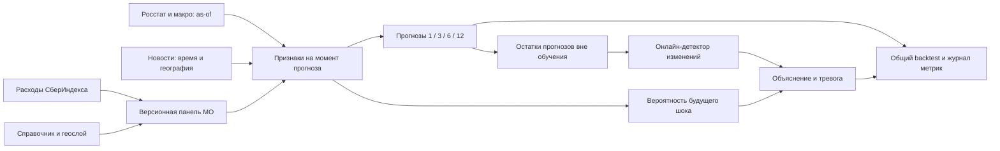

# Прогноз потребительских расходов и ранние сигналы структурных изменений

> Архив исходного плана. Актуальное состояние и проверка выполнения: [доработка исследования](RESEARCH_AUDIT_RESULTS_RU.md), [план завершения](RESEARCH_COMPLETION_PLAN_RU.md), [критерии](CRITERIA_AUDIT_RU.md). Формулировки «не выполнено» ниже отражают момент составления плана. Веса критериев пока не сверены с официальной шкалой.

Статус (обновлено 04.10.2026): план выполнен для муниципальных расходов СберИндекса (2 016 МО × 6 категорий, 2023–2024): Prophet и Chronos/TimesFM, национальные приоры, структурная модель, ансамбль, интервалы, детекторы (инъекции, реестр событий, offline-proxy, недельные ряды), «новостные» признаки с плацебо, недельный nowcast, заморозка прогнозов. Итоги — `docs/MUNICIPAL_RESULTS_RU.md` и `report/report.pdf`. Не выполнено: текстовый корпус новостей, Росстат по МО, верифицированная разметка шоков, дообучение фундаментальных моделей; раннее предупреждение навыка не показало. Ниже — исходный план; фактические отклонения от него перечислены в отчёте.

Описание новых выгрузок — `docs/CONSUMER_DATA_DESCRIPTION_RU.md`, их аудит — `notebooks/02_consumer_exports_audit.ipynb` и `artifacts/consumer_audit/`. Результаты муниципального аудита находятся в `notebooks/01_municipal_data_audit.ipynb` и `artifacts/eda/`.

## 1. Постановка задачи и результат проекта

Для каждого муниципального образования (МО) строим прогноз безналичных потребительских расходов на 1, 3, 6 и 12 календарных месяцев. Дополнительно выдаём вероятность существенного изменения ряда в ближайшие 1 и 3 месяца и сигнал об уже начавшемся изменении. Объяснение для пользователя: «обычный уровень расходов прогнозируется по истории и календарю; дополнительные признаки помогают заметить отклонение и оценить риск смены режима».

Три задачи оцениваем отдельно: точность прогноза, скорость обнаружения уже начавшегося изменения и качество предупреждения до его начала. Предупреждение возможно при наличии предшествующего сигнала; непредсказуемое событие не обязано иметь наблюдаемый предвестник. Вероятностные предупреждения оцениваем вместе с частотой ложных тревог.

Обязательный источник — муниципальные расходы СберИндекса. Справочник и геослой этого же источника уже используются для согласования территорий. В итоговом решении нужно явно показать участие расходов в прогнозировании; один геослой не заменяет целевой временной ряд. Дополняющие источники: БДПМО Росстата, официальные макропоказатели, календарь и датированные сообщения официальных органов или проверяемых новостных источников.

Артефакты завершённого проекта: код с инструкцией запуска, конфигурации JSON/YAML, прогнозы вне обучения, журналы экспериментов, русскоязычный методологический отчёт и PDF-презентация либо интерактивный лендинг с реальными результатами и примерами. Публикацию GitHub-репозитория выполняем отдельным этапом после подготовки воспроизводимого решения.

## 2. Что уже есть в данных

Локальный XLSX содержит 3 101 запись, 18 атрибутов, 2 660 значений `territory_id`, 3 063 кода ОКТМО и 85 регионов. В GPKG 2 660 геометрий в EPSG:4326. У 438 территорий несколько записей атрибутов. Это результат чтения локальных файлов, а не характеристика всех возможных версий набора СберИндекса.

`territory_id` обозначает неизменную территорию: несколько записей названий, типов и ОКТМО могут относиться к одному идентификатору. При изменении границ требуется другая территория. Интервал действия записи — `[year_from, year_to)`. Поле `shape` описывает расположение административного центра; его нельзя использовать как признак отсутствия полигона. Эти значения полей сверены с [описанием автора СберИндекса](https://habr.com/ru/companies/sberbank/articles/849682/).

Приложенные [метаданные СберИндекса](../data/inputs/municipal_metadata.pdf) указывают покрытие с 1 января 2018 по 1 января 2024 включительно. Это ежегодные срезы: изменения внутри года учитываются к началу следующего. Наличие `year_from=2024` не подтверждает учёт изменений в течение всего 2024 года. Значение `year_to=9999` означает открытый конец записи, но не гарантирует актуальность после последнего подтверждённого среза. Сохраняем дату получения и SHA256 файлов, а для более позднего периода проверяем новую версию справочника. История административных изменений не является разметкой экономических шоков.

Фактические результаты выполненного аудита: 441 переход между версиями атрибутов при сохранении территории, включая 436 смен типа, 437 смен ОКТМО и 2 смены статуса. Категории могут пересекаться. По `change_id` найдено 33 преобразования, у всех присутствуют обе стороны и согласованы годы. Количество активных МО в локальном наборе сокращается с 2 617 на 01.01.2018 до 2 594 на 01.01.2024. Статус включён в анализ причин версионности согласно PDF.

Полностью повторных строк, невалидных интервалов, пересечений и разрывов версий одной территории не найдено. Наборы идентификаторов XLSX и GPKG совпадают; все интервалы атрибутов укладываются в интервалы геометрий. Проверка SQLite завершилась `ok`. Это подтверждение перечисленных структурных проверок; топология полигонов, точность границ и полнота покрытия территории отдельным геоаудитом пока не проверены.

### Ограничения из приложенного PDF

Названия административных центров оставлены в варианте 2018 года, поскольку даты их смены неизвестны. Поэтому эти поля нельзя считать достоверной историей центров и использовать для датирования изменений локаций. Координаты не предоставлены для городов федерального значения: все 268 строк с отсутствующими координатами в локальном справочнике относятся к Москве (146), Санкт-Петербургу (112) и Севастополю (10); неожиданных пропусков вне этих регионов не найдено. Это количество строк версий, а не обязательно уникальных территорий. При добавлении центроидов полигонов сохраняем отдельные поля и метод расчёта в подходящей проекции: центроид не равен административному центру.

В PDF отдельно указано, что передачи частей территорий муниципалитетов Чечни не учтены. Для 18 строк локального справочника этого региона нужен флаг ограниченной полноты истории границ; результаты моделирования и географического согласования проверяем также на выборке без него. Отсутствие `change_id` здесь не доказывает отсутствие территориального изменения. По известным событиям проверяем связи, но это не тест полноты регистрации всех преобразований.

Охват ограничен верхним уровнем МО; муниципалитеты новых регионов не включены. Внутригодовые изменения и различия дат учёта в законодательстве, ОКТМО и статистике могут приводить к расхождениям числа МО между источниками. При объединении расходов с Росстатом такие расхождения сохраняем как диагностические результаты. Описанные авторами ручные корректировки полигонов и полное покрытие являются заявленными свойствами источника, а не результатом нашего независимого топологического теста.

В PDF ожидается обновление по 01.01.2025 в июле 2025 года. Эта фраза — исторический план автора, не подтверждение того, что соответствующая версия существует в репозитории. Структурированная выдержка ограничений хранится в `configs/municipal_metadata.json`, а PDF и JSON включены в manifest с SHA256.

## 3. Контракты данных и соединение источников

| Таблица | Минимальные поля | Проверка |
|---|---|---|
| Расходы | `source_id`, `period`, `y`, `unit`, `available_at`, `source_version` | Частота, единицы, опубликованные значения, пропуски, дубликаты |
| Соответствие ключей | `source_id`, `territory_id`, `valid_from`, `valid_to`, `mapping_source` | Официальная связь id набора и территории; временная однозначность |
| Атрибуты МО | `territory_id`, `oktmo`, `year_from`, `year_to`, регион, тип | Интервалы, уникальность активной версии |
| Росстат | `oktmo`, `indicator`, `period`, `value`, `available_at`, `revision` | Объединение по периоду и версии; дата публикации |
| Новости | `document_id`, `source`, `url`, `published_at`, `first_seen_at`, `event_date`, география, текст | Дубликаты, время доступности, географическая привязка |
| Прогнозы | `run_id`, `territory_id`, `origin`, `issued_at`, `target_date`, `horizon_months`, `y_true`, `y_pred` | Единая оценочная сетка, отсутствие временных утечек |

Сначала выясняем, что означает id в файле расходов: отдельный идентификатор, `territory_id` или ОКТМО. Не соединяем источники только по совпадению чисел или названий. Проверяем официальный справочник набора и долю однозначно сопоставленных записей. Несопоставленные записи сохраняем в отчёте; их исключение должно быть объяснено.

По каждому показателю фиксируем: рубли или индекс, сумма или значение на человека, номинальный или реальный показатель, сезонная корректировка, полные или неполные периоды. Нельзя автоматически суммировать индекс и удельный показатель. При необходимости дефляции официальную метрику всё равно считаем на исходной шкале после обратного преобразования.

При неизменной территории историю можно продолжить через смену имени или кода после проверки методологии. При объединении территорий суммируем только аддитивные величины, если известны все участники и исключён двойной счёт. Для удельных показателей восстанавливаем числитель и знаменатель. При разделениях нельзя достоверно разнести расходы по долям площади без дополнительных сведений. Практические варианты: закончить старый ряд и начать новый либо построить доказуемо сопоставимый агрегат, сохранив provenance.

Год начала версии обозначает год среза, а не обязательно год фактического административного изменения: изменения внутри предыдущего года отражены к следующему 1 января. Поэтому нельзя добавлять в monthly-модель «шок в январе» на основании `year_from`. Точную дату, если она нужна, подтверждаем первичным документом и согласуем с методологией датирования расходов. Для строгого исторического backtest дата доступности справочника также важна: PDF описывает ежегодное обновление в июле. Ретроспективная очистка допустима как отдельный исследовательский режим, но не доказывает работу с информацией, известной тогда.

## 4. Первичный анализ расходов после их добавления

1. Построить панель `territory_id × month`, проверить повторные ключи, частоту, единицы и временное покрытие.
2. Вывести распределение длины рядов, долю пропусков, нулей, отрицательных значений и частичных месяцев. Отрицательные значения проверять по смыслу показателя, а не удалять автоматически.
3. Построить ряды репрезентативных МО: крупный и малый, растущий и стабильный, с изменением атрибутов и с изменением границ. Выбор примеров задать до просмотра ошибок модели.
4. Исследовать сезонность, тренд, изменение дисперсии, региональные зависимости, изменение покрытия транзакций и методики поставщика. Различать экономический шок и измерительный артефакт.
5. До обучения зафиксировать допустимые территории, пропуски целей, минимальную историю, календарную сетку и правила fallback. Импутацию входов обучать только на доступной истории; цели оценочного периода не заполнять прогнозами.

## 5. Валидация без утечки будущего

### Календарь и горизонты

Горизонт `h` — прогноз значения конкретного месяца `origin+h`. Если дополнительно нужен расход за следующие h месяцев, считаем его отдельной задачей с другим названием метрики. Месяцы отсчитываем календарно, а не как 30/90/180/365 дней.

Используем expanding-window backtest с общими календарными origins для всех МО. Начальная история в конфигурации — 36 месяцев, шаг origins — 1 месяц. Последние 12 месяцев целей оставляем финальным holdout. Изменение этих параметров допустимо только до сравнения моделей и должно быть обосновано фактической длиной ряда.

Dev-origin подходит для полного сравнения 1/3/6/12, только если его максимальная цель лежит строго раньше holdout. Пример при доступных расходах за январь 2018 — декабрь 2024: train с января 2018; dev origins декабрь 2020 — декабрь 2022; holdout цели январь — декабрь 2024. Последний dev-origin имеет цель декабря 2023 на горизонте 12. Это иллюстрация, не утверждение о наличии таких расходов в проекте.

При 24 месяцах истории нельзя одновременно получить 36 месяцев train и полноценное испытание горизонта 12. Тогда фиксируем доступную короткую историю, сокращаем сложность моделей, честно описываем малое число фолдов и ищем более длинный ряд. Фундаментальная модель не создаёт отсутствующие независимые наблюдения для проверки качества.

### Дата доступности и обучение

Origin — последний месяц контекста; `issued_at` — реальный момент выдачи прогноза. Сохраняем оба поля. Для каждого входа обязательно `available_at <= issued_at`. Если расходы публикуются с задержкой, календарь issuance смещается и горизонт относительно последнего известного месяца фиксируется явно.

Для direct-модели обучающий пример с признаками месяца t разрешён только тогда, когда метка `y[t+h]` уже доступна к выдаче прогноза текущего фолда. Простое условие `t <= origin` недостаточно. Метки, пересекающие отсечение, удаляем. Для вероятности будущего шока также требуется завершённое окно разметки; если offline-разметка использует дополнительный lookahead, учитываем и его.

Все признаки и параметры преобразований строим внутри фолда: нормировка, сезонная декомпозиция, выбор признаков, кластеризация, веса ансамбля, пороги тревог. Скользящие признаки используют только trailing-window. Региональные суммы и соседние МО не должны давать текущие ещё не опубликованные расходы. Для Росстата и макроданных делаем as-of join по дате публикации и доступной на тот момент версии; нельзя подставлять пересмотренные значения, опубликованные позднее.

Перекрытие будущих окон соседних origins ожидаемо для rolling evaluation; оно создаёт зависимость ошибок. Для доверительных интервалов используем парный блочный bootstrap по календарным origins, при необходимости с кластеризацией по регионам. Нельзя считать тысячи МО независимыми наблюдениями одного общероссийского шока.

### Финальный holdout

Подбор моделей и гиперпараметров выполняем только на dev. Для более строгой оценки отбора используем внутренние временные фолды в dev. После фиксации решения, признаков, порогов и правил агрегирования открываем holdout один раз. Если результаты holdout использованы для улучшения, этот период становится development, а для новой независимой проверки нужен другой период.

На финальном испытании считаем цели, лежащие в holdout, отдельно для каждого h. Часть origins для длинных горизонтов может лежать до начала holdout. Это корректно: никаких целей holdout не использовали для выбора решения. Для полностью совместимого состава всех horizons дополнительно публикуем метрики на общей пересекающейся сетке, если она существует. Не подгоняем календарь после просмотра качества.

Допустим operational backtest с ежемесячным переобучением: более ранние уже опубликованные значения holdout входят в train следующего origin, но только по заранее зафиксированному расписанию без изменения гиперпараметров. Отдельно указываем, выбран ли этот режим или frozen Модель; сравниваем кандидатов в одном режиме.

## 6. Модели прогнозирования и порядок экспериментов

| Этап | Модель | Что проверяем |
|---|---|---|
| E01 | Последнее значение, seasonal naive, Prophet | Воспроизводимые простые ориентиры и основной baseline |
| E02 | ETS; глобальный CatBoost с direct-головой для каждого h | Сезонность; общий опыт разных МО и нелинейные лаги |
| E03 | Замороженные Chronos и TimesFM | Польза предобученных временных моделей на тех же рядах |
| E04 | Победитель + Росстат и региональные лаги | Прирост от доступных внешних признаков |
| E05 | Та же модель + новостные признаки | Дополнительный прирост от новостей |
| E08 | Ансамбль сильных кандидатов | Устойчивость и дополнительное снижение ошибки |

Для monthly Prophet используем месячные даты, явно задаём годовую сезонность и проверяем настройки trend/changepoints на dev. Дневную и недельную сезонность для месячных наблюдений не вводим автоматически. Праздники агрегируем в месячные календарные признаки. Сначала воспроизводим именно baseline организатора, если доступны его настройки; свой Prophet называем отдельным воспроизводимым baseline. [Официальный протокол исторических отсечений Prophet](https://facebook.github.io/prophet/docs/diagnostics.html).

CatBoost получает лаги 1/2/3/6/12/18/24, trailing mean/std за 3/6/12 месяцев, календарь, доступные демографические признаки, регион и тип МО. Для коротких рядов сохраняем missing-флаги и fallback. Проверяем MAE loss и, при необходимости, log1p-цель; выбираем только по MAE после возврата на исходную шкалу. Большой lag не должен автоматически исключать все короткие ряды из оценочной сетки.

Предобученные [Chronos](https://github.com/amazon-science/chronos-forecasting) и [TimesFM](https://github.com/google-research/timesfm) включаем как самостоятельные кандидаты. Перед запуском фиксируем точный checkpoint, hash/revision, размер контекста, способ подготовки ряда, лицензию и требования к вычислениям. Текущая конфигурация не скачивает веса и не реализует эти модели. Проверяем возможное пересечение обучающих данных checkpoint с периодом оценки и доступность самого checkpoint на историческую дату; результат современного zero-shot baseline отдельно маркируем, если он не соответствует историческому deployment. Fine-tuning выполняем только внутри train; веса ансамбля выбираем по dev-прогнозам вне обучения.

Архитектура итогового кандидата:

## 7. MAE, R² и правило выбора победителя

Для территории i и горизонта h считаем `MAE[i,h] = mean_origin(abs(y_true - y_pred))`.

Основная `macro_MAE[h] = mean_territory(MAE[i,h])`: каждое МО имеет одинаковый вес. Рядом публикуем `micro_MAE[h]`, средний модуль ошибки по всем оцениваемым наблюдениям. Оба показателя остаются в исходных единицах и чувствительны к масштабу расходов; macro лишь устраняет разный вес из-за числа наблюдений. Поэтому дополнительно показываем ошибки по группам размера МО и MASE с масштабом, вычисленным на train, но MAE остаётся обязательной.

`R² = 1 - sum((y-yhat)^2) / sum((y-mean(y))^2)` считаем отдельно по горизонту на одинаковой сетке. Сохраняем pooled R² и при достаточных наблюдениях распределение R² внутри МО. Если ряд постоянный, R² не определён; не подменяем его нулём. Pooled R² на панельных расходах может быть высоким благодаря межтерриториальному масштабу, поэтому он не доказывает прогноз динамики каждой территории.

Прирост относительно Prophet: `100 × (MAE_Prophet - MAE_candidate) / MAE_Prophet`, если знаменатель положителен. Положительное значение означает улучшение. Для выбора используем среднее macro-MAE четырёх horizons с заранее заданными равными весами; обязательно выводим все четыре значения и ухудшения на отдельных горизонтах. Если организатор задаёт другую агрегацию, официальную метрику публикуем отдельно и выбираем по её протоколу.

Любое сравнение включает количество МО и прогнозов, coverage, состав ключей, фолды и парный доверительный интервал разницы MAE. Модель не считается лучше при пропуске сложных серий; заранее задаём fallback и считаем его в общем результате. Победа над Prophet — измеряемый вывод, а не обещание. Если прирост неустойчив или статистическая неопределённость велика, так и пишем.

## 8. Структурные изменения: обнаружение и предупреждение

Сначала фиксируем определение события: устойчивый сдвиг уровня, тренда или дисперсии после учёта сезонности. Краткий выброс оцениваем отдельно. Порог величины и минимальную длительность сдвига выбираем на dev и проверяем чувствительность результата. Административные и методологические изменения поставщика сохраняем в отдельной таблице событий.

Для онлайн-обнаружения сравниваем CUSUM, Page-Hinkley и [BOCPD](https://arxiv.org/abs/0710.3742). Подаём стандартизированные остатки исторических прогнозов вне обучения: новый расход сравниваем с прогнозом, выпущенным до его наблюдения. Масштаб остатков оцениваем только по доступному прошлому. Остатки fit на всём ряду для этого не подходят.

PELT используем для ретроспективной разметки и анализа чувствительности, дополняя экспертной проверкой и внешними подтверждениями. Данные будущего допустимы при независимой оценочной разметке устойчивого события, но не во входах онлайн-детектора или предупреждения. Сохраняем версию разметки, ограничения и неопределённость даты; не объявляем ретроспективную точку «истинным шоком» без проверки. Способ разметки не должен быть выбран по лучшему результату оцениваемого детектора.

Для раннего предупреждения обучаем отдельную вероятность события в интервале `(origin, origin+k]`, k=1/3 месяца. Источники предвестников: изменения доступных лагов расходов, рост ошибок, региональные изменения и уже опубликованные события. Ретроспективную метку можно использовать для train только после завершения её окна подтверждения. BOCPD и CUSUM сами по себе обнаруживают наблюдённый сдвиг и не обеспечивают предсказание будущего события.

Сопоставление тревог и событий задаём заранее и делаем one-to-one. Для предупреждений совпадение допускается только до начала события, в пределах выбранного окна; для обнаружения — после начала с заранее заданным допуском задержки. Повторные тревоги одного события не увеличивают recall; cooldown 3 месяца фиксирован в конфигурации.

Метрики: event precision/recall/F1, PR-AUC для вероятностной метки будущего окна, Brier score и калибровка, ложные тревоги на 100 МО-месяцев, медиана lead time для правильных предупреждений, задержка обнаружения и доля пропущенных событий. PR-AUC и Brier относятся к классификации окна; event-F1 относится к событиям, их нельзя смешивать. Длинное предупреждение ценим вместе с precision и recall: единственный ранний удачный сигнал при множестве ложных тревог не является хорошим решением.

Порог каждого метода выбираем на dev при общем бюджете ложных тревог, первоначально 1 на 100 МО-месяцев. На тесте сравниваем методы при этом зафиксированном пороге и публикуем фактическую частоту ложных тревог. Синтетические сдвиги допустимы для проверки механики, но качество на них показываем отдельно от реальных расходов.

## 9. Согласование новостей и данных МО

У новости есть дата публикации, дата первого наблюдения и дата описываемого события. Для входа модели используем момент реальной доступности: как минимум публикацию, а при сборе с задержкой — `max(published_at, first_seen_at)`. Нельзя поместить статью, написанную после шока, в более ранний месяц по дате события. Учитываем timezone и момент выдачи месячного прогноза.

Извлекаем место события, разрешаем название через регион и историческую версию МО. Одноимённые населённые пункты и организации не считаем однозначной привязкой. Если известно только название региона, используем региональный признак с соответствующей меткой точности. Координатное событие можно присоединить к действующим на дату события полигонам; доступность исторической карты в operational backtest проверяется отдельно.

Группируем дубли и перепечатки по исходному событию, сохраняем URL и происхождение. Признаки по trailing-окнам 7/30/90 дней до issued_at: число событий по темам, тяжесть, доверие к источнику, embeddings текста и признаки пространственной близости. Нормировка, тематический классификатор при обучении и dimensionality reduction строятся только на train. Для прогнозного месяца нельзя использовать фактические новости, которые появятся позже; известные объявления о будущем событии допустимы.

Эксперименты на одной сетке: только расходы; +календарь; +Росстат/макро; +новости; отдельно shuffled/placebo новости со сдвигом только внутри разрешённого прошлого. Пользу новостей проверяем по MAE и ранним сигналам, а не только по красивым объяснениям. Для текстового инструмента фиксируем версию, способ извлечения и возможную утечку знаний о позднейших событиях.

## 10. Как отслеживать улучшения

В `configs/experiment.json` сохранены горизонты, календарь, признаки, кандидаты и параметры тревог. Флаги внешних данных пока выключены. `tracking/experiments.csv` — список гипотез и состояний; `forecast_metrics.csv` и `shock_metrics.csv` — пустые журналы численных результатов. Строки заполняем только после реально выполненных запусков.

Описание справочника зафиксировано отдельной конфигурацией `configs/municipal_metadata.json`. При обновлении PDF или справочника заново проверяем соответствие покрытия, семантики полей и ограничений. В текущем эксперименте явно сохранены срез 01.01.2024, базовый год центров 2018 и политика отдельной проверки Чечни.

Каждый run получает уникальный `run_id` и отдельный каталог `artifacts/runs/<run_id>/`: `config.json`, `manifest.json` с SHA256 данных и версией кода, `environment.txt`, `split_manifest.csv`, `predictions.csv`, `forecast_metrics.csv`, `alarms.csv`, `shock_metrics.csv`, описание изменения и время/память запуска. Не перезаписываем предыдущие run. Текущий аудит сохраняет версии входных файлов в `artifacts/eda/input_manifest.csv`; полный runtime snapshot появится при обучении.

Leaderboard фильтруется по `data_hash`, `split_id`, единицам цели, горизонту, версии разметки и stage dev/holdout. Разные периоды или составы МО не сравниваем одной цифрой. Сохраняем per-origin и per-territory ошибки, чтобы видеть, где получен прирост, а также общую таблицу 1/3/6/12, график MAE по origins, ошибку по группам МО и precision-recall кривую предупреждений. MLflow можно подключить позднее; первоначальные CSV позволяют работать без сервера.

На один эксперимент — одна основная гипотеза: какая проблема, что изменили относительно parent-run, какая метрика должна улучшиться, каков результат и решение keep/reject/inconclusive. Конкретный статус E00 обновлён после выполнения ноутбука. Муниципальные этапы остаются заблокированными до получения расходов МО. Национальный прогнозный опыт зарегистрирован отдельно как N01; его численные результаты находятся в `tracking/national_forecast_metrics.csv`, чтобы не смешивать разные географические задачи.

## 11. Этапы и критерии готовности

| Этап | Статус / зависимость | Результат и критерий приёмки |
|---|---|---|
| 0. Аудит справочника | Выполнен | Ноутбук, хеши, проверки интервалов и связей, реальные примеры |
| 1. Аудит расходов | Нужен целевой набор | Панель, словарь единиц/id, отчёт пропусков, календарь |
| 2. Зафиксировать валидацию | После этапа 1 | Общая сетка train/dev/holdout, available_at, правила fallback |
| 3. Baseline | После этапа 2 | Last value, seasonal naive и Prophet; MAE для четырёх h |
| 4. Сильные прогнозы | После baseline | ETS/CatBoost и минимум одна фундаментальная модель, честное сравнение |
| 5. Разметка и детекторы | Нужны реальные ряды | Независимая версия событий; CUSUM/Page-Hinkley/BOCPD на OOF остатках |
| 6. Внешние данные и новости | Нужны даты доступности | Crosswalk, as-of joins, ablation и предупреждения |
| 7. Финальная оценка | Решение зафиксировано | Однократный holdout, интервалы неопределённости, ограничения |
| 8. Отчёт и презентация | После реальных результатов | Архитектура, все сравнения, примеры, инструкции и воспроизводимый репозиторий |

Бюджет и последовательность адаптируем после проверки длины расходов. Если ресурсов мало, приоритет: честная оценка → Prophet и CatBoost → один frozen foundation baseline → онлайн-детекторы → новости → ансамбль.

## 12. Соответствие критериям задания

| Критерий | Вес | Где будет подтверждение |
|---|---:|---|
| Понятная методология | 10% | Простое объяснение, схема, пример одного МО |
| Прогнозы и 1/3/6/12 | 20% | Общая таблица MAE, baseline Prophet, фолды и coverage |
| Сравнение детекторов | 20% | Event-метрики, ложные тревоги, задержки, зафиксированные пороги |
| Фундаментальные модели | 15% | Checkpoint/revision, frozen baseline, честная оценка |
| Новости и согласование | 15% | Время доступности, география, ablation, примеры сигналов |
| Обязательная MAE | 10% | MAE в исходных единицах для каждого горизонта |
| Интерпретация и воспроизводимость | 10% | Конфиги, хеши, код, отчёт, ограничения, презентация |

В итоговой презентации нужны: постановка и данные; архитектура; временная проверка на периоде подбора; прогнозный leaderboard; сравнение детекторов и ранних предупреждений; вклад внешних данных; три реальных примера, включая ложную тревогу; ограничения и инструкция воспроизведения. PDF национального опыта уже сформирован на реальных результатах; муниципальные метрики, детекторы и новости в нём явно обозначены как незавершённые части исходного задания.

## 13. Источники и цитирование

- [Набор границ и преобразований СберИндекса](https://sberindex.ru/ru/research/dataset-borders-and-changes-of-municipalities).
- [Приложенные пользователем метаданные, 3 страницы](../data/inputs/municipal_metadata.pdf).
- [Объяснение атрибутов и логики справочника командой СберИндекса](https://habr.com/ru/companies/sberbank/articles/849682/).
- [БДПМО Росстата](https://rosstat.gov.ru/storage/mediabank/MUNST.htm).
- [Prophet: diagnostics](https://facebook.github.io/prophet/docs/diagnostics.html).
- [Chronos: официальный репозиторий](https://github.com/amazon-science/chronos-forecasting).
- [TimesFM: официальный репозиторий](https://github.com/google-research/timesfm).
- [Adams, MacKay: Bayesian Online Changepoint Detection](https://arxiv.org/abs/0710.3742).

По предоставленному описанию набор границ распространяется по CC BY-SA 4.0. При публикации сохраняем атрибуцию СберИндекса и проверяем условия для производных данных. Условия расходов и каждого внешнего источника проверяем отдельно. Рекомендуемая ссылка: «Данные о границах и преобразованиях муниципальных образований. Сбериндекс. Данные доступны по адресу https://sberindex.ru/ru/research/dataset-borders-and-changes-of-Муниципалитетов (данные скачаны [фактическая дата])». Дата загрузки текущих локальных файлов неизвестна; не подменяем её датой аудита.
