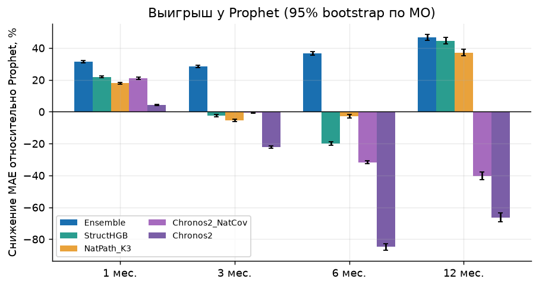
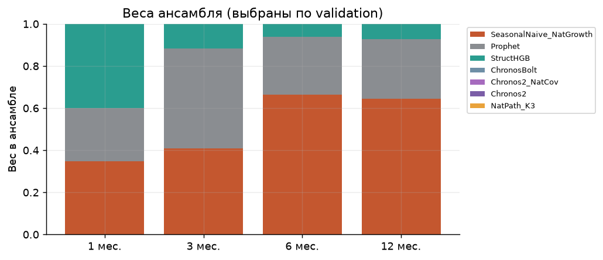
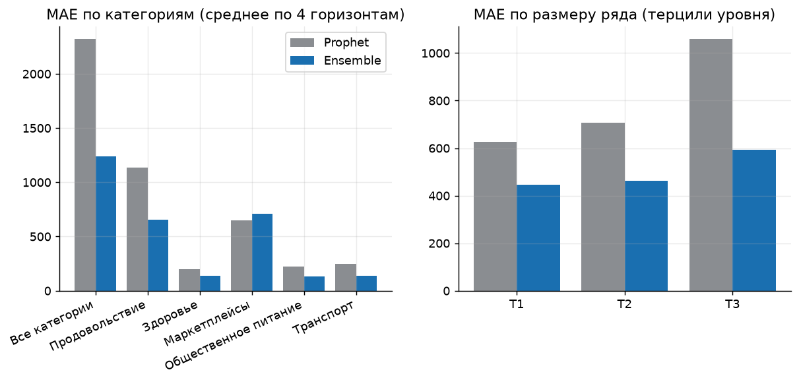
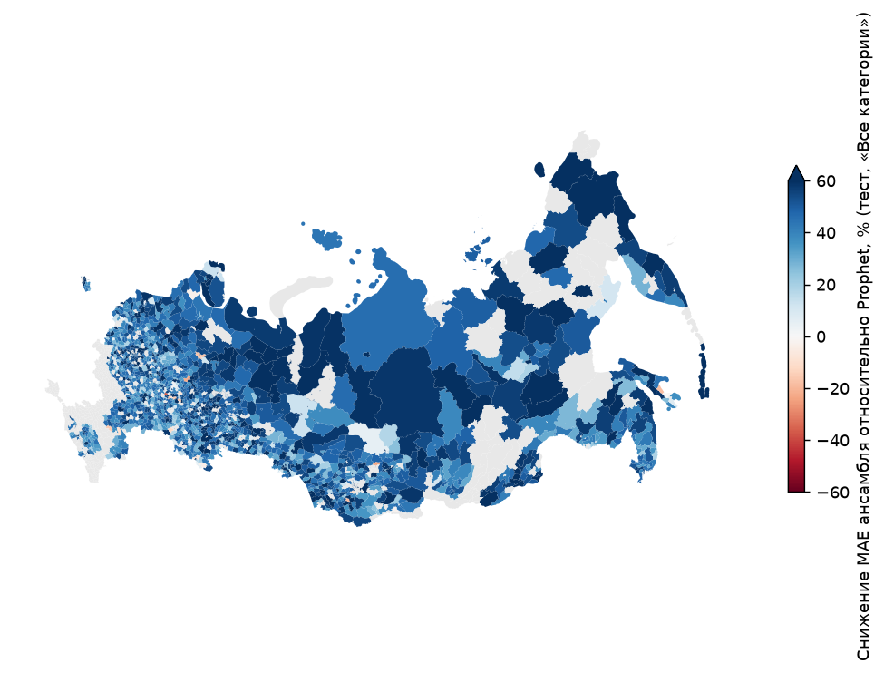
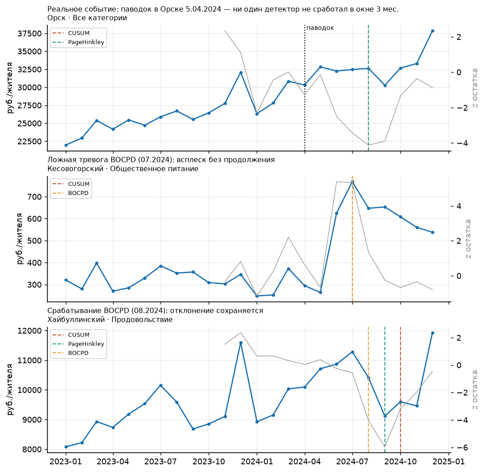
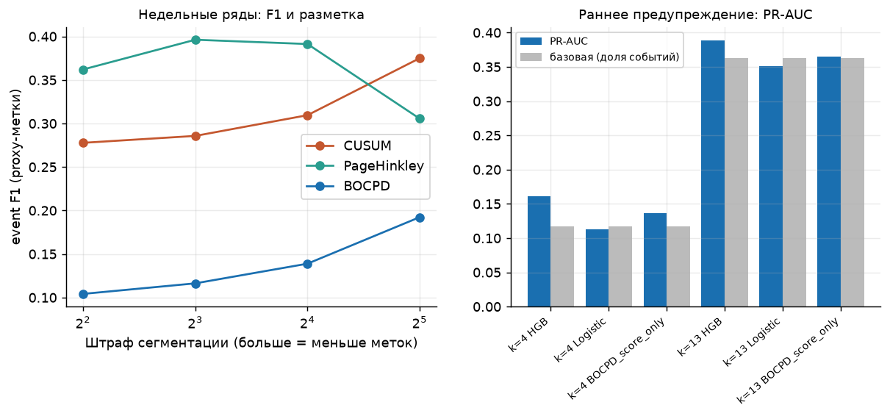
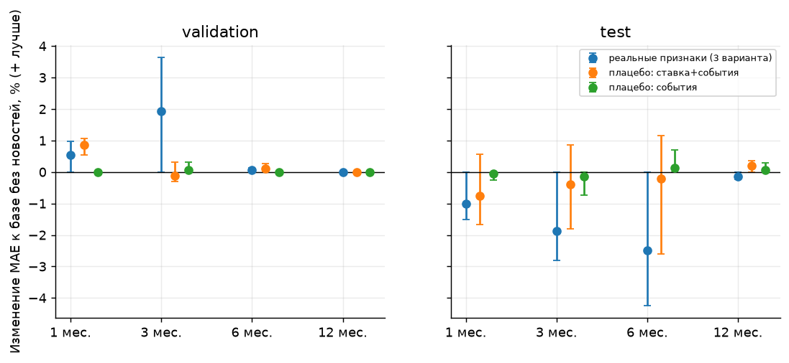
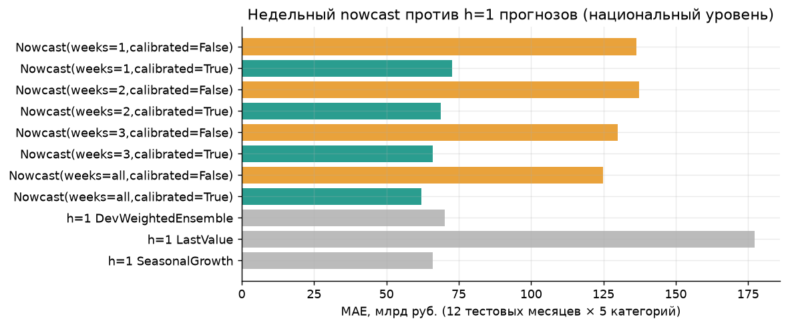
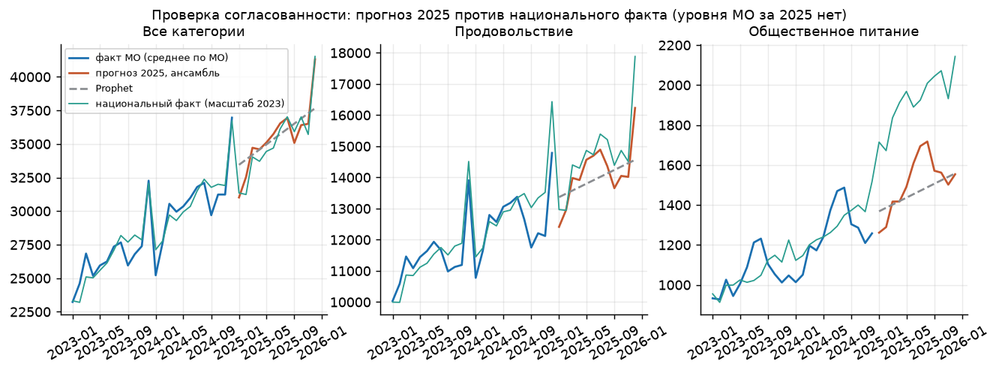

# Прогноз потребительских расходов муниципалитетов и ранние сигналы сдвигов

Отчёт построен автоматически из результатов запуска `municipal_20261004T140239Z`. Данные: СберИндекс, безналичные расходы на жителя по 12 096 рядам (2016 МО × 6 категорий), январь 2023 – декабрь 2024. Численные утверждения ниже прочитаны из файлов результатов. Каталог обученных моделей и все метрики: `docs/MODELS_AND_METRICS_RU.md`.

## Резюме

Исходные результаты ниже сохранены. Аудит от 07.10.2026 уточнил ретроспективный характер весов и отсутствие стандартной гарантии исходных интервалов; новые эксперименты выполнены после просмотра теста и приведены в разделе 11.

- **Прогнозы 1/3/6/12 мес.** Ансамбль на тесте имеет MAE 440/514/466/583 руб. против 640/719/736/1093 у Prophet, то есть на 31/28/37/47% меньше. Выбор моделей и весов заморожен до открытия теста.
- **Откуда выигрыш.** Основной вклад — национальные ряды с 2018 г.: у МО всего 24 месяца, поэтому сезонность и рост берутся из страны, а по МО оценивается уровень и небольшая поправка. Абляция показывает вклад в явном виде.
- **Фундаментальные модели** (Chronos-Bolt, Chronos-2, Chronos-2 с национальной ковариатой, TimesFM на подвыборке) без дообучения на таких коротких рядах уступают Prophet на горизонтах ≥3 (на h=1 Chronos-2 с ковариатой лучше) и получили нулевой вес в ансамбле.
- **Детекторы** CUSUM / Page–Hinkley / BOCPD сравнены тремя способами и на недельных реальных рядах; победитель зависит от способа разметки. **Раннее предупреждение: навык не подтверждён.**
- **Новости** как датированные официальные события (ставка ЦБ, реестр) не показали пользы относительно плацебо.
- **Недельный nowcast** национального уровня с поправкой смещения лучше h=1-ансамбля при ≥2 неделях месяца; без поправки он непригоден.
- Прогноз на 2025 г. по МО заморожен для будущей проверки.

## 1. Данные

| Источник | Что | Период | Использование |
|---|---|---|---|
| СберИндекс, `consumption.parquet` | безналичные расходы на жителя, руб./мес., 6 категорий | 2023-01…2024-12 | цель; 12096 полных рядов, 1044 неполных исключены |
| Справочник МО (`t_dict_municipal`) | регион, тип, координаты, интервалы действия | срез 2024 | статические признаки, сопоставление событий |
| `market_access.parquet` | индекс доступности рынков | 2024 | статический признак (log) |
| Национальные расходы СберИндекса | 5 категорий, млрд руб./мес. | 2018-12…2026-08 | приор: сезонность и рост **только по данным ≤ origin** |
| Недельный рост г/г (46 категорий), активность | недельные ряды | 2021/2023…2026-09 | детекторы, nowcast |
| ЦБ РФ: ключевая ставка | по дням | 2018…2026 | новостные/макро-признаки |
| Реестр событий | 7 событий со ссылками | 2023–2024 | событийная оценка детекторов |

Лицензия данных СберИндекса — CC BY-SA 4.0. Все входные данные хранятся локально в `data/inputs/` и исключены из Git. `make data` проверяет их наличие без скачивания; список файлов — `docs/INPUT_DATA_RU.md`.

## 2. Протокол оценки

Правила организатора мне неизвестны, поэтому использован «конкурсный» протокол, описанный в открытых работах участников: validation — цели янв.–июнь 2024, test — цели июль–декабрь 2024, расширяющееся окно, прогноз горизонтов 1/3/6/12 из каждого origin с историей не менее 6 месяцев. **Допущение подлежит сверке с официальными правилами.**

1. Для каждого origin и каждого ряда используются только значения ≤ origin; direct-метки обучения — только с целью ≤ origin (проверено тестами `tests/test_municipal.py`: изменение будущих значений не меняет признаки, метки и национальные приоры).
2. Конфигурация структурной модели и веса ансамбля выбраны **по validation**; `frozen_selection.json` записан до подсчёта метрик теста. В исходном запуске после первого показа теста модели, кандидаты и веса не менялись; изменения касались только расчёта Prophet для origin 12.2024 (нужен для прогноза 2025, на тест не влияет) и оформления. Значительная часть решений (дрейф без экстраполяции за обученный горизонт, сжатие 0.25) принята по validation после того, как первая версия модели провалилась на h=6.
3. Метрика — MAE в рублях на жителя по всей сетке (сетки у всех моделей совпадают, покрытие 100%), дополнительно R² по уровню и по изменению.
4. Неопределённость — парный bootstrap по МО (1000 повторов) и по целевым месяцам (6 месяцев).
5. Допущения: значение месяца origin известно на origin; актуальная версия данных (без пересмотров); validation для h=12 содержит один целевой месяц (2024-06).

## 3. Модели

- **Baseline'ы:** LastValue; SeasonalNaive (то же значение год назад, а если нет — LastValue); **Prophet** (месячные даты, настройки по умолчанию, годовая сезонность `auto` включается только при истории >2 лет; настройки организатора неизвестны).
- **Национальный путь (NatPath):** прогноз = локальный уровень (среднее по последним 3 месяцам, скорректированное на реализованное национальное изменение) × национальное SeasonalGrowth-изменение от origin до цели (сезонность и темп роста из национальных рядов; соответствие муниципальных категорий национальным задано заранее).
- **SeasonalNaive_NatGrowth:** значение того же месяца год назад × национальный годовой рост.
- **StructHGB:** градиентный бустинг (MAE) по остатку относительно NatPath: признаки — локальные импульсы относительно страны, шум, сезонные разности, региональные и категорийные средние, статические признаки МО. Дрейф на месяц умножается на горизонт, **но не дальше обученного** (h ≤ origin−5) и сжимается на валидации (коэффициент 0.25).
- **Foundation:** Chronos-Bolt-small, Chronos-2 (zero-shot), Chronos-2 + национальный путь как ковариата, TimesFM-2.5 (подвыборка). Ревизии чекпойнтов в `artifacts/municipal_runs/_foundation/*_meta.json`.
- **Ансамбль:** веса минимизируют MAE на validation (линейная программа, симплекс), отдельно по горизонтам.
- **Интервалы:** эмпирические квантили на общей validation; стандартная conformal-гарантия не заявляется.

## 4. Прогноз 1/3/6/12 мес.

**Результат исходного запуска.** На ретроспективном тесте (цели июль–декабрь 2024, 12 096 рядов) замороженный ансамбль имеет MAE **440 / 514 / 466 / 583 руб. на жителя** для горизонтов 1 / 3 / 6 / 12 мес. против **640 / 719 / 736 / 1093** у Prophet по умолчанию. Снижение — **31% / 28% / 37% / 47%**.
Парный bootstrap по МО (1000 повторов) даёт 95% интервалы разности MAE строго ниже нуля на всех горизонтах; bootstrap по шести целевым месяцам (общий шок месяца не усредняется по МО) также исключает ноль на всех горизонтах.
R² по изменению относительно origin (динамика, а не масштаб МО): ансамбль 0.67 / 0.74 / 0.84 / 0.69, Prophet 0.13 / 0.42 / 0.53 / -0.44. Обычный R² по уровню 0.97–0.996 у всех моделей и почти ничего не показывает: уровень определяется масштабом МО.

### Таблица теста

| Модель                  |   MAE h=1 |   MAE h=3 |   MAE h=6 |   MAE h=12 |   Среднее |   Δ к Prophet, % (среднее) |
|:------------------------|----------:|----------:|----------:|-----------:|----------:|---------------------------:|
| Ensemble                |     439.6 |     513.9 |     466.1 |      583.4 |     500.7 |                       37.2 |
| SeasonalNaive_NatGrowth |     546.7 |     542.6 |     529.0 |      612.4 |     557.7 |                       30.0 |
| NatPath_K1              |     402.8 |     724.3 |     873.2 |      612.4 |     653.2 |                       18.1 |
| StructHGB               |     499.9 |     736.4 |     883.1 |      606.2 |     681.4 |                       14.5 |
| NatPath_K3              |     525.6 |     757.9 |     757.1 |      686.5 |     681.8 |                       14.5 |
| Prophet                 |     640.4 |     718.6 |     736.5 |     1092.8 |     797.1 |                        0.0 |
| LocalOnlyHGB            |     665.9 |     774.7 |     930.3 |     1165.1 |     884.0 |                      -10.9 |
| Chronos2_NatCov         |     506.2 |     721.8 |     969.8 |     1533.3 |     932.8 |                      -17.0 |
| LastValue               |     624.4 |     863.8 |    1124.2 |     1288.6 |     975.3 |                      -22.4 |
| LocalBase_K3            |     691.0 |     815.6 |    1005.7 |     1534.5 |    1011.7 |                      -26.9 |
| Chronos2                |     612.9 |     877.1 |    1360.7 |     1817.0 |    1166.9 |                      -46.4 |
| SeasonalNaive           |    1288.6 |    1288.6 |    1288.6 |     1288.6 |    1288.6 |                      -61.7 |
| ChronosBolt             |     706.7 |    1024.2 |    1603.4 |     1986.0 |    1330.1 |                      -66.9 |

### Что даёт национальная информация (абляция)

| Вариант                                     |   MAE h=1 |   MAE h=3 |   MAE h=6 |   MAE h=12 |
|:--------------------------------------------|----------:|----------:|----------:|-----------:|
| Локальный уровень (без национальных данных) |     691.0 |     815.6 |    1005.7 |     1534.5 |
| + GBM без национальных данных               |     665.9 |     774.7 |     930.3 |     1165.1 |
| Национальный путь (NatPath_K3)              |     525.6 |     757.9 |     757.1 |      686.5 |
| NatPath + остаточный GBM (StructHGB)        |     499.9 |     736.4 |     883.1 |      606.2 |

Национальный путь (сезонность и темп роста из рядов с 2018 г., только по данным до origin) снижает среднюю MAE с 1012 до 682 (33%). Остаточный GBM поверх национального пути даёт смешанный эффект: лучше на h=1 (526 → 500) и h=12 (687 → 606), но хуже на h=3 и h=6; в среднем 682 → 681. Основной вклад вносит национальный приор, а не нелинейная модель по МО. Причина: у МО всего 6–23 месяца истории, и ни сезонность, ни годовой рост по такому ряду оценить нельзя.

### Веса ансамбля (подобраны на validation)

| Модель                  |    1 |    3 |    6 |   12 |
|:------------------------|-----:|-----:|-----:|-----:|
| Prophet                 | 0.25 | 0.47 | 0.27 | 0.28 |
| SeasonalNaive_NatGrowth | 0.35 | 0.41 | 0.66 | 0.64 |
| StructHGB               | 0.40 | 0.12 | 0.06 | 0.07 |

Веса найдены линейной программой (минимум MAE на симплексе); для h=12 использованы пары h=6 и h=12, потому что на validation у h=12 один целевой месяц. Foundation-модели получили нулевой вес: на validation они не лучше выбранных кандидатов.

### По категориям (среднее по 4 горизонтам)

| Категория            |   Ensemble |   Prophet |   Δ, % |
|:---------------------|-----------:|----------:|-------:|
| Все категории        |     1236.3 |    2319.8 |   46.7 |
| Здоровье             |      137.6 |     201.0 |   31.5 |
| Маркетплейсы         |      710.7 |     649.0 |   -9.5 |
| Общественное питание |      132.7 |     225.8 |   41.2 |
| Продовольствие       |      652.1 |    1138.5 |   42.7 |
| Транспорт            |      135.0 |     248.3 |   45.6 |

В категории «Маркетплейсы» с очень быстрым ростом и сильной сезонностью ансамбль не лучше Prophet — это слабое место, которое стоит исправлять отдельным национальным приором для маркетплейсов.

### По размеру ряда (терцили уровня внутри категории)

| Терциль   |   Ensemble |   Prophet |   Δ, % |
|:----------|-----------:|----------:|-------:|
| T1        |      446.9 |     626.0 |   28.6 |
| T2        |      461.7 |     706.8 |   34.7 |
| T3        |      593.6 |    1058.6 |   43.9 |

### Интервалы

|   Горизонт, мес. |   Номинал |   Покрытие на тесте |   Средняя полуширина (отн.) |
|-----------------:|----------:|--------------------:|----------------------------:|
|            1.000 |     0.900 |               0.889 |                       0.166 |
|            3.000 |     0.900 |               0.874 |                       0.193 |
|            6.000 |     0.900 |               0.941 |                       0.274 |
|           12.000 |     0.900 |               0.944 |                       0.417 |

Исходные интервалы используют ту же validation, где выбирались веса. Стандартная гарантия split-conformal не заявляется. Отдельная последовательная калибровка проверена в дополнении от 07.10.2026.

### Фундаментальные модели (zero-shot)

| Модель          |   MAE h=1 |   MAE h=3 |   MAE h=6 |   MAE h=12 |
|:----------------|----------:|----------:|----------:|-----------:|
| Chronos2        |     612.9 |     877.1 |    1360.7 |     1817.0 |
| Chronos2_NatCov |     506.2 |     721.8 |     969.8 |     1533.3 |
| ChronosBolt     |     706.7 |    1024.2 |    1603.4 |     1986.0 |
| Prophet         |     640.4 |     718.6 |     736.5 |     1092.8 |

Chronos-Bolt-small и Chronos-2 использованы без дообучения, контекст — `history[:origin+1]`. Версия `Chronos2_NatCov` получает национальный путь как known-future ковариату. Результат: на коротких рядах (6–23 точки) zero-shot модели уступают Prophet на h≥3; на h=1 Chronos-2 и особенно Chronos-2 с ковариатой чуть лучше Prophet. Ковариата заметно улучшает Chronos-2 на всех горизонтах, но не доводит его до Prophet на h≥6. Возможное пересечение обучающих корпусов чекпойнтов с 2023–2024 гг. проверить нельзя, поэтому это оценка современной модели, а не исторического deployment.

**TimesFM-2.5 (200M)** на CPU считает ~0,13 с на ряд, поэтому оценён на случайной подвыборке из 200 МО (1200 рядов, все категории; seed 42), остальные модели сравнены на тех же рядах:

| Модель                  |     1 |     3 |      6 |     12 |   среднее |
|:------------------------|------:|------:|-------:|-------:|----------:|
| Ensemble                | 427.7 | 498.0 |  450.3 |  583.4 |     489.8 |
| SeasonalNaive_NatGrowth | 533.3 | 527.0 |  510.1 |  590.9 |     540.3 |
| NatPath_K3              | 506.1 | 723.2 |  720.0 |  672.2 |     655.4 |
| Prophet                 | 622.1 | 694.8 |  709.2 | 1077.6 |     775.9 |
| Chronos2_NatCov         | 497.1 | 703.4 |  946.1 | 1494.1 |     910.2 |
| LastValue               | 610.4 | 844.1 | 1094.5 | 1234.1 |     945.8 |
| TimesFM                 | 549.3 | 785.8 | 1245.0 | 1630.3 |    1052.6 |
| Chronos2                | 603.5 | 869.3 | 1327.6 | 1757.5 |    1139.5 |


<figure><figcaption>MAE по горизонтам на тесте</figcaption></figure>


<figure><figcaption>Снижение MAE относительно Prophet с 95% bootstrap по МО</figcaption></figure>


<figure><figcaption>Веса ансамбля</figcaption></figure>


<figure><figcaption>MAE по категориям и размеру ряда</figcaption></figure>


<figure><figcaption>Карта выигрыша у Prophet по МО (категория «Все категории»)</figcaption></figure>


## 5. Структурные изменения: обнаружение и предупреждение

Детекторы CUSUM, Page–Hinkley и BOCPD подаются стандартизированными остатками прогноза h=1, выпущенного до наблюдения (национальный путь × локальный уровень). Масштаб остатка считается только по прошлому и сжимается к масштабу категории. Пороги подобраны на месяцах 10–17 при бюджете **1 ложная тревога на 100 ряд-месяцев**, оценка — на месяцах 18–23. Реальных размеченных шоков по МО у нас нет, поэтому оценка идёт тремя способами диагностики, и ни один из них не называется «истиной».

### A. Инъекция известных сдвигов в реальные остатки

Сдвиг ±1.5/2.5/4σ добавляется в 5% рядов (604 события) на месяцы 18–20; остальные 95% остаются реальными и служат фоном для ложных тревог. Пять независимых повторов.

| Метод       |   Порог |   Precision |   Recall |    F1 |   ± F1 (5 повторов) |   Медиана задержки, мес. |   Ложных тревог / 100 ряд-мес. |
|:------------|--------:|------------:|---------:|------:|--------------------:|-------------------------:|-------------------------------:|
| CUSUM       |  10.000 |       0.161 |    0.449 | 0.237 |               0.004 |                    1.400 |                          1.914 |
| PageHinkley |  12.000 |       0.090 |    0.314 | 0.140 |               0.004 |                    1.200 |                          2.716 |
| BOCPD       |   0.500 |       0.128 |    0.353 | 0.188 |               0.009 |                    1.000 |                          2.097 |

| Метод       |   Recall при сдвиге 1.5σ |   Recall при сдвиге 2.5σ |   Recall при сдвиге 4.0σ |
|:------------|-------------------------:|-------------------------:|-------------------------:|
| CUSUM       |                     0.22 |                     0.37 |                     0.74 |
| PageHinkley |                     0.15 |                     0.23 |                     0.54 |
| BOCPD       |                     0.20 |                     0.34 |                     0.51 |

Частота тревог на тесте выше, чем на калибровке (~2 против ≤1 на 100 ряд-месяцев): в тесте часть тревог — настоящие шоки или сезонные промахи прогноза (Дек–Янв), а не ложные. Поэтому precision здесь консервативна.

### B. Реестр датированных событий

В реестре 7 событий (паводки, теракты, обстрелы; ссылки в `data/inputs/event_registry.csv`). Сопоставление с МО по названию внутри региона нашло 6 территорий. Белгорода, Курска и Суджи в панели нет (не прошли порог качества СберИндекса), а для Севастополя, Дербента и Махачкалы сопоставление по названию МО не нашло. Оценимы Орск, Оренбург, Новотроицк (паводок, 04.2024) и Красногорск («Крокус», 03.2024).

| event_id   | pattern     | method      |   рядов |   доля_с_тревогой |   макс_z |   фон_все_ряды |
|:-----------|:------------|:------------|--------:|------------------:|---------:|---------------:|
| EV01       | Новотроицк  | BOCPD       |       6 |              0.17 |     2.84 |           0.07 |
| EV01       | Новотроицк  | CUSUM       |       6 |              0.00 |     2.84 |           0.09 |
| EV01       | Новотроицк  | PageHinkley |       6 |              0.00 |     2.84 |           0.02 |
| EV01       | Оренбург    | BOCPD       |       6 |              0.00 |     2.74 |           0.07 |
| EV01       | Оренбург    | CUSUM       |       6 |              0.00 |     2.74 |           0.09 |
| EV01       | Оренбург    | PageHinkley |       6 |              0.00 |     2.74 |           0.02 |
| EV01       | Орск        | BOCPD       |       6 |              0.17 |     3.43 |           0.07 |
| EV01       | Орск        | CUSUM       |       6 |              0.00 |     3.43 |           0.09 |
| EV01       | Орск        | PageHinkley |       6 |              0.00 |     3.43 |           0.02 |
| EV05       | Красногорск | BOCPD       |       6 |              0.00 |     2.80 |           0.07 |
| EV05       | Красногорск | CUSUM       |       6 |              0.00 |     2.80 |           0.06 |
| EV05       | Красногорск | PageHinkley |       6 |              0.00 |     2.80 |           0.01 |

Отклик на реальные события слабый: максимум |z| 2.7–3.4σ, тревоги единичны (BOCPD по 1 из 6 категорий в Орске и Новотроицке), в других случаях — нет. Это не доказывает отсутствие эффекта — месячная сумма по всем категориям сглаживает локальный шок, — но и не подтверждает работоспособность детекторов на реальных событиях.

### C. Offline-сегментация как proxy-разметка

F1 по меткам offline-сегментации z-рядов (3000 случайных рядов, тест). Разметка не независима от формы z и не равна истине, поэтому это анализ чувствительности: ранжирование методов зависит от типа разметки (на инъекциях выигрывает CUSUM, на offline-метках — BOCPD).

|   Штраф |   BOCPD |   CUSUM |   PageHinkley |
|--------:|--------:|--------:|--------------:|
|   2.000 |   0.608 |   0.016 |         0.220 |
|   4.000 |   0.523 |   0.019 |         0.183 |
|   8.000 |   0.359 |   0.010 |         0.209 |

### D. Недельные реальные ряды (46 категорий, 151 неделя)

У недельных рядов достаточно длины для оценки на реальных данных: пороги — на первых 55% недель при бюджете 1/100, оценка — на последних 30%. Метки — offline-сегментация со штрафом 16 (чувствительность по штрафам 4/8/16/32 — в `artifacts/weekly_shocks/detector_metrics_proxy_labels.csv`).

| method      |   threshold |   n_proxy_events_test |   n_alarms_test |   event_precision |   event_recall |   event_f1 |   false_alarms_per_100_series_weeks |   median_delay_weeks |
|:------------|------------:|----------------------:|----------------:|------------------:|---------------:|-----------:|------------------------------------:|---------------------:|
| CUSUM       |      20.000 |                    58 |              26 |             0.500 |          0.224 |      0.310 |                               0.614 |                4.000 |
| PageHinkley |      24.000 |                    58 |              34 |             0.529 |          0.310 |      0.391 |                               0.756 |                3.000 |
| BOCPD       |       0.900 |                    58 |              14 |             0.357 |          0.086 |      0.139 |                               0.425 |                1.000 |

### E. Раннее предупреждение (вероятность сдвига в окне (t, t+k])

Признаки на момент t: z, средние и максимумы |z| за 4 недели, доля рядов с |z|>2 (ширина шока), оценки трёх детекторов, изменение ключевой ставки ЦБ за 13 недель и недели с последнего изменения. Обучение — на метках, зрелых к границе; между train и test зазор 8 недель.

|   Окно, нед. | Модель           |   Доля событий (базовый PR-AUC) |   PR-AUC |   Brier |   Brier константы |   alarm_rate_per_100 |   row_precision |   row_recall |
|-------------:|:-----------------|--------------------------------:|---------:|--------:|------------------:|---------------------:|----------------:|-------------:|
|            4 | HGB              |                           0.117 |    0.162 |   0.108 |             0.103 |                9.173 |           0.202 |        0.158 |
|            4 | Logistic         |                           0.117 |    0.113 |   0.109 |             0.103 |                5.090 |           0.135 |        0.059 |
|            4 | BOCPD_score_only |                           0.117 |    0.136 | nan     |             0.103 |                4.772 |           0.133 |        0.054 |
|           13 | HGB              |                           0.363 |    0.389 |   0.247 |             0.232 |               11.413 |           0.357 |        0.112 |
|           13 | Logistic         |                           0.363 |    0.351 |   0.271 |             0.232 |                1.495 |           0.455 |        0.019 |
|           13 | BOCPD_score_only |                           0.363 |    0.365 | nan     |             0.232 |                4.552 |           0.373 |        0.047 |

**Навык раннего предупреждения не подтверждён**: PR-AUC лишь немного выше доли событий, Brier не лучше константного прогноза, а при бюджете ложных тревог recall низкий. Нужны размеченные события и ряды длиннее; сейчас честный вывод — детекторы реагируют на уже начавшийся сдвиг, предсказывать его заранее по этим признакам не получается.


<figure><figcaption>Детекторы на инъекциях в реальные остатки</figcaption></figure>


<figure><figcaption>Три примера: событие, тревога без события в реестре, срабатывание</figcaption></figure>


<figure><figcaption>Недельные ряды: детекторы и раннее предупреждение</figcaption></figure>


## 6. Новости и внешние события

«Новости» здесь — это **датированные официальные события**, а не текстовый корпус: решения Банка России по ключевой ставке (cbr.ru; `available_at` = дата вступления в силу, чтобы не заглядывать вперёд) и реестр из 7 региональных событий со ссылками. Признаки на якоре a: уровень ставки, её изменения за 3 и 6 мес., месяцев с последнего изменения, тяжесть недавних событий в МО и в регионе (окно 3 мес.). Текстовые новости (Интерфакс, Lenta, GDELT) не собирались.

Сравнение — одна быстрая конфигурация HGB на одной сетке; плацебо: реестр переносится на случайные МО и месяцы (5 повторов), ставка сдвигается назад на случайные 3–12 мес. (остаётся только прошлым).

Изменение MAE к базе без новостей, % (положительное — лучше). Тест:

| Вариант                                 |     1 |     3 |     6 |    12 |
|:----------------------------------------|------:|------:|------:|------:|
| база                                    |  0.00 |  0.00 |  0.00 |  0.00 |
| плацебо: ставка + события               | -0.75 | -0.40 | -0.21 |  0.20 |
| плацебо: события                        | -0.05 | -0.15 |  0.14 |  0.06 |
| реальные признаки (среднее 3 вариантов) | -1.01 | -1.87 | -2.50 | -0.15 |

Validation:

| Вариант                                 |     1 |     3 |    6 |   12 |
|:----------------------------------------|------:|------:|-----:|-----:|
| база                                    |  0.00 |  0.00 | 0.00 | 0.00 |
| плацебо: ставка + события               |  0.85 | -0.11 | 0.11 | 0.00 |
| плацебо: события                        | -0.00 |  0.07 | 0.00 | 0.00 |
| реальные признаки (среднее 3 вариантов) |  0.55 |  1.92 | 0.07 | 0.00 |

MAE по вариантам на тесте:

| Вариант               |     1 |     3 |     6 |    12 |
|:----------------------|------:|------:|------:|------:|
| +key_rate             | 500.8 | 743.4 | 894.2 | 601.8 |
| +key_rate+events      | 500.8 | 743.4 | 902.8 | 601.9 |
| +regional_events      | 493.4 | 723.1 | 866.0 | 600.5 |
| base_no_news          | 493.4 | 723.1 | 866.0 | 600.5 |
| placebo_events_0      | 493.4 | 723.1 | 866.0 | 600.5 |
| placebo_events_1      | 493.4 | 723.1 | 866.0 | 600.5 |
| placebo_events_2      | 493.4 | 723.1 | 866.0 | 600.5 |
| placebo_events_3      | 494.6 | 728.3 | 859.9 | 598.8 |
| placebo_events_4      | 493.4 | 723.1 | 866.0 | 600.5 |
| placebo_rate+events_0 | 498.0 | 725.4 | 856.9 | 598.3 |
| placebo_rate+events_1 | 501.7 | 726.0 | 880.7 | 600.5 |
| placebo_rate+events_2 | 497.3 | 736.1 | 888.5 | 600.5 |
| placebo_rate+events_3 | 490.6 | 716.9 | 856.1 | 598.8 |
| placebo_rate+events_4 | 498.0 | 725.4 | 856.9 | 598.3 |

Варианты «+regional_events» и часть плацебо-событий дают побитово те же прогнозы, что база: события затрагивают единицы МО из 2016, и бустинг не делает по ним разбиений. Единственные признаки, меняющие прогноз, — ставка ЦБ и её лаги, а они лишь индекс времени в панели из 24 месяцев.

**Вывод.** Реальные признаки не отличаются от плацебо: полезность новостных признаков для прогноза не подтверждена. Это ожидаемо: ставка ЦБ — признак времени, а в панели всего 24 месяца, и он не может выучиться на разрезе МО; региональные события затрагивают единицы МО из 2016.


<figure><figcaption>Новостные признаки против плацебо</figcaption></figure>


## 7. Недельный nowcast

Недельные ряды роста г/г идут по 27.09.2026, месячные — по 08.2026. Для целевого месяца по уже вышедшим неделям оценивается г/г и переводится в уровень: уровень = уровень_{M−12} × (1 + yoy/100). Доступность недели консервативна (период + 7 дней), поправка смещения считается только по завершённым ранее месяцам, параметры не подбирались. Национальный уровень, 12 тестовых месяцев × 5 категорий (те же, что в N01):

| Метод                               |   n |   MAE, млрд руб. |
|:------------------------------------|----:|-----------------:|
| Nowcast(weeks=1,calibrated=False)   |  60 |            136.4 |
| Nowcast(weeks=1,calibrated=True)    |  60 |             72.6 |
| Nowcast(weeks=2,calibrated=False)   |  60 |            137.4 |
| Nowcast(weeks=2,calibrated=True)    |  60 |             68.9 |
| Nowcast(weeks=3,calibrated=False)   |  60 |            130.0 |
| Nowcast(weeks=3,calibrated=True)    |  60 |             65.9 |
| Nowcast(weeks=all,calibrated=False) |  60 |            124.8 |
| Nowcast(weeks=all,calibrated=True)  |  60 |             62.0 |
| h=1 DevWeightedEnsemble             |  60 |             70.1 |
| h=1 LastValue                       |  60 |            177.2 |
| h=1 SeasonalGrowth                  |  60 |             66.0 |

Без поправки смещения недельный nowcast плох (MAE 125–137): ряды СберИндекса по транзакциям не равны месячному набору, согласованному с Росстатом, и поправка по прошлым месяцам обязательна. С поправкой: по одной неделе месяца — хуже h=1-ансамбля и SeasonalGrowth, по двум — лучше ансамбля, по трём сравним с SeasonalGrowth, по полному месяцу — ниже обоих (62.0 против 70.1 и 66.0). Выигрыш скромный и на 60 наблюдениях; это nowcast с частичной информацией целевого месяца, а не прогноз h=1.


<figure><figcaption>Недельный nowcast против h=1</figcaption></figure>


## 8. Ретроспективный прогноз 2025 и ожидаемая проверка

Прогноз на 12 месяцев 2025 г. построен от origin = 12.2024 и заморожен вместе с SHA256 (`prospective/`); фактов по МО за 2025 нет, и скрипт `scripts/score_prospective.py` посчитает MAE, когда они появятся.

Санити-проверка по национальным фактам 2025 г. (модель их не видела): средний по МО г/г рост прогноза против национального г/г роста, среднее модуля разницы, п.п.:

|   index | Категория            |   ensemble |   prophet |   structural |
|--------:|:---------------------|-----------:|----------:|-------------:|
|       0 | Все категории        |       2.31 |      5.48 |         2.34 |
|       1 | Общественное питание |      28.70 |     32.63 |        35.81 |
|       2 | Продовольствие       |       3.50 |      8.39 |         6.43 |

Это проверка согласованности (выборка МО без весов не равна стране), а не оценка точности на уровне МО. У ансамбля подразумеваемый рост ближе к национальному, чем у Prophet, во всех трёх категориях, но для «Общественного питания» разрыв велик у обеих моделей (около 29–33 п.п.): национальный общепит в 2025 г. рос заметно быстрее, чем предполагает любая из моделей; причина (состав категории, отличие от муниципальной выборки) не исследована.


<figure><figcaption>Прогноз 2025 против национального факта</figcaption></figure>


## 9. Ограничения

- Всего 24 месяца: сезонность по МО не оценивается, h=12 на validation проверяется один месяц; протокол валидации — допущение.
- Тест — 6 целевых месяцев; месячные интервалы поэтому широки. Общие шоки месяца (например, декабрьский пик) коррелируют по всем МО, и bootstrap по МО их не отражает.
- Модели обучались на последней версии данных; даты публикации и пересмотры неизвестны.
- Foundation-модели оценены без дообучения; TimesFM — только на подвыборке 200 МО; возможное пересечение их обучающих данных с 2023–2024 гг. проверить нельзя.
- Метки шоков по МО отсутствуют: оценка детекторов опирается на инъекцию, 4 события из реестра и proxy-разметку.
- В исходном опыте новости представлены коротким реестром и решениями ЦБ; расширенный региональный корпус проверен отдельно в дополнении.
- В панели 2 016 МО из 2 594 в справочнике (73 региона из 85): МО, не прошедшие порог качества СберИндекса, отсутствуют (например, Белгород, Курск, Краснодар); 1 044 неполных ряда исключены.

## 10. Воспроизведение

```bash
conda env create -f environment.yml && conda activate sber   # Python 3.12
make data                                                   # локальные входы в data/inputs/, без скачивания
make municipal                                               # Prophet, Chronos, структурная модель, ансамбль, метрики
make shocks                                                  # детекторы и недельные ряды
make report                                                  # отчёт, слайды, лендинг
```


## 11. Доработка исследования после аудита

Перенос национальной динамики на короткие муниципальные ряды

Дополнение от 07.10.2026, запуск `research_20261007T073840_163667Z`. **Все эксперименты этого дополнения выполнены после просмотра теста 2024H2.** Это анализ устойчивости и новые исследовательские результаты; они не превращают просмотренный тест в независимый. Исходные прогнозы и файлы `prospective/` сохранены.

### Исследовательский вопрос и вклад

Можно ли прогнозировать расходы муниципалитета с 6–24 месяцами истории, перенося сезонность и рост из длинных национальных рядов? Гипотеза: основную пользу приносит общий национальный путь, а локальная нелинейная коррекция даёт небольшую прибавку. Проверяем MAE в рублях, WAPE, медианную относительную ошибку и долю выигравших территорий на общей сетке.

Это прикладная проверка переноса информации между уровнями, а не заявка на новый алгоритм ансамблирования или conformal prediction. Общие и локальные модели обсуждаются в [Montero-Manso и Hyndman](https://arxiv.org/abs/2008.00444). Наше отличие — явное разложение на муниципальный уровень и национальную траекторию, проверка доступности параметров и разбор короткой истории в этой панели. Полноценного обзора всех решений конкурса нет.

### Сильные базы и цена усложнения

MAE на просмотренном тесте, полная панель 2 016 МО × 6 категорий:

| Модель                    |     h=1 |     h=3 |     h=6 |     h=12 |   Среднее по h |
|:--------------------------|--------:|--------:|--------:|---------:|---------------:|
| Ensemble                  | 439.606 | 513.868 | 466.104 |  583.405 |        500.746 |
| DevBlend_NoHGB            | 445.466 | 508.998 | 462.879 |  595.033 |        503.094 |
| EqualBlend_NoHGB          | 454.374 | 541.812 | 525.439 |  628.111 |        537.434 |
| PastOnlyBlend             | 454.006 | 539.040 | 576.824 |  628.111 |        549.495 |
| SeasonalNaive_NatGrowth   | 546.714 | 542.560 | 528.960 |  612.419 |        557.664 |
| Prophet                   | 640.425 | 718.560 | 736.483 | 1092.845 |        797.078 |
| RidgeSeasonal_DevSelected | 601.014 | 713.457 | 787.697 |  969.596 |        767.941 |
| WeeklyMarketplacePrior    | 480.561 | 507.459 | 509.180 |  619.345 |        529.136 |

DevBlend_NoHGB: Prophet + SeasonalNaive_NatGrowth + NatPath_K3, LAD-веса на validation. EqualBlend_NoHGB: те же три модели с фиксированными равными весами. Прибавка исходного ансамбля с HGB относительно DevBlend_NoHGB по средней MAE — **0.47%**. Уникальный вклад HGB мал; дополнительная сложность пока не обоснована большим выигрышем.

NatPath_K1 имеет MAE 402.8 на h=1, ниже 439.6 у исходного ансамбля. Исходный ансамбль не является лучшим на каждом горизонте; выбирать победителя по текущему тесту для финального утверждения нельзя.

Разность MAE исходного ансамбля и сильного SeasonalNaive_NatGrowth, 95% bootstrap по шести целевым месяцам (отрицательное — лучше ансамбль):

|      h |   mae_difference |   month_ci_low |   month_ci_high |
|-------:|-----------------:|---------------:|----------------:|
|  1.000 |         -107.108 |       -162.146 |         -38.208 |
|  3.000 |          -28.693 |        -93.034 |          32.860 |
|  6.000 |          -62.856 |       -106.250 |         -18.664 |
| 12.000 |          -29.015 |        -83.609 |          19.080 |

На h=3 и h=12 интервалы включают ноль. Шесть месяцев недостаточны для уверенного вывода об устойчивости по времени; пространственный размер панели не добавляет независимых временных режимов. Bootstrap по месяцам здесь диагностический: временная зависимость и малое число месяцев ограничивают его интерпретацию.

Явно сезонный Prophet проверен с Fourier order=2, двумя вариантами регуляризации, выбранными по validation. Все модели сравнены на **одних и тех же 25 случайных МО / 150 рядах**, seed=42; выполнено 5 700 подгонок. Это ограниченное исследование чувствительности, не официальный baseline и не полный поиск параметров.

| model                       |       1 |       3 |       6 |       12 |
|:----------------------------|--------:|--------:|--------:|---------:|
| Ensemble                    | 446.395 | 520.725 | 445.846 |  547.694 |
| PastOnlyBlend               | 459.294 | 551.593 | 570.228 |  597.779 |
| Prophet                     | 674.727 | 754.886 | 732.361 | 1016.425 |
| ProphetSeasonal_DevSelected | 581.839 | 628.093 | 690.507 | 1917.265 |
| RidgeSeasonal_DevSelected   | 626.596 | 743.277 | 790.271 |  995.276 |
| SeasonalNaive_NatGrowth     | 510.407 | 504.155 | 495.496 |  623.672 |

### Доступность параметров во времени

Исходные веса выбирались по целям до июня 2024 включительно. На h=12 прогнозы тестовых целей июля–декабря 2024 имеют origin июль–декабрь 2023: выбранные позднее веса тогда были недоступны. Это ретроспективная проверка метода, отделённая от численного as-of backtest.

PastOnlyBlend подбирает веса только по ошибкам с target ≤ origin−2; последние два зрелых месяца оставлены калибровке. При менее двух месяцев подбора используются фиксированные равные веса. Для h=12 на данном тесте нет зрелых меток: используется именно fallback, а не параметры, обученные на будущих фактах. Случайная подвыборка подбора ограничена 3 000 строками, seed=42. Модели в этом сравнении не используют статические признаки среза 2024.

Сохраняются: `past_only_selection_audit.csv`, `calibration_audit.csv`, `original_selection_time_audit.csv`. Ограничения: последняя версия данных, неизвестные задержки публикаций месячных значений и выбор полных рядов по всей истории. «As-of» относится к численным входам и весам при допущении доступности месяца origin; историческую доступность современного кода или винтажей оно не доказывает.

### Интервалы: калибровка отделена от подбора

Последовательная калибровка использует ошибки ранее выданных прогнозов; её целевые месяцы исключены из текущего подбора весов. Из-за коррелированных территорий, короткой истории и изменения распределения гарантии обменного split-conformal не заявляются. [Adaptive Conformal Inference](https://arxiv.org/abs/2106.00170) показывает важность отдельного рассмотрения изменения распределения; адаптивный алгоритм этой статьи здесь не реализован.

Среднее эмпирическое покрытие по категориям и месяцам:

|      h |   availability |   coverage |   relative_half_width |
|-------:|---------------:|-----------:|----------------------:|
|  1.000 |          1.000 |      0.859 |                 0.159 |
|  3.000 |          1.000 |      0.867 |                 0.244 |
|  6.000 |          1.000 |      0.927 |                 0.304 |
| 12.000 |          0.000 |    nan     |               nan     |

На h=1 и h=3 есть недопокрытие относительно 90%. На h=12 интервал недоступен: нулевую доступность нельзя заменять высоким покрытием. Полный разрез по категориям и месяцам — `past_only_intervals.csv`.

Исходные интервалы были рассчитаны по той же validation, где выбирались веса. Их старые значения сохранены как эмпирическая диагностика; стандартная гарантия split-conformal к ним неприменима.

### Внешние данные: маркетплейсы и инфляция

В имеющейся выгрузке найден недельный рост расходов на маркетплейсах с 12.11.2023. Новый prior использует медиану доступных недель последних 13 недель (минимум 4) и расход МО того же месяца год назад. Доступность недели = период + 7 дней; неизвестный или недоступный prior заменяется SeasonalNaive_NatGrowth. Чужая будущая неделя не используется. Для остальных категорий прогноз базы не меняется.

MAE только по маркетплейсам, одна сетка:

| Модель                  |        1 |       3 |       6 |       12 |
|:------------------------|---------:|--------:|--------:|---------:|
| Ensemble                |  521.442 | 575.929 | 661.425 | 1083.842 |
| PastOnlyBlend           |  561.048 | 569.589 | 541.311 | 1131.560 |
| WeeklyMarketplacePrior  |  617.427 | 747.900 | 845.292 | 1357.207 |
| SeasonalNaive_NatGrowth | 1014.348 | 958.511 | 963.972 | 1315.653 |

Источник категории «Непродовольственные товары» слишком широк для маркетплейсов; недельная категория совпадает по названию, но равенство транзакционного охвата не подтверждено. Улучшение относительно прежнего сезонного правила есть на h=1/3/6, на h=12 его нет; замена всего исходного ансамбля этим правилом не обоснована. Такой prior теперь можно проверять на следующем независимом периоде.

Для интерпретации добавлен национальный ИПЦ декабря 2024 к декабрю 2023 из [Росстата](https://rosstat.gov.ru/storage/mediabank/1_15-01-2025.html), опубликованный 15.01.2025. Он не подаётся в исторические прогнозы 2024 года.

| category       | price_group              |   nominal_yoy_mean_pct |   deflated_proxy_yoy_mean_pct |   cpi_yoy_pct |
|:---------------|:-------------------------|-----------------------:|------------------------------:|--------------:|
| Все категории  | Все товары и услуги      |                 14.353 |                         4.413 |         9.520 |
| Продовольствие | Продовольственные товары |                  5.958 |                        -4.585 |        11.050 |

Дефлированный показатель — диагностический proxy. Он не отделяет объём потребления от изменений структуры корзины, охвата платежей и состава клиентов. Для общепита, здоровья и маркетплейсов соответствующий точный дефлятор не найден; широкие индексы не подставляются как эквивалент.

### Экономическая интерпретация и устойчивость

Средний г/г рост по месяцам 2024: национальный proxy и муниципальная панель отличаются; соответствие категорий является допущением.

| category             |   mean_local_yoy_pct |   median_local_yoy_pct |   national_proxy_yoy_pct |
|:---------------------|---------------------:|-----------------------:|-------------------------:|
| Все категории        |               14.867 |                 14.928 |                   16.088 |
| Здоровье             |               10.227 |                 10.702 |                   17.328 |
| Маркетплейсы         |               64.686 |                 56.594 |                   17.328 |
| Общественное питание |               19.925 |                 17.378 |                   23.131 |
| Продовольствие       |               10.126 |                 10.695 |                   14.773 |
| Транспорт            |                8.598 |                  9.157 |                   14.952 |

Прогноз 2025: чувствительность к агрегированию (среднее по 12 месяцам):

| category             |   mean_mo_yoy_pct |   ratio_of_sums_yoy_pct |   national_actual_yoy_pct |
|:---------------------|------------------:|------------------------:|--------------------------:|
| Все категории        |            16.026 |                  16.166 |                    14.153 |
| Общественное питание |            20.753 |                  20.349 |                    49.456 |
| Продовольствие       |            12.490 |                  12.581 |                    12.343 |

По общепиту переход от среднего роста МО к отношению сумм почти не устраняет разрыв с национальным фактом. **Различие весов этих двух способов не объясняет расхождение.** Причина остаётся неустановленной: нужны проверка определений категорий, охвата и возможных изменений измерения. Отношение сумм расходов на жителя не является суммой денежных расходов страны: для неё нужны веса населения.

Доля МО с улучшением против сильной сезонной базы:

| model         | comparator              |   h |   municipal_win_share |
|:--------------|:------------------------|----:|----------------------:|
| Ensemble      | SeasonalNaive_NatGrowth |   1 |                 0.804 |
| Ensemble      | SeasonalNaive_NatGrowth |   3 |                 0.569 |
| Ensemble      | SeasonalNaive_NatGrowth |   6 |                 0.833 |
| Ensemble      | SeasonalNaive_NatGrowth |  12 |                 0.603 |
| PastOnlyBlend | SeasonalNaive_NatGrowth |   1 |                 0.760 |
| PastOnlyBlend | SeasonalNaive_NatGrowth |   3 |                 0.519 |
| PastOnlyBlend | SeasonalNaive_NatGrowth |   6 |                 0.322 |
| PastOnlyBlend | SeasonalNaive_NatGrowth |  12 |                 0.481 |

Категории: MAE, WAPE и медианная относительная ошибка; значения усреднены по месяцам и горизонтам:

| model         | value                |      mae |   wape |   median_ape |
|:--------------|:---------------------|---------:|-------:|-------------:|
| Ensemble      | Все категории        | 1236.331 |  0.039 |        0.033 |
| Ensemble      | Здоровье             |  137.634 |  0.093 |        0.085 |
| Ensemble      | Маркетплейсы         |  710.659 |  0.132 |        0.124 |
| Ensemble      | Общественное питание |  132.715 |  0.099 |        0.104 |
| Ensemble      | Продовольствие       |  652.107 |  0.052 |        0.046 |
| Ensemble      | Транспорт            |  135.029 |  0.071 |        0.061 |
| PastOnlyBlend | Все категории        | 1399.182 |  0.044 |        0.038 |
| PastOnlyBlend | Здоровье             |  165.339 |  0.112 |        0.106 |
| PastOnlyBlend | Маркетплейсы         |  700.877 |  0.129 |        0.121 |
| PastOnlyBlend | Общественное питание |  153.981 |  0.114 |        0.119 |
| PastOnlyBlend | Продовольствие       |  726.011 |  0.058 |        0.053 |
| PastOnlyBlend | Транспорт            |  151.581 |  0.080 |        0.070 |

Десять регионов с наибольшим средним WAPE исходного ансамбля:

| value                           |      mae |   wape |   median_ape |
|:--------------------------------|---------:|-------:|-------------:|
| Республика Калмыкия             |  564.178 |  0.088 |        0.116 |
| Республика Саха (Якутия)        |  945.527 |  0.082 |        0.095 |
| Сахалинская область             |  933.798 |  0.081 |        0.105 |
| Чукотский автономный округ      | 1610.064 |  0.081 |        0.105 |
| Амурская область                |  690.194 |  0.079 |        0.096 |
| Республика Тыва                 |  591.815 |  0.079 |        0.092 |
| Ненецкий автономный округ       | 1014.389 |  0.078 |        0.077 |
| Магаданская область             | 1160.715 |  0.077 |        0.089 |
| Ямало-Ненецкий автономный округ |  975.719 |  0.071 |        0.090 |
| Республика Марий Эл             |  450.369 |  0.070 |        0.085 |

Результаты относятся к полной наблюдаемой когорте, а не ко всем МО России. В «Все категории» входят расходы подкатегорий; средняя метрика по шести категориям не является суммой экономической полезности. Итоговые веса категорий следует согласовать с регламентом.

### Официальные события и действие после тревоги

Добавлены три кейса с подтверждающими официальными публикациями. Дата события, дата публикации и дата проверки сохранены отдельно. Это внешние события, **не независимые подтверждённые метки сдвига расходов**.

| event_id   | title                                           |   matched_territories | evaluable   | period_role         | reason                                  |
|:-----------|:------------------------------------------------|----------------------:|:------------|:--------------------|:----------------------------------------|
| VC01       | Эвакуация жителей Орска после повреждения дамбы |                     1 | True        | calibration         | available                               |
| VC02       | Пожар и нападение в Крокус Сити Холле           |                     1 | True        | calibration         | available                               |
| VC03       | Паводок в Уссурийске                            |                     1 | False       | outside_calibration | no_matched_rows_or_insufficient_history |

| event_id   | method      |   series |   detected_share |   median_delay |
|:-----------|:------------|---------:|-----------------:|---------------:|
| VC01       | AbsZ        |        6 |            0.000 |        nan     |
| VC01       | BOCPD       |        6 |            0.167 |          3.000 |
| VC01       | CUSUM       |        6 |            0.000 |        nan     |
| VC01       | PageHinkley |        6 |            0.000 |        nan     |
| VC02       | AbsZ        |        6 |            0.000 |        nan     |
| VC02       | BOCPD       |        6 |            0.000 |        nan     |
| VC02       | CUSUM       |        6 |            0.000 |        nan     |
| VC02       | PageHinkley |        6 |            0.000 |        nan     |

Два оценимых события относятся к периоду настройки порогов: это описательные кейсы, а не независимый событийный тест. Уссурийск сопоставлен, но история для стандартизации слишком коротка. BOCPD реагирует на одну из шести категорий Орска; реакция остальных методов и на Красногорск слабая. Отсутствие тревоги не доказывает отсутствие экономического воздействия.

Добавлена база AbsZ: порог абсолютного стандартизованного остатка, подобранный по той же калибровке при бюджете 1 тревога на 100 ряд-месяцев; cooldown=3 месяца. Тревоги без события в коротком реестре сохранены в `unmatched_alarms.csv`; достоверно назвать их ложными нельзя.

Проверена связка «тревога → коррекция будущего прогноза». После сигнала используем только доступный остаток, сжатие 0.5, ограничение log-коррекции ±0.3 и затухание за 3 месяца. Параметры заданы для этого исследовательского опыта, по тесту не оптимизировались. Разность MAE относительно неизменённого NatPath_K3 (отрицательное — лучше):

| method      |       1 |      3 |     6 |     12 |
|:------------|--------:|-------:|------:|-------:|
| AbsZ        |  -0.553 | -0.696 | 3.683 | -0.884 |
| BOCPD       | -11.453 | -7.820 | 0.363 |  0.000 |
| CUSUM       |  -2.826 |  4.705 | 5.372 |  0.000 |
| PageHinkley |  -7.708 | -3.424 | 0.030 |  0.000 |

Эффект небольшой и зависит от горизонта; раннее предупреждение будущего события этим не доказано. Действие начинается после наблюдения сигнала. Сравнение не заменяет существующую оценку детекторов на инъекциях и недельных proxy-метках.

### Сценарий использования

Пользователь — региональный аналитик спроса. Он выбирает МО и категорию, смотрит прогноз расходов и диапазон неопределённости, сопоставляет отклонение с общим национальным ростом. При тревоге проверяет качество данных и официальные события; решение о коррекции принимает после проверки. Возможный результат — приоритет территории для ручного анализа. Экономия бюджета или эффект для бизнеса не измерены и не заявляются.

Демонстрация: `presentation/research_demo.html`, без сервера и внешних библиотек. Три реальных кейса показывают факт, прогноз до наблюдения и тревоги; отдельная таблица показывает замороженный ретроспективный прогноз 2025, фактов МО за этот год нет.

### Воспроизводимость и границы готовности

Полный снимок среды в `requirements.lock.txt`; `environment.yml` теперь использует его. HiGHS и BLAS ограничены одним потоком; команды Make используют пониженный приоритет. Исходный запуск воспроизведён по сохранённым прогнозам. `make verify` проверяет версии пакетов, SHA256 входов, доступность недельных данных, зрелость/разделение меток, сохранность файлов `prospective/` и совпадение исходных метрик.

```bash
conda env create -f environment.yml
conda activate sber
make test
make research-prophet   # 1 worker; совместимый кэш используется повторно
make research
make verify
make report
```

Перед research нужны исходные данные и прогнозы source_run. Полное воспроизведение с нуля: `make all`, затем команды выше; оно существенно дороже лёгкого повторного анализа. Установка зависимостей в новой среде с нуля и независимая внешняя временная отметка пока не подтверждены. Просмотренный тест не используется для заявления нового независимого выигрыша.

Критерии и веса подтверждены пользователем 07.10.2026. Точный baseline и правила валидации ещё не предоставлены; подробной шкалы качества внутри критериев нет. Итоговое сопоставление — `docs/CRITERIA_AUDIT_RU.md`; баллы жюри и численный шанс на приз не оцениваются.


---

# Влияние региональных новостей на прогнозы и детекторы

Пилот: Оренбургская область, 39 МО, 234 ряда, 24 месяца (2023–2024). Корпус — 28900 заголовков, 2 источника; публикации найдены в 24 из 24 месяцев. Запуск: `artifacts/regional_news_runs/news_20261007T171936_092637Z`. Расчёт занял 24.7 секунды, один вычислительный поток; обучение фундаментальных моделей не повторялось.

**Вывод:** Новостной вариант снижает MAE относительно without_news на горизонтах 1, 3, 12; повышает на 6. Сохранённый ансамбль точнее with_news на всех горизонтах. Результат исследовательский; детекторные сравнения чувствительны к финансовой proxy-разметке.

| source                                |   Публикаций |
|:--------------------------------------|-------------:|
| ГУ МЧС России по Оренбургской области |           53 |
| Оренбург Медиа                        |        28847 |

### Протокол

Конфигурация — configs/news_impact.json. Обучение прогнозов: расширяющееся окно, метки только до origin включительно. Валидация — цели 01–06.2024, тест — 07–12.2024; горизонты 1/3/6/12. Ridge alpha=1000, shrink=0.25 и ограничение коррекции ±0.3 log заданы одинаково для вариантов до запуска. Категории кодируются индикаторами; заполнение пропусков и масштабирование обучаются только на прошлых строках. Будущий горизонт не усиливает дрейф дальше максимального обученного горизонта.

Прогнозная база — национальный сезонный путь NatPath_K3; Ridge оценивает муниципальное отклонение. Сравниваются одинаковые модели: without_news, coverage_only (объём по источникам), with_news (все признаки), delayed_news_3m (задержка на 3 месяца), mchs_only (исходный корпус), crisis_only (ЧС из расширенного корпуса), economic_only (экономические темы). Последние два варианта сохраняют одинаковые признаки покрытия, изолируя темы. Задержанный контроль не использует будущие публикации раньше оригинала; он не является доказательством причинности.

Новостные признаки: log(1+количество) за последние 1 и 3 календарных месяца, по источникам, десяти темам и известному МО. Четыре темы ЧС дополнены ценами, доходами/работой, выплатами, торговлей/услугами, предприятиями, транспортом/жильём. Пять признаков направления: рост/снижение цен, рост доходов, открытие/закрытие бизнеса. Всего 58 признаков; имена — news_feature_schema.json. Правила фиксированы без подбора по тесту. Материалы с неподтверждённой географией не создают тематический сигнал. При известном МО событие не переносится на все МО области. Заголовок может иметь несколько тем; упоминание суммы не превращается в финансовый показатель.

Для детекторов используется сохранённый финансовый стандартизованный остаток z, рассчитанный по прошлой истории. Новостной вариант усиливает z в 1.5 раза только в месяц доступной тематической публикации соответствующей географии; нулевой финансовый остаток не превращается в тревогу. Пороги каждого варианта выбираются только на калибровке 11.2023–06.2024 при одном максимальном бюджете 1 тревога на 100 ряд-месяцев. Это бюджет общего количества тревог, а не доказанных ложных тревог. Реализованный бюджет может различаться из-за дискретной сетки. Тестовые частоты не обязаны соблюдать калибровочный бюджет.


### Насыщение новостного входа

| variant         |   mean_fraction_series_with_signal |   months_same_as_coverage |
|:----------------|-----------------------------------:|--------------------------:|
| coverage_only   |                              1.000 |                         6 |
| crisis_only     |                              1.000 |                         6 |
| delayed_news_3m |                              1.000 |                         6 |
| economic_only   |                              1.000 |                         6 |
| mchs_only       |                              0.004 |                         0 |
| with_news       |                              1.000 |                         6 |
| without_news    |                              0.000 |                         0 |

При большом корпусе правило «есть хотя бы одна тематическая новость» может включаться во всех ряд-месяцах. Тогда новостной вариант лишь постоянно масштабирует финансовый остаток; изменение тревог объясняется масштабом и дискретной сеткой порогов. Совпадение с coverage_only означает, что дополнительная польза содержания новостей для детектора не показана. Следующий содержательный вариант должен проверять локальную интенсивность или новизну тем на новых данных; правило после просмотра теста здесь не подбиралось.


### Прогнозы: основной контроль

Меньшая MAE лучше. Изменение положительное означает ухудшение.

|   Горизонт, мес |   MAE без новостей |   MAE с новостями |   Изменение MAE, % |
|----------------:|-------------------:|------------------:|-------------------:|
|           1.000 |            394.555 |           380.665 |             -3.520 |
|           3.000 |            573.485 |           545.454 |             -4.888 |
|           6.000 |            555.054 |           731.825 |             31.848 |
|          12.000 |            755.427 |           740.189 |             -2.017 |

Валидационные MAE:

| model           |       1 |       3 |       6 |      12 |
|:----------------|--------:|--------:|--------:|--------:|
| NatPath_K3      | 358.540 | 524.403 | 739.684 | 677.480 |
| coverage_only   | 367.454 | 436.039 | 836.198 | 677.480 |
| crisis_only     | 340.679 | 429.548 | 744.357 | 677.480 |
| delayed_news_3m | 332.770 | 345.747 | 720.716 | 677.480 |
| economic_only   | 349.545 | 401.819 | 748.919 | 677.480 |
| mchs_only       | 340.036 | 349.436 | 801.735 | 677.480 |
| with_news       | 347.913 | 407.696 | 753.600 | 677.480 |
| without_news    | 348.193 | 336.700 | 764.989 | 677.480 |

Выбор между without_news и with_news по валидации допускает новости на h=1,6; при равенстве выбирает without_news. Это исследовательский выбор внутри пилота, а не новая глобальная модель проекта.

|   h | selected_on_validation   |   validation_mae_without_news |   validation_mae_with_news |   test_mae_selected |
|----:|:-------------------------|------------------------------:|---------------------------:|--------------------:|
|   1 | with_news                |                       348.193 |                    347.913 |             380.665 |
|   3 | without_news             |                       336.700 |                    407.696 |             573.485 |
|   6 | with_news                |                       764.989 |                    753.600 |             731.825 |
|  12 | without_news             |                       677.480 |                    677.480 |             755.427 |

Bootstrap по шести целевым месяцам, delta=MAE варианта − MAE без новостей:

| variant   |   h |   delta_mae_vs_without_news |   month_ci_low |   month_ci_high |   municipality_ci_low |   municipality_ci_high |   target_months |
|:----------|----:|----------------------------:|---------------:|----------------:|----------------------:|-----------------------:|----------------:|
| with_news |   1 |                     -13.890 |        -25.082 |          -2.758 |               -17.025 |                -10.550 |               6 |
| with_news |   3 |                     -28.032 |        -85.514 |          24.344 |               -37.697 |                -18.987 |               6 |
| with_news |   6 |                     176.771 |         -0.460 |         356.405 |               157.977 |                197.515 |               6 |
| with_news |  12 |                     -15.238 |        -96.736 |          64.117 |               -28.701 |                 -5.708 |               6 |

Месячный интервал разности news−coverage целиком ниже нуля на h=1. Сравнения множественные и исследовательские. Узкие интервалы по МО не устраняют зависимость от общих региональных месяцев; шестимесячный тест не подтверждает устойчивость эффекта.

|      h |   delta_mae_news_vs_coverage_only |   month_ci_low |   month_ci_high |
|-------:|----------------------------------:|---------------:|----------------:|
|  1.000 |                           -12.466 |        -22.805 |          -2.325 |
|  3.000 |                           -31.763 |        -99.907 |          27.439 |
|  6.000 |                           116.572 |          9.876 |         253.543 |
| 12.000 |                            84.490 |         22.628 |         165.432 |

Все новые варианты и сохранённые ориентиры на тех же рядах:

| model           |       1 |       3 |       6 |      12 |
|:----------------|--------:|--------:|--------:|--------:|
| CachedEnsemble  | 367.332 | 425.870 | 424.662 | 511.778 |
| CachedProphet   | 466.109 | 527.422 | 533.743 | 781.341 |
| NatPath_K3      | 396.493 | 619.356 | 661.799 | 584.683 |
| coverage_only   | 393.131 | 577.217 | 615.254 | 655.699 |
| crisis_only     | 376.935 | 533.075 | 856.565 | 765.625 |
| delayed_news_3m | 375.862 | 559.070 | 601.959 | 797.093 |
| economic_only   | 379.265 | 554.430 | 665.790 | 704.811 |
| mchs_only       | 386.594 | 558.411 | 583.609 | 798.802 |
| with_news       | 380.665 | 545.454 | 731.825 | 740.189 |
| without_news    | 394.555 | 573.485 | 555.054 | 755.427 |

CachedEnsemble/CachedProphet — ранее сохранённые прогнозы, они не переобучались и не являются парной абляцией архитектуры Ridge. Их ретроспективные ограничения описаны в основном аудите. Сохранённый ансамбль точнее with_news на всех горизонтах.


### Какие признаки использовала модель

| feature                             |   mean_abs_coefficient |   mean_signed_coefficient |
|:------------------------------------|-----------------------:|--------------------------:|
| log_local_fire_3m                   |                  0.002 |                     0.002 |
| log_relevant_transport_housing_3m   |                  0.002 |                    -0.002 |
| log_relevant_weather_1m             |                  0.002 |                    -0.002 |
| log_business_closure_1m             |                  0.002 |                     0.002 |
| log_relevant_business_industry_3m   |                  0.002 |                    -0.002 |
| log_local_infrastructure_3m         |                  0.002 |                     0.002 |
| log_relevant_flood_or_evacuation_1m |                  0.002 |                     0.001 |
| log_local_retail_services_3m        |                  0.002 |                     0.002 |
| log_relevant_payments_support_1m    |                  0.002 |                    -0.001 |
| log_relevant_fire_3m                |                  0.002 |                    -0.002 |
| log_local_payments_support_3m       |                  0.002 |                     0.002 |
| log_relevant_business_industry_1m   |                  0.002 |                     0.002 |

Средние коэффициенты Ridge после стандартизации на origin≤17, до тестового периода. Это диагностика модели, не причинный эффект: темы коррелируют между собой и со временем.


### Детекторы

Независимая от новостей ориентировочная разметка: DP-сегментация финансового z, минимальная длина сегмента 4, минимальный сдвиг 1.5σ. Проверены штрафы 2/4/8·log(T). Сами эти метки используют весь ряд и не являются доказанными реальными шоками. Новости не используются для формирования эталона. Совпадения считаются один-к-одному, задержка до 3 месяцев, только события и тревоги тестового периода.

Основной срез штрафа 4:

| method      | variant      |   n_proxy_events |   n_alarms |   matched_proxy_events |   proxy_precision |   proxy_recall |   proxy_f1 |   median_delay_months |
|:------------|:-------------|-----------------:|-----------:|-----------------------:|------------------:|---------------:|-----------:|----------------------:|
| CUSUM       | without_news |               14 |         19 |                      0 |             0.000 |          0.000 |      0.000 |               nan     |
| PageHinkley | without_news |               14 |         47 |                      1 |             0.021 |          0.071 |      0.033 |                 1.000 |
| BOCPD       | without_news |               14 |          5 |                      2 |             0.400 |          0.143 |      0.211 |                 1.000 |
| CUSUM       | with_news    |               14 |         13 |                      1 |             0.077 |          0.071 |      0.074 |                 2.000 |
| PageHinkley | with_news    |               14 |         57 |                      3 |             0.053 |          0.214 |      0.085 |                 2.000 |
| BOCPD       | with_news    |               14 |         19 |                      4 |             0.211 |          0.286 |      0.242 |                 1.500 |

Уменьшение числа тревог само по себе не доказывает рост качества. Оценивать нужно precision, recall и чувствительность к варианту разметки совместно.

Чувствительность F1 к штрафу разметки:

| method      |   proxy_penalty |   n_proxy_events |   with_news |   without_news |
|:------------|----------------:|-----------------:|------------:|---------------:|
| BOCPD       |               2 |               32 |       0.314 |          0.162 |
| BOCPD       |               4 |               14 |       0.242 |          0.211 |
| BOCPD       |               8 |                3 |       0.182 |          0.500 |
| CUSUM       |               2 |               32 |       0.044 |          0.000 |
| CUSUM       |               4 |               14 |       0.074 |          0.000 |
| CUSUM       |               8 |                3 |       0.000 |          0.000 |
| PageHinkley |               2 |               32 |       0.135 |          0.101 |
| PageHinkley |               4 |               14 |       0.085 |          0.033 |
| PageHinkley |               8 |                3 |       0.067 |          0.040 |

Полная таблица всех тематических контролей и методов сохранена в detector_metrics.csv. Универсального победителя по одному выбранному штрафу не устанавливаем.

Выбранные пороги и фактические частоты:

| variant         | method      |   threshold |   calibration_alarm_rate_per_100 |   test_alarm_rate_per_100 |   test_alarms |
|:----------------|:------------|------------:|---------------------------------:|--------------------------:|--------------:|
| without_news    | CUSUM       |      12.000 |                            0.588 |                     1.353 |            19 |
| without_news    | PageHinkley |      12.000 |                            0.214 |                     3.348 |            47 |
| without_news    | BOCPD       |       0.700 |                            0.160 |                     0.356 |             5 |
| coverage_only   | CUSUM       |      24.000 |                            0.214 |                     0.926 |            13 |
| coverage_only   | PageHinkley |      16.000 |                            0.641 |                     4.060 |            57 |
| coverage_only   | BOCPD       |       0.700 |                            0.801 |                     1.353 |            19 |
| with_news       | CUSUM       |      24.000 |                            0.214 |                     0.926 |            13 |
| with_news       | PageHinkley |      16.000 |                            0.641 |                     4.060 |            57 |
| with_news       | BOCPD       |       0.700 |                            0.801 |                     1.353 |            19 |
| delayed_news_3m | CUSUM       |      24.000 |                            0.214 |                     0.926 |            13 |
| delayed_news_3m | PageHinkley |      16.000 |                            0.641 |                     4.060 |            57 |
| delayed_news_3m | BOCPD       |       0.700 |                            0.801 |                     1.353 |            19 |
| mchs_only       | CUSUM       |      16.000 |                            0.321 |                     0.427 |             6 |
| mchs_only       | PageHinkley |      12.000 |                            0.481 |                     3.276 |            46 |
| mchs_only       | BOCPD       |       0.700 |                            0.267 |                     0.285 |             4 |
| crisis_only     | CUSUM       |      24.000 |                            0.214 |                     0.926 |            13 |
| crisis_only     | PageHinkley |      16.000 |                            0.641 |                     4.060 |            57 |
| crisis_only     | BOCPD       |       0.700 |                            0.801 |                     1.353 |            19 |
| economic_only   | CUSUM       |      24.000 |                            0.214 |                     0.926 |            13 |
| economic_only   | PageHinkley |      16.000 |                            0.641 |                     4.060 |            57 |
| economic_only   | BOCPD       |       0.700 |                            0.801 |                     1.353 |            19 |

Изменившиеся тревоги могут появляться и позже месяца новости из-за состояния детектора, cooldown и нового порога. Их нельзя все объяснять конкретным событием. Ниже два локальных примера изменившихся тестовых тревог, не доказательство правильного обнаружения:

| method   |   territory_id | mo_name   | category             |   month_index | month      | baseline_alarm   | news_alarm   |   news_signal |
|:---------|---------------:|:----------|:---------------------|--------------:|:-----------|:-----------------|:-------------|--------------:|
| BOCPD    |           1665 | Оренбург  | Общественное питание |            20 | 2024-09-01 | False            | True         |         1.000 |
| BOCPD    |           1668 | Бузулук   | Общественное питание |            21 | 2024-10-01 | False            | True         |         1.000 |

### Ограничения и решение

- Регион и тест уже рассматривались ранее; результат исследовательский, не независимая финальная оценка. Региональная выборка не обосновывает улучшение по всей России.
- МЧС — неполная поисковая выборка; Оренбург Медиа — датированный архив JSON, охватывающий также экономику и общество. Полнота страниц проверяется по X-WP-TotalPages в news_orenburg_archive_audit.csv; это не полнота всех новостей региона. Ноль найденных публикаций не означает отсутствие событий.
- API возвращает текущие версии заголовков; дата публикации берётся из date_gmt, история исправлений неизвестна. Региональные СМИ могут перепечатывать федеральные новости: тематические признаки требуют явной географии.
- Историческая доступность принимается по дате публикации. Фактический first_seen_at — 2026 год; в строгом онлайн-режиме эти сообщения не были получены системой в 2023–2024.
- Годовые версии географии не позволяют установить точный месяц административного изменения. Финансовые proxy-метки требуют экспертной проверки.
- Для h=12 валидация содержит один целевой месяц; доступные новости относятся к ранним origin, а не к будущему паводку. Будущие сообщения не подставлялись.

**Практическое решение:** основной ансамбль и выбранный основной детектор сохраняются. Новостной корпус расширен экономическим источником; следующий шаг — новые неиспользованные целевые месяцы, независимый источник экономики и экспертная проверка географии/тем.

### Воспроизведение и проверка

```bash
python scripts/collect_news_archive.py --offline # повторная обработка кеша без сети
OMP_NUM_THREADS=1 OPENBLAS_NUM_THREADS=1 nice -n 15 python scripts/evaluate_news_impact.py
OMP_NUM_THREADS=1 OPENBLAS_NUM_THREADS=1 nice -n 15 python scripts/build_news_impact_report.py
```

Нужны локальный CSV новостей, муниципальные входы и сохранённые z/прогнозы из исходного запуска. Хеши всех входов и кода сохранены в manifest.json, конфигурация — в config.json. forecast_predictions.csv содержит прогнозы теста, detector_alarms.csv — тревоги, detector_proxy_labels.csv — независимые от новостей ориентиры, detector_changed_alarms.csv — изменившиеся тревоги. Предыдущие запуски не перезаписываются.

Проверки текущего запуска: 7/7 выполнено; метки обучения не позже origin, новости до cutoff, калибровочные частоты в бюджете, полное покрытие прогнозов и совпадение хешей. Первый технический запуск помечен superseded_invalid_geography_numeric_csv_cast: исправлена интерпретация числовых territory_id из CSV; его результаты не используются.
