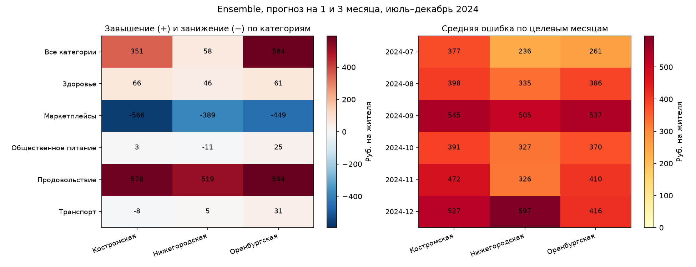

# Где ошибается прогноз и помогают ли новости

Анализ сохранённых прогнозов восьми моделей в трёх областях. Модели, параметры, ответы LLM и исходные данные не изменялись. Ни одна часть этого разбора не использовалась для выбора модели.

MAE — средняя абсолютная ошибка: на сколько рублей в среднем прогноз отличается от факта. Средняя знаковая ошибка показывает систематическое завышение или занижение. WAPE — сумма абсолютных ошибок, делённая на сумму фактических расходов; 0,10 означает 10%. Высокая ошибка в рублях может быть следствием высокого уровня расходов, поэтому приведены оба показателя.

«Все категории» — отдельный ряд общего объёма расходов, а не ещё одна товарная категория. Как и в прежних экспериментах, каждый из шести рядов имеет одинаковый вес. «Доля всей ошибки» описывает эту схему оценки, а не долю категории в потреблении.

## Что видно по основным горизонтам

Оренбургская область: наибольшая ошибка в категории «Все категории» (969.08 руб./жителя); её доля суммарной абсолютной ошибки — 40.7%. Худший целевой месяц — 2024-09 (537.44). 4 из 39 муниципалитетов дают 15.2% ошибки.

Нижегородская область: наибольшая ошибка в категории «Все категории» (939.50 руб./жителя); её доля суммарной абсолютной ошибки — 40.4%. Худший целевой месяц — 2024-12 (597.11). 5 из 50 муниципалитетов дают 12.8% ошибки.

Костромская область: наибольшая ошибка в категории «Все категории» (1040.72 руб./жителя); её доля суммарной абсолютной ошибки — 38.4%. Худший целевой месяц — 2024-09 (545.46). 3 из 28 муниципалитетов дают 18.4% ошибки.

Расходы на продукты обычно завышены, а на маркетплейсах — занижены. Для маркетплейсов национальным ориентиром служат все непродовольственные товары, а не отдельный ряд маркетплейсов; это возможный источник расхождения, который требует отдельной проверки. По относительной ошибке общепит проблемен, хотя его ошибка в рублях мала.

При резких изменениях в Оренбургской области новости уменьшают ошибку на 5,20 руб., но вариант только с количеством новостей — на 5,70 руб. В остальные месяцы новостная поправка ухудшает результат. В Нижегородской на основных горизонтах поправка не применяется; в Костромской новости не помогают и в группе резких изменений. Это описательная проверка, без отдельного подтверждения статистической значимости.

## Оренбургская область

Основные горизонты — 1 и 3 месяца. Ошибка исходной модели 396.60 руб./жителя.

Категории:

| Категория            |   MAE, руб. |   Ошибка / сумма расходов |   Среднее завышение (+) / занижение (−), руб. |   Доля всей ошибки, % |
|:---------------------|------------:|--------------------------:|----------------------------------------------:|----------------------:|
| Все категории        |      969.08 |                      0.04 |                                        583.66 |                 40.72 |
| Продовольствие       |      658.06 |                      0.07 |                                        593.81 |                 27.65 |
| Маркетплейсы         |      488.91 |                      0.11 |                                       -448.58 |                 20.55 |
| Здоровье             |       95.70 |                      0.09 |                                         60.71 |                  4.02 |
| Общественное питание |       87.59 |                      0.13 |                                         24.85 |                  3.68 |
| Транспорт            |       80.26 |                      0.07 |                                         31.40 |                  3.37 |

Месяцы:

| Месяц   |   MAE, руб. |   Среднее завышение (+) / занижение (−), руб. |
|:--------|------------:|----------------------------------------------:|
| 2024-09 |      537.44 |                                        472.72 |
| 2024-12 |      415.90 |                                       -156.84 |
| 2024-11 |      409.50 |                                        176.89 |
| 2024-08 |      386.13 |                                        144.85 |
| 2024-10 |      369.89 |                                        124.65 |
| 2024-07 |      260.75 |                                         83.57 |

Пять муниципалитетов с наибольшей ошибкой:

| Муниципалитет   |   MAE, руб. |   Ошибка / сумма расходов |   Среднее завышение (+) / занижение (−), руб. |
|:----------------|------------:|--------------------------:|----------------------------------------------:|
| Домбаровский    |      648.53 |                      0.11 |                                        577.52 |
| Ясненский       |      602.88 |                      0.09 |                                        505.50 |
| Гайский         |      585.53 |                      0.08 |                                        506.17 |
| Асекеевский     |      508.63 |                      0.08 |                                        217.67 |
| Северный        |      506.91 |                      0.09 |                                        402.95 |

Все варианты:

| Вариант                                   |   MAE, руб. |   Среднее завышение (+) / занижение (−), руб. |   Снижение ошибки против исходной, руб. |
|:------------------------------------------|------------:|----------------------------------------------:|----------------------------------------:|
| Исходная модель                           |      396.60 |                                        140.97 |                                    0.00 |
| Поправка без новостей                     |      396.60 |                                        140.97 |                                    0.00 |
| Прежние доли новостей                     |      396.60 |                                        140.97 |                                    0.00 |
| Новости с уменьшением влияния со временем |      406.80 |                                        161.84 |                                  -10.20 |
| Только количество новостей                |      399.75 |                                        152.08 |                                   -3.15 |

При резких изменениях и в остальные месяцы:

| Вариант                                   | Изменение фактических расходов   |   Число прогнозов |   MAE, руб. |   Снижение ошибки против исходной, руб. |
|:------------------------------------------|:---------------------------------|------------------:|------------:|----------------------------------------:|
| Исходная модель                           | Изменение за месяц <20%          |              2572 |      395.90 |                                    0.00 |
| Исходная модель                           | Изменение за месяц ≥20%          |               236 |      404.22 |                                    0.00 |
| Поправка без новостей                     | Изменение за месяц <20%          |              2572 |      395.90 |                                    0.00 |
| Поправка без новостей                     | Изменение за месяц ≥20%          |               236 |      404.22 |                                    0.00 |
| Прежние доли новостей                     | Изменение за месяц <20%          |              2572 |      395.90 |                                    0.00 |
| Прежние доли новостей                     | Изменение за месяц ≥20%          |               236 |      404.22 |                                    0.00 |
| Новости с уменьшением влияния со временем | Изменение за месяц <20%          |              2572 |      407.52 |                                  -11.61 |
| Новости с уменьшением влияния со временем | Изменение за месяц ≥20%          |               236 |      399.02 |                                    5.20 |
| Только количество новостей                | Изменение за месяц <20%          |              2572 |      399.86 |                                   -3.96 |
| Только количество новостей                | Изменение за месяц ≥20%          |               236 |      398.52 |                                    5.70 |

## Нижегородская область

Основные горизонты — 1 и 3 месяца. Ошибка исходной модели 387.71 руб./жителя.

Категории:

| Категория            |   MAE, руб. |   Ошибка / сумма расходов |   Среднее завышение (+) / занижение (−), руб. |   Доля всей ошибки, % |
|:---------------------|------------:|--------------------------:|----------------------------------------------:|----------------------:|
| Все категории        |      939.50 |                      0.03 |                                         57.56 |                 40.39 |
| Продовольствие       |      687.93 |                      0.06 |                                        519.27 |                 29.57 |
| Маркетплейсы         |      428.70 |                      0.08 |                                       -388.77 |                 18.43 |
| Здоровье             |      102.96 |                      0.07 |                                         46.35 |                  4.43 |
| Транспорт            |       90.46 |                      0.06 |                                          4.94 |                  3.89 |
| Общественное питание |       76.69 |                      0.12 |                                        -11.25 |                  3.30 |

Месяцы:

| Месяц   |   MAE, руб. |   Среднее завышение (+) / занижение (−), руб. |
|:--------|------------:|----------------------------------------------:|
| 2024-12 |      597.11 |                                       -464.79 |
| 2024-09 |      505.29 |                                        441.75 |
| 2024-08 |      335.30 |                                         88.51 |
| 2024-10 |      326.73 |                                        128.66 |
| 2024-11 |      325.99 |                                        123.63 |
| 2024-07 |      235.84 |                                        -89.66 |

Пять муниципалитетов с наибольшей ошибкой:

| Муниципалитет     |   MAE, руб. |   Ошибка / сумма расходов |   Среднее завышение (+) / занижение (−), руб. |
|:------------------|------------:|--------------------------:|----------------------------------------------:|
| Княгининский      |      509.28 |                      0.07 |                                        332.28 |
| Тонкинский        |      507.45 |                      0.07 |                                        413.34 |
| Краснооктябрьский |      497.22 |                      0.07 |                                       -176.10 |
| Вадский           |      493.84 |                      0.07 |                                        321.90 |
| Краснобаковский   |      475.85 |                      0.06 |                                        -46.43 |

Все варианты:

| Вариант                                   |   MAE, руб. |   Среднее завышение (+) / занижение (−), руб. |   Снижение ошибки против исходной, руб. |
|:------------------------------------------|------------:|----------------------------------------------:|----------------------------------------:|
| Исходная модель                           |      387.71 |                                         38.02 |                                    0.00 |
| Поправка без новостей                     |      387.71 |                                         38.02 |                                    0.00 |
| Прежние доли новостей                     |      387.71 |                                         38.02 |                                    0.00 |
| Новости с уменьшением влияния со временем |      387.71 |                                         38.02 |                                    0.00 |
| Только количество новостей                |      387.71 |                                         38.02 |                                    0.00 |

При резких изменениях и в остальные месяцы:

| Вариант                                   | Изменение фактических расходов   |   Число прогнозов |   MAE, руб. |   Снижение ошибки против исходной, руб. |
|:------------------------------------------|:---------------------------------|------------------:|------------:|----------------------------------------:|
| Исходная модель                           | Изменение за месяц <20%          |              3346 |      370.33 |                                    0.00 |
| Исходная модель                           | Изменение за месяц ≥20%          |               254 |      616.64 |                                    0.00 |
| Поправка без новостей                     | Изменение за месяц <20%          |              3346 |      370.33 |                                    0.00 |
| Поправка без новостей                     | Изменение за месяц ≥20%          |               254 |      616.64 |                                    0.00 |
| Прежние доли новостей                     | Изменение за месяц <20%          |              3346 |      370.33 |                                    0.00 |
| Прежние доли новостей                     | Изменение за месяц ≥20%          |               254 |      616.64 |                                    0.00 |
| Новости с уменьшением влияния со временем | Изменение за месяц <20%          |              3346 |      370.33 |                                    0.00 |
| Новости с уменьшением влияния со временем | Изменение за месяц ≥20%          |               254 |      616.64 |                                    0.00 |
| Только количество новостей                | Изменение за месяц <20%          |              3346 |      370.33 |                                    0.00 |
| Только количество новостей                | Изменение за месяц ≥20%          |               254 |      616.64 |                                    0.00 |

## Костромская область

Основные горизонты — 1 и 3 месяца. Ошибка исходной модели 451.81 руб./жителя.

Категории:

| Категория            |   MAE, руб. |   Ошибка / сумма расходов |   Среднее завышение (+) / занижение (−), руб. |   Доля всей ошибки, % |
|:---------------------|------------:|--------------------------:|----------------------------------------------:|----------------------:|
| Все категории        |     1040.72 |                      0.04 |                                        350.94 |                 38.39 |
| Продовольствие       |      800.26 |                      0.07 |                                        578.20 |                 29.52 |
| Маркетплейсы         |      591.73 |                      0.12 |                                       -565.75 |                 21.83 |
| Здоровье             |      115.27 |                      0.11 |                                         66.10 |                  4.25 |
| Транспорт            |       94.64 |                      0.08 |                                         -8.27 |                  3.49 |
| Общественное питание |       68.22 |                      0.17 |                                          3.22 |                  2.52 |

Месяцы:

| Месяц   |   MAE, руб. |   Среднее завышение (+) / занижение (−), руб. |
|:--------|------------:|----------------------------------------------:|
| 2024-09 |      545.46 |                                        420.81 |
| 2024-12 |      526.90 |                                       -387.18 |
| 2024-11 |      472.04 |                                        199.06 |
| 2024-08 |      397.98 |                                        118.95 |
| 2024-10 |      391.31 |                                        154.67 |
| 2024-07 |      377.14 |                                        -81.87 |

Пять муниципалитетов с наибольшей ошибкой:

| Муниципалитет   |   MAE, руб. |   Ошибка / сумма расходов |   Среднее завышение (+) / занижение (−), руб. |
|:----------------|------------:|--------------------------:|----------------------------------------------:|
| Волгореченск    |     1102.13 |                      0.16 |                                        707.86 |
| Антроповский    |      678.51 |                      0.10 |                                         31.34 |
| Парфеньевский   |      543.21 |                      0.08 |                                        138.14 |
| Сусанинский     |      505.56 |                      0.08 |                                        186.71 |
| Межевской       |      488.90 |                      0.07 |                                        -25.93 |

Все варианты:

| Вариант                                   |   MAE, руб. |   Среднее завышение (+) / занижение (−), руб. |   Снижение ошибки против исходной, руб. |
|:------------------------------------------|------------:|----------------------------------------------:|----------------------------------------:|
| Исходная модель                           |      451.81 |                                         70.74 |                                    0.00 |
| Поправка без новостей                     |      447.01 |                                         84.28 |                                    4.80 |
| Прежние доли новостей                     |      454.93 |                                         88.73 |                                   -3.12 |
| Новости с уменьшением влияния со временем |      453.05 |                                         87.54 |                                   -1.24 |
| Только количество новостей                |      445.82 |                                         78.29 |                                    5.99 |

При резких изменениях и в остальные месяцы:

| Вариант                                   | Изменение фактических расходов   |   Число прогнозов |   MAE, руб. |   Снижение ошибки против исходной, руб. |
|:------------------------------------------|:---------------------------------|------------------:|------------:|----------------------------------------:|
| Исходная модель                           | Изменение за месяц <20%          |              1736 |      449.42 |                                    0.00 |
| Исходная модель                           | Изменение за месяц ≥20%          |               280 |      466.60 |                                    0.00 |
| Поправка без новостей                     | Изменение за месяц <20%          |              1736 |      443.83 |                                    5.59 |
| Поправка без новостей                     | Изменение за месяц ≥20%          |               280 |      466.70 |                                   -0.10 |
| Прежние доли новостей                     | Изменение за месяц <20%          |              1736 |      452.92 |                                   -3.50 |
| Прежние доли новостей                     | Изменение за месяц ≥20%          |               280 |      467.39 |                                   -0.78 |
| Новости с уменьшением влияния со временем | Изменение за месяц <20%          |              1736 |      450.65 |                                   -1.24 |
| Новости с уменьшением влияния со временем | Изменение за месяц ≥20%          |               280 |      467.88 |                                   -1.28 |
| Только количество новостей                | Изменение за месяц <20%          |              1736 |      442.22 |                                    7.20 |
| Только количество новостей                | Изменение за месяц ≥20%          |               280 |      468.15 |                                   -1.54 |

## Как читать проверку резких изменений

Порог 20% задан для описания фактических изменений расходов относительно предыдущего месяца, а не для настройки модели. Эти сведения становятся известны после получения факта. Проверка показывает, где прогноз не справился, но не доказывает, что изменение вызвано новостью. Высокая относительная ошибка на малых уровнях расходов тоже возможна. Во всех таблицах «снижение ошибки» больше нуля означает улучшение; меньше нуля — ухудшение.

Тестовый период — июль–декабрь 2024, всего шесть месяцев. Результаты уже просмотрены, а исходный Ensemble сохраняет прежние ограничения подбора весов. Разбор помогает выбрать следующие гипотезы, но не превращает повторную оценку в независимый тест.

Подробные ошибки остаются в data/inputs/regional_error_analysis/ensemble_errors.csv и исключены из Git; сводные таблицы и хеши — artifacts/regional_error_analysis. Воспроизведение: `python scripts/analyze_regional_errors.py`.
